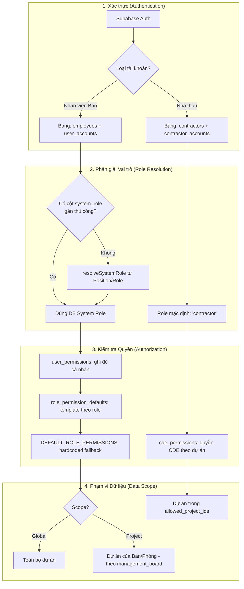
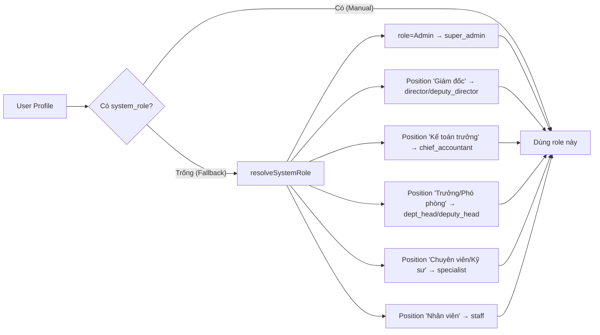

# 🛡️ Tài liệu Phân quyền Hệ thống QLDA ĐTXD ĐDCN

> [!IMPORTANT]
> **Phiên bản:** 3.3 | **Cập nhật:** 2026-06-04
> Tài liệu này gồm 3 phần: **(A) Đặc tả thiết kế phân quyền**, **(B) Đánh giá hiện trạng triển khai & rủi ro**, **(C) Kế hoạch hoàn thiện code** (gồm scope Phó GĐ, hoàn thiện UI Cài đặt, hoàn thiện Giả làm người dùng).
> Hệ thống phân quyền thiết kế theo nguyên tắc **Deny-by-default** — mỗi người dùng chỉ truy cập được chức năng và dữ liệu được cấp phép rõ ràng.

---

# PHẦN A — ĐẶC TẢ THIẾT KẾ

## 1. 🏗️ Nguyên tắc & Kiến trúc

### 1.1 Nguyên tắc cốt lõi
| Nguyên tắc | Mô tả |
| :--- | :--- |
| 🔒 **Deny-by-default** | Mọi quyền bị từ chối cho đến khi được cấp cụ thể. Khi quyền chưa load xong → từ chối (`can()` trả `false`). |
| 🎭 **Role-based (RBAC)** | Quyền cấp theo **System Role** (vai trò hệ thống), không gán lẻ tẻ. |
| ⚙️ **Customizable** | Admin có thể bật/tắt từng quyền cho từng cá nhân (ghi đè role). |
| 🌍 **Scope-aware** | Phạm vi dữ liệu động: Toàn ban (Global), Theo phòng/Ban ĐHDA (Project-scoped), Theo nhà thầu (Contractor-scoped). |
| 👥 **Dual Auth** | Phân tách 2 tệp người dùng: Nhân sự Ban QLDA (`employees`) & Nhà thầu (`contractors`). |
| 🧱 **Defense-in-depth** | Kiểm tra ở **2 tầng**: UI (`can()`) + Database (RLS). *Hiện trạng tầng DB chưa đầy đủ — xem Phần B.* |

### 1.2 Kiến trúc luồng phân quyền



---

## 2. 🎭 Vai trò hệ thống (System Roles)

Hệ thống quy định **9 vai trò**, chia 3 nhóm (mã định nghĩa tại `types/permission.types.ts`):

### 💼 Nhóm Lãnh đạo
| Vai trò | Code | Phạm vi | Thẩm quyền |
| :--- | :--- | :--- | :--- |
| **Quản trị HT** | `super_admin` | Global | Toàn quyền, bỏ qua mọi kiểm tra (bypass). |
| **Giám đốc** | `director` | Global | Quản lý chung, xem toàn hệ thống. |
| **Phó Giám đốc** | `deputy_director` | **Theo phòng phụ trách** | Quản lý theo ủy quyền; **chỉ xem dữ liệu/dự án của các phòng do mình phụ trách** (xem §6.2). |
| **Kế toán Trưởng** | `chief_accountant` | Global | Soát xét tài chính, quản lý module Thanh toán và Hợp đồng. |

> [!IMPORTANT]
> **Thay đổi v3.0:** Phó Giám đốc **KHÔNG còn là Global Scope**. Theo sơ đồ tổ chức, mỗi Phó GĐ chỉ phụ trách một nhóm phòng nhất định và chỉ được xem nội dung/dự án thuộc các phòng đó. Đây là thay đổi so với hiện trạng code (xem Phần B-11, kế hoạch C-1.4).

### 🏢 Nhóm Chuyên môn (theo Phòng ban / Ban ĐHDA)
| Vai trò | Code | Thẩm quyền |
| :--- | :--- | :--- |
| **Trưởng phòng / Trưởng ban** | `dept_head` | Quản lý phòng/ban, quản lý trong phạm vi dự án phụ trách. |
| **Phó phòng** | `deputy_head` | Hỗ trợ trưởng phòng, điều hành tác nghiệp. |
| **Chuyên viên / Kỹ sư** | `specialist` | Tác nghiệp chính (thêm/sửa tài liệu, lập phiếu). |
| **Nhân viên (Hành chính)** | `staff` | Nhập liệu, xem cơ bản, tải tài liệu. Không có quyền Sửa/Xóa diện rộng. |

### 👷 Nhóm Nhà thầu
| Vai trò | Code | Thẩm quyền |
| :--- | :--- | :--- |
| **Nhà thầu** | `contractor` | Chỉ CDE (nộp hồ sơ), Hợp đồng, Thanh toán, Dự án — của các dự án được gán. |

> [!NOTE]
> Code có 2 vai trò ánh xạ cùng nhãn "Lãnh đạo Ban" (`director`, `deputy_director`). Đây là chủ đích để phân biệt thẩm quyền ký duyệt nhưng hiển thị gộp nhãn.

---

## 3. ⚙️ Quy tắc phân giải vai trò

> [!TIP]
> **Ưu tiên gán thủ công:** hệ thống ưu tiên cột `employees.system_role` do Admin thiết lập; nếu trống mới fallback sang phân tích `position` + `role` (hàm `resolveSystemRole`).



---

## 4. 📊 Ma trận quyền hạn (Permissions Matrix)

Nguồn chuẩn (source of truth): bảng DB `role_permission_defaults` (seed tại migration `20260515100004_seed_all_role_permissions.sql`), đồng bộ với hằng số `DEFAULT_ROLE_PERMISSIONS`.

**Action:** `view` (Xem) · `create` (Thêm) · `update` (Sửa) · `delete` (Xóa) · `export` (Xuất).

### 4.1 Nhóm Lãnh đạo & Quản trị
> `super_admin` có toàn quyền mọi nơi (bypass).

| Module | Giám đốc / Phó GĐ | Kế toán trưởng |
| :--- | :---: | :---: |
| Dự án | Xem | Xem |
| Công việc | Xem | Xem |
| Nhân sự, Nhà thầu | Xem | Xem |
| Đấu thầu | Xem | Xem |
| Hợp đồng | Xem | Xem |
| Thanh toán | Xem | **Thêm/Sửa/Xóa** |
| KH Vốn & Giải ngân | Xem, Xuất | **Xem, Xuất** |
| CDE | Xem | Xem |
| Báo cáo | Xem, Xuất | Xem, Xuất |
| Giải phóng mặt bằng | Xem, Xuất | Xem |
| Quản trị HT | Chỉ xem (accounts/audit) | Chỉ xem (accounts) |

### 4.2 Nhóm Chuyên môn
> Áp dụng **trong phạm vi phòng ban/dự án** mà nhân sự thuộc về.

| Module | Trưởng/Phó phòng | Chuyên viên | Hành chính (staff) |
| :--- | :---: | :---: | :---: |
| Dự án | Thêm/Sửa | Thêm/Sửa | Chỉ Xem |
| Công việc | Thêm/Sửa/Xóa | Thêm/Sửa | **Thêm/Sửa** |
| Nhà thầu | Thêm/Sửa | Thêm/Sửa | Chỉ Xem |
| Đấu thầu | Thêm/Sửa/Xuất | Thêm/Sửa | Chỉ Xem |
| Hợp đồng | Thêm/Sửa | Thêm/Sửa | Chỉ Xem |
| Thanh toán | Thêm/Sửa | Thêm | Chỉ Xem |
| KH Vốn & Giải ngân | **Thêm/Sửa/Xuất** | **Thêm/Sửa** | Chỉ Xem |
| CDE | Thêm/Sửa | Thêm/Sửa | Chỉ Xem |
| Hồ sơ tài liệu | Thêm/Sửa/Xóa | Thêm/Sửa | **Chỉ Thêm** (nhập liệu) |
| GPMB | Thêm/Sửa | Thêm/Sửa | Chỉ Xem |

> [!NOTE]
> `staff` và `specialist` đều là nhân sự phòng ban. `staff` bị hạn chế Sửa/Xóa diện rộng để an toàn dữ liệu; phân biệt qua `position` ("Nhân viên..." → `staff`; "Chuyên viên/Kỹ sư/Thành viên..." → `specialist`).
> Từ 2026-06-02, `staff` được bổ sung quyền `create`/`update` cho **Công việc** (migration `20260602230000`).

---

## 5. 👷 Phân quyền riêng cho Nhà thầu

> [!CAUTION]
> Nhà thầu **TUYỆT ĐỐI KHÔNG** truy cập Tổng quan, Nhân sự, Quy chế, Báo cáo, Quản trị HT.

Nhà thầu chỉ truy cập **các module cố định** của dự án được gán (qua `allowed_project_ids`): Dự án (xem), Hợp đồng (xem), Thanh toán (xem), CDE (xem + nộp hồ sơ).

### 5.1 Các mức cấp quyền CDE (theo ISO 19650)
| Vai trò CDE | Code | Upload | Duyệt | Container truy cập |
| :--- | :--- | :---: | :---: | :--- |
| **Chỉ xem** | `viewer` | ❌ | ❌ | `WIP`, `SHARED`, `PUBLISHED` |
| **Nộp hồ sơ** | `contributor` | ✅ | ❌ | `WIP` *(mặc định khi gán dự án)* |
| **Kiểm tra** | `reviewer` | ✅ | ❌ | `WIP`, `SHARED` |
| **Phê duyệt** | `approver` | ✅ | ✅ | `WIP`, `SHARED`, `PUBLISHED` |
| **Quản trị CDE** | `admin` | ✅ | ✅ | Toàn bộ (gồm `ARCHIVED`) |

---

## 6. 🌐 Phạm vi dữ liệu (Data Scopes)

### 6.1 Các loại phạm vi
| Scope | Áp dụng cho | Quy tắc lọc |
| :--- | :--- | :--- |
| **Global** | Giám đốc, Kế toán trưởng, các phòng chức năng (Văn phòng, KH-ĐT...) | Thấy toàn bộ dự án |
| **Leadership (phụ trách)** | **Phó Giám đốc** | Thấy dự án thuộc **các phòng do PGĐ đó phụ trách** (hợp nhất nhiều phòng) |
| **Project** | Phòng QLDA 1–5 / Ban ĐHDA | Chỉ dự án có `management_board` khớp số Ban của nhân sự |
| **Contractor** | Nhà thầu | Chỉ dự án trong `allowed_project_ids` |

- Frontend: hook `useScopedProjects` đẩy bộ lọc `board` xuống server (phân trang chính xác); `canOnProject()` chặn thao tác trên dự án ngoài phạm vi.
- Danh sách phòng global/project-scoped định nghĩa tại `GLOBAL_VIEW_DEPARTMENTS` / `PROJECT_SCOPED_DEPARTMENTS`.

### 6.2 Phân công lãnh đạo (Leadership scope cho Phó GĐ)
Mỗi Phó GĐ phụ trách một nhóm phòng (theo sơ đồ tổ chức tại `features/organization/OrgChartPage.tsx`). Phạm vi dữ liệu = **hợp các dự án của tất cả phòng phụ trách**.

| Phó Giám đốc | Phòng phụ trách (ví dụ theo sơ đồ hiện tại) |
| :--- | :--- |
| PGĐ 1 | Phòng Phát triển dịch vụ · Phòng Quản lý dự án 1 |
| PGĐ 2 | Phòng Hành chính – Tổng hợp · Phòng Quản lý dự án 2 |
| PGĐ 3 | Phòng Kỹ thuật – Thẩm định · Phòng Quản lý dự án 3 |

> [!WARNING]
> Bảng trên hiện đang **suy ra theo vị trí mảng** (`pgds[0]`, `pgds[1]`, `pgds[2]`) trong `OrgChartPage.tsx` — **không bền vững** (đổi thứ tự nhân sự là sai phân công). Cần một **bảng phân công lãnh đạo dữ liệu hóa** (xem C-1.4) làm nguồn sự thật chung cho cả sơ đồ tổ chức lẫn phân quyền.

> [!CAUTION]
> **Lệch tên phòng giữa các nơi cấu hình:** `OrgChartPage` dùng "Phòng Kế hoạch – **Đấu thầu**", "Phòng Kỹ thuật – **Thẩm định**", "Phòng Hành chính – Tổng hợp", "Phòng Phát triển dịch vụ"... trong khi `permission.types.ts` (`GLOBAL_VIEW_DEPARTMENTS`) dùng "Phòng Kế hoạch – **Đầu tư**", "Phòng Kỹ thuật – **Chất lượng**", "Văn phòng", "Trung tâm Dịch vụ tư vấn". Đây là **hai bộ tên phòng khác nhau** → rủi ro lọc scope sai. Phải chuẩn hóa một bộ tên duy nhất (xem B-14, C-3.4).

---

## 7. 🛠️ Dành cho Developer

### 7.1 Kiểm tra quyền trong React
```tsx
const { can, canOnProject, isGlobalScope, systemRole } = usePermissionCheck();

if (can('contracts', 'create')) { /* ... */ }

<PermissionGate resource="cde" anyAction={['create', 'update']}>
  <Button>Thao tác CDE</Button>
</PermissionGate>

// Bảo vệ route
<ProtectedRoute resource="admin_accounts" action="view">
  <UserAccountManager />
</ProtectedRoute>
```

### 7.2 Engine kiểm tra quyền (thứ tự ưu tiên trong `PermissionContext.can()`)
1. `super_admin`? → **ALLOW ALL**.
2. Quyền chưa load (`!loaded`)? → **DENY** (an toàn).
3. Có ghi đè cá nhân `user_permissions`? → trả về ALLOW/DENY theo đó.
4. Có template `role_permission_defaults` (DB)? → trả về ALLOW/DENY.
5. Fallback `DEFAULT_ROLE_PERMISSIONS` (hardcoded) — kèm cảnh báo console.

### 7.3 Bảng DB liên quan
| Bảng | Mô tả |
| :--- | :--- |
| `employees` | Nhân sự, có cột `system_role` (TEXT, nullable) để gán role thủ công. |
| `user_accounts` | Tài khoản nhân viên, liên kết `auth_user_id ↔ employee_id`. |
| `contractor_accounts` | Tài khoản nhà thầu, có `allowed_project_ids[]`. |
| `user_permissions` | Quyền ghi đè cá nhân (override role). |
| `role_permission_defaults` | **Template quyền theo role** — bảng đang dùng thực tế. |
| `role_permissions` | ⚠️ Bảng trùng mục đích, **hiện không được code sử dụng** (xem Phần B-5). |
| `cde_permissions` | Quyền CDE của nhà thầu theo dự án (5 mức). |
| `audit_logs` | Nhật ký append-only thao tác phân quyền. |

### 7.4 Hạ tầng bảo mật phụ trợ
- **Cache quyền:** `sessionStorage`, TTL 5 phút, key theo `userId` (`utils/permissionCache.ts`).
- **Impersonation:** Admin giả lập user khác để debug (ghi audit).
- **MFA (TOTP):** thử thách AAL2 khi đăng nhập.
- **Inactivity timeout:** 8 giờ không hoạt động → tự đăng xuất.
- **Rate limit đăng nhập:** RPC `check_auth_rate_limit` / `record_auth_attempt`.
- **RLS helper functions:** `is_admin()`, `is_global_role()`, `is_project_member()`, `get_current_employee_id()`...

---

# PHẦN B — ĐÁNH GIÁ HIỆN TRẠNG & RỦI RO

> [!IMPORTANT]
> Kết quả rà soát ngày 2026-06-03. Mức độ: 🔴 Nghiêm trọng · 🟠 Cao · 🟡 Trung bình · 🟢 Thấp/Đã ổn.

## B-1 🔴 RLS không enforce quyền theo *action* (lỗ hổng lớn nhất)
RLS hiện chỉ kiểm soát **phạm vi dòng** (`is_global_role` / `is_project_member` / `is_admin`), **không** đọc `role_permission_defaults` hay `user_permissions`. Hệ quả:
- Một `staff` (chỉ `view`) nếu là project member / global role vẫn có thể **INSERT/UPDATE** trực tiếp qua API Supabase, vượt qua `can()` ở UI.
- `can()` chỉ là *UI guard*, **không phải hàng rào bảo mật**.
- Các action `approve` / `export` **không tồn tại** ở tầng DB → duyệt thanh toán/hợp đồng không được bảo vệ server-side.

**Rủi ro:** leo thang đặc quyền theo chiều ngang/dọc qua REST API.

## B-2 🟠 Hai mô hình scope song song, khác nguồn dữ liệu
- **Frontend** scope theo `projects.management_board` (số Ban suy ra từ `Department`).
- **RLS** scope theo bảng `project_members` (membership).

Nếu `project_members` không được đồng bộ với `management_board`, sẽ xảy ra: UI hiển thị dự án nhưng API từ chối (hoặc ngược lại). Cần thống nhất **một nguồn sự thật** cho phạm vi dự án.

## B-3 🟠 `system_role` thủ công không được tầng DB công nhận
App resolve role qua `employees.system_role`, nhưng RLS (`is_global_role`, `is_admin`) chỉ đọc `employees.role` + `department`. → Admin đổi `system_role` trên UI **không** thay đổi quyền truy cập dữ liệu ở DB. Hai nguồn sự thật về vai trò.

## B-4 🟡 `canOnProject` so khớp chuỗi Department không nhất quán
`canOnProject` dùng `effectiveUser.Department === projectManagementUnit` (so khớp chuỗi chính xác), trong khi scope chính dùng `management_board` dạng số (`extractBanNumber`). Tham số truyền vào không đồng nhất giữa các nơi gọi → dễ allow/deny nhầm khi tên phòng có biến thể (canonical vs legacy).

## B-5 🟡 Bảng `role_permissions` trùng lặp / chết
Migration `20260514132449_create_role_permissions.sql` tạo bảng `role_permissions`, nhưng code thực tế đọc `role_permission_defaults`. Hai bảng cùng mục đích gây nhầm lẫn, cần bỏ hoặc hợp nhất.

## B-6 🟡 Đồng bộ thủ công giữa hardcoded và DB seed
`DEFAULT_ROLE_PERMISSIONS` (TS) và `role_permission_defaults` (SQL seed) phải khớp tay. Hiện tại khớp, nhưng dễ "drift" khi sửa một bên. Không có test tự động đối chiếu.

## B-7 🟡 Audit log phân quyền có thể bị bỏ qua / giả mạo
- Ghi audit phụ thuộc app gọi `logPermissionChange` (client) — có thể bỏ qua nếu thao tác trực tiếp DB.
- RLS `audit_logs` cho phép **mọi** authenticated INSERT → client tự đặt `changed_by` (giả mạo được).

## B-8 🟡 Scope nhà thầu lọc client-side sau phân trang
`useScopedProjects` fetch trang rồi mới `filter(allowedIds)` → đếm/phân trang cho contractor không chính xác (đang workaround bằng `total = scopedProjects.length`). Contractor cũng có 2 nguồn scope (`allowed_project_ids` vs RLS qua `contracts.contractor_id`).

## B-9 🟢 Một số bảng vẫn write rộng `USING(true)`/authenticated bất kỳ
`sub_tasks`, `folders`, `task_*`, `cde_*`, `contractor_accounts`, `document_attachments` cho phép mọi authenticated ghi. Chấp nhận tạm cho dữ liệu phụ trợ, nhưng nên thu hẹp.

## B-10 🟢 Điểm đã làm tốt
- Deny-by-default + DENY khi quyền chưa load.
- Cache quyền theo session, invalidate khi logout/đổi quyền/impersonation.
- `PermissionGate`, `ProtectedRoute`, gating menu Sidebar đồng bộ qua `can()`.
- RLS đã loại bỏ ~92 policy `allow_all_*`, thay bằng row-scoping theo role.
- MFA, inactivity timeout, rate limit, orphan-user sign-out, impersonation audit.
- Lỗ hổng RLS cũ đã vá: `user_permissions` (20260512), `role_permission_defaults` join sai uid (20260515100003), `legal_documents` cột không tồn tại (20260520).

## B-11 🟠 Phó Giám đốc đang bị cấp quyền quá rộng (Global)
Theo yêu cầu nghiệp vụ mới, Phó GĐ chỉ được xem dự án của các phòng mình phụ trách. Nhưng hiện tại:
- `GLOBAL_VIEW_ROLES` (trong `permission.types.ts`) **bao gồm** `deputy_director`.
- `PermissionContext.isGlobalScope` trả `true` cho `deputy_director`.
- RLS `is_global_role()` cho phép `role = 'DeputyDirector'` thấy mọi dòng.

→ Phó GĐ hiện thấy **toàn bộ** dự án, **trái** với mô hình tổ chức. Cần chuyển sang *Leadership scope* (§6.2).

## B-12 🟠 Tính năng "Giả làm người dùng" mới chỉ là *preview phía client*
- Impersonation chỉ đổi `effectiveUser` ở tầng React → ảnh hưởng `can()` và một số hook scope. **Phiên Supabase Auth không đổi**, nên mọi truy vấn DB vẫn chạy dưới quyền admin thật (RLS vẫn thấy admin). Dữ liệu hiển thị **không phản ánh đúng** giới hạn RLS của người bị giả lập.
- Bảng xem trước quyền trong `UserImpersonator` dùng `DEFAULT_ROLE_PERMISSIONS` (hardcoded), **không** đọc `user_permissions`/`role_permission_defaults` thực tế → preview có thể **sai** so với quyền thật của người đó.
- `systemRole` trong preview gọi `resolveSystemRole(Role, Position)` mà **bỏ qua** `employees.system_role` (gán thủ công) → role hiển thị sai cho người đã được set system_role.
- Một số module truy vấn trực tiếp (không qua `useScopedProjects`) sẽ không bị thu hẹp theo người giả lập.

## B-13 🟡 UI quản trị phân quyền còn thiếu mảnh ghép
`PermissionManager`, `RoleDefaultsManager`, `UserImpersonator`, `CDEPermissionManager` đã có, nhưng:
- **Không có UI quản lý phân công lãnh đạo** (PGĐ phụ trách phòng nào) — đang ẩn trong sơ đồ tổ chức.
- **Không có UI gán phạm vi dữ liệu** (scope) cho cá nhân/role một cách tường minh.
- Sau khi admin sửa quyền cho người khác, **không tự invalidate cache** của người đó (chỉ TTL 5 phút mới hết hạn) → quyền mới áp dụng trễ. `PermissionManager.handleSave` không gọi `permissionCache.invalidate(targetUserId)`.
- `RoleDefaultsManager` sửa template role nhưng cần đảm bảo invalidate `roleDefaultsCache` toàn cục để mọi user thuộc role nhận thay đổi.
- Đổi `system_role` lưu DB nhưng (do B-3) chưa phản ánh ở tầng RLS.

## B-14 🟡 Hai bộ tên phòng ban không khớp
`OrgChartPage` và `permission.types.ts` dùng **hai danh sách tên phòng khác nhau** (xem cảnh báo §6.2). Vì scope dựa trên so khớp chuỗi tên phòng, sai lệch này gây lọc sai. Cần một nguồn `departments` chuẩn (bảng DB) và mọi nơi tham chiếu vào đó.

---

# PHẦN C — KẾ HOẠCH HOÀN THIỆN CODE

> Sắp xếp theo độ ưu tiên. Mỗi mục có: mục tiêu, việc cần làm, tiêu chí hoàn thành (DoD).

## 🚩 Giai đoạn 1 — Bịt lỗ hổng bảo mật server-side (ưu tiên cao nhất)

### C-1.1 Enforce quyền theo action ở tầng DB *(giải quyết B-1)* — 🟢 ĐÃ LÀM & VERIFY (2026-06-03)
> [!CAUTION]
> **Phát hiện khi triển khai:** DB production `qlda-ddcn-ht` **chưa từng nhận** migration RLS hardening (`20260401120000`) — các bảng nghiệp vụ vẫn còn policy `allow_all_* = true` (mọi authenticated ghi tự do, không cả action lẫn row-scope). Repo và DB đã lệch.

- **Đã làm:**
  - Hàm `_resolve_system_role(role, position)` — mirror SQL **chính xác** của `resolveSystemRole` (verify khớp 100% trên toàn bộ 129 nhân sự thực tế).
  - `current_system_role()` (ưu tiên `system_role`, fallback resolver) + `has_permission(resource, action)` (super_admin → `user_permissions` → `role_permission_defaults` → deny).
  - Thay policy `allow_all_{insert,update,delete}` → `has_permission(resource, action)` cho 8 bảng: `projects, tasks, contracts, payments, bidding_packages, capital_plans, disbursements, documents`. **Chỉ thắt chặt** (true → has_permission), SELECT giữ mở.
  - Migrations: `20260603150000_rbac_permission_functions.sql`, `20260603160000_rbac_enforce_action_write_policies.sql`. Đã áp lên DB.
- **Verify (RLS thật, transaction rollback):** kế toán trưởng UPDATE task → **0 dòng (chặn)**; super_admin → **1 dòng (cho)**. has_permission khớp ma trận spec cho mọi role.
- **Lưu ý rollout:** `has_permission` == `can()` của app (cùng resolver + cùng bảng) → thao tác hợp lệ qua UI không bị ảnh hưởng; chỉ chặn ghi vượt quyền qua API trực tiếp. Nếu có luồng ghi không qua `can()` gate, cần bổ sung gate hoặc cấp quyền.
- **Còn lại (B-2 — row scope):** SELECT vẫn mở; chưa giới hạn "ghi đúng dự án của mình" ở DB. Cần thay `allow_all_select` + thêm điều kiện scope (`is_global_role` OR `is_project_member` OR `is_project_managed_by_current_deputy` OR contractor) — nhưng phải **đối soát `project_members` vs `management_board`** trước (hiện app scope theo board, RLS theo membership). Đây là hạng mục lớn, làm sau.

### C-1.2 Bảo vệ action `approve` *(B-1)* — 🚫 ĐÃ LOẠI BỎ THEO YÊU CẦU (2026-06-04)
- **Đã xử lý (2026-06-04):** Do hệ thống chưa triển khai phê duyệt và ký số thực tế, quyền `approve` đã bị xóa bỏ hoàn toàn khỏi hệ thống (TypeScript và DB).
- **Điều chỉnh:** Các RLS policies cho hành động UPDATE trên các bảng nghiệp vụ (`contracts`, `payments`, `bidding_packages`, `capital_plans`, `disbursements`) đã được sửa đổi để chỉ kiểm tra quyền Sửa (`update`) đơn thuần (loại bỏ kiểm tra quyền `approve`). Migration `20260604180000_remove_approve_permission.sql`.

### C-1.3 Đồng bộ `system_role` vào RLS *(giải quyết B-3)*
- **Việc làm:** Sửa `is_global_role()` / `is_admin()` để ưu tiên đọc `employees.system_role` (nếu có) trước khi rơi về `role`+`department`. Bổ sung index trên `employees.system_role`.
- **DoD:** Đổi `system_role` trên UI lập tức phản ánh đúng phạm vi truy cập dữ liệu ở DB.

### C-1.4 Phạm vi "phụ trách" cho Phó Giám đốc *(giải quyết B-11, §6.2)* — 🟡 ĐANG TRIỂN KHAI
> **Đã làm (2026-06-03):** Mô hình dữ liệu + scope phía client.
> - Migration `20260603120000_create_leadership_assignments.sql`: bảng `leadership_assignments` + RLS + helper `get_current_deputy_managed_boards()`, `is_project_managed_by_current_deputy()`.
> - `LeadershipService` (đọc/ghi phân công). `extractBanNumber` tách ra `utils/boardScope.ts`.
> - `PermissionContext`: PGĐ resolve `managedBoards`, `isGlobalScope=false` khi đã có phân công; **fallback không phá vỡ** — PGĐ chưa phân công vẫn giữ Global view.
> - `useScopedProjects` / `ProjectService` / `ProjectList` (export): lọc `board IN (managedBoards)`. `canOnProject` chặn theo Ban phụ trách.
>
> **Còn lại:** (1) ✅ Migration đã áp lên DB `qlda-ddcn-ht` (2026-06-03), đã verify bảng + 2 helper + ghi/đọc qua UI; (2) ✅ UI phân công — xem **C-5.2**; (3) Gắn helper `is_project_managed_by_current_deputy()` vào RLS các bảng nghiệp vụ (thuộc Giai đoạn 1 server-side); (4) Lan toả scope sang các module khác (tasks/contracts) dùng `scopedProjectIds`; (5) Admin cấu hình phân công thực tế cho 3 PGĐ (hiện chưa gán → tạm Global).
- **Mô hình dữ liệu (đề xuất):** tạo bảng `leadership_assignments(deputy_employee_id, department_name)` (1 PGĐ ↔ nhiều phòng), thay cho việc suy theo vị trí mảng trong `OrgChartPage`. Sơ đồ tổ chức **đọc lại** từ bảng này để đồng nhất nguồn sự thật.
- **Frontend:**
  - Trong `permission.types.ts`: **bỏ** `deputy_director` khỏi `GLOBAL_VIEW_ROLES`.
  - `PermissionContext.isGlobalScope`: với `deputy_director` trả `false`; thêm `managedDepartments`/`managedBoards` vào context.
  - `useScopedProjects`: nếu là `deputy_director`, đẩy bộ lọc `board IN (danh sách số Ban của các phòng phụ trách)` xuống server (mở rộng `usePaginatedProjects` hỗ trợ nhiều board).
  - `canOnProject`: cho phép nếu dự án thuộc một trong các phòng PGĐ phụ trách.
- **DB/RLS:** thêm helper `is_managed_by_deputy(p_project_id)` kiểm tra `projects.management_board`/phòng nằm trong `leadership_assignments` của PGĐ hiện tại; gắn vào policy SELECT/UPDATE các bảng nghiệp vụ.
- **DoD:** Phó GĐ chỉ thấy & thao tác dự án thuộc phòng phụ trách; thử nghiệm với từng PGĐ cho kết quả đúng theo sơ đồ tổ chức.

## ⚙️ Giai đoạn 2 — Thống nhất mô hình scope

### C-2.1 Một nguồn sự thật cho phạm vi dự án *(giải quyết B-2, B-4)* — 🟢 ĐÃ LÀM & VERIFY
- **Quyết định:** Chọn **`management_board`** làm chuẩn (vì `project_members` chỉ phủ 26/129 nhân viên — quá thưa). RLS không dùng `project_members` làm scope chính.
- **Đã làm (2026-06-03):** Helper `current_user_board_number`, `has_global_project_scope`, `can_access_project`; gắn vào RLS SELECT + write của 8 bảng (migrations `20260603190000`, `20260603200000`). `canOnProject` (client) cũng đã dùng số Ban cho PGĐ.
- **Verify (RLS thật):** QLDA1 thấy 235 dự án (board 1), HCTH/global thấy 751, QLDA1 UPDATE dự án board khác → bị chặn. App (admin) vẫn thấy 751, không vỡ.

### C-2.2 Scope nhà thầu nhất quán *(giải quyết B-8)* — 🟢 ĐÃ LÀM
- **Đã làm (2026-06-03):** `useScopedProjects` đẩy `filters.projectIds = allowed_project_ids` xuống server (`ProjectService` dùng `.in('project_id', ...)`); bỏ filter client + hack `total`. RLS `can_access_project` cũng enforce contractor qua `allowed_project_ids` (defense-in-depth). Phân trang/đếm nay chính xác.

## 🧹 Giai đoạn 3 — Dọn dẹp & chống "drift"

### C-3.1 Loại bỏ bảng `role_permissions` trùng *(giải quyết B-5)*
- **Việc làm:** Migration `DROP TABLE IF EXISTS role_permissions` (sau khi xác nhận không nơi nào đọc); cập nhật tài liệu.
- **DoD:** Chỉ còn `role_permission_defaults` là nguồn template duy nhất.

### C-3.2 Test đối chiếu hardcoded ↔ DB seed *(giải quyết B-6)*
- **Việc làm:** Thêm test (Vitest) so khớp `DEFAULT_ROLE_PERMISSIONS` với nội dung seed `role_permission_defaults`; CI fail nếu lệch.
- **DoD:** Mọi thay đổi một bên buộc cập nhật bên kia.

### C-3.3 Đảm bảo seed áp dụng ở mọi môi trường *(B-6)*
- **Việc làm:** Kiểm tra pipeline migration chạy seed `20260515100004` ở staging/production; thêm cảnh báo nếu bảng rỗng lúc khởi động.
- **DoD:** Không còn log "Hardcoded fallback" ở production.

### C-3.4 Chuẩn hóa một bộ tên phòng ban *(giải quyết B-14)* — 🟢 ĐÃ LÀM
- **Đã làm (2026-06-03):** Cập nhật `GLOBAL_VIEW_DEPARTMENTS` (`permission.types.ts`) khớp tên canonical thực tế của Ban QLDA Hà Tĩnh ('Phòng Hành chính – Tổng hợp', 'Phòng Kế hoạch – Đấu thầu', 'Phòng Kỹ thuật – Thẩm định', 'Phòng Phát triển dịch vụ'), giữ tên cũ làm alias. RLS scope dùng số Ban (không phụ thuộc tên phòng) nên không lệch.
- **Tinh chỉnh tương lai (tùy chọn):** áp bảng `departments` lookup lên DB để dữ liệu hóa hoàn toàn.

## 🔍 Giai đoạn 4 — Audit & siết quyền còn lại

### C-4.1 Audit log phía DB *(giải quyết B-7)* — 🟢 ĐÃ LÀM & VERIFY
- **Đã làm (2026-06-03):** Trigger `audit_permission_change()` AFTER INSERT/UPDATE/DELETE trên `user_permissions`, `role_permission_defaults`, `leadership_assignments` → ghi `audit_logs` với `changed_by = auth.uid()` (server-side, không tin client). Migration `20260603180000`.
- **Verify (RLS thật, rollback):** insert phân công dưới JWT admin → audit_logs sinh `permission_insert`, `changed_by` = uid auth thật.
- **Còn lại (tùy chọn):** mở rộng cho `cde_permissions`.

### C-4.2 Thu hẹp các policy write rộng *(giải quyết B-9)*
- **Việc làm:** Rà `sub_tasks`, `folders`, `task_*`, `cde_*`, `contractor_accounts` — thay `USING(true)`/authenticated-bất-kỳ bằng kiểm tra membership/role phù hợp.
- **DoD:** Không còn policy ghi cho "authenticated bất kỳ" trên bảng nghiệp vụ.

## 🖥️ Giai đoạn 5 — Hoàn thiện phân quyền qua UI Cài đặt hệ thống *(giải quyết B-13)*

Khu vực **Quản trị HT → Cài đặt** gồm các tab: Phân quyền cá nhân (`PermissionManager`), Mẫu quyền theo vai trò (`RoleDefaultsManager`), Giả làm người dùng (`UserImpersonator`), Quyền CDE (`CDEPermissionManager`).

### C-5.1 Áp dụng quyền tức thì sau khi sửa — 🟢 ĐÃ LÀM (phần PermissionManager)
- **Đã làm (2026-06-03):** `PermissionManager.handleSave` gọi `permissionCache.invalidate(targetUserId)` sau khi lưu; nếu sửa quyền của chính mình → `refresh()`. `LeadershipAssignmentManager` cũng invalidate cache PGĐ sau khi lưu phân công.
- **Còn lại:** áp dụng tương tự cho `RoleDefaultsManager` (sửa template role → `roleDefaultsCache.delete(role)` + thông báo) — gắn với C-5.4.

### C-5.2 UI quản lý phân công lãnh đạo (PGĐ ↔ Ban) *(gắn với C-1.4)* — 🟢 ĐÃ LÀM
- **Đã làm (2026-06-03):** Tab **"Phân công lãnh đạo"** trong Cài đặt (`features/settings/LeadershipAssignmentManager.tsx`): liệt kê các Phó GĐ, tích chọn Ban phụ trách, lưu vào `leadership_assignments`, invalidate cache PGĐ. Guard `can('admin_roles','update')`. ✅ Đã verify trên preview (3 PGĐ, lưu DB OK, `created_by` đúng).
- **Đã làm:** `OrgChartPage` đọc phân công từ `leadership_assignments` (map board→PGĐ), fallback vị trí mảng khi Ban chưa phân công. ✅ Verify node trái phản ánh đúng PGĐ được gán.
- **Còn lại:** (tùy chọn) seed phân công ban đầu cho 3 PGĐ.

### C-5.3 UI gán phạm vi dữ liệu (scope) tường minh
- **Việc làm:** Trong `PermissionManager`, hiển thị rõ scope hiệu lực của nhân sự (Global / Phụ trách / Phòng / Nhà thầu) và nguồn suy ra (role, phòng, system_role). Cho phép admin ghi đè scope khi cần (lưu vào cột/bảng riêng).
- **DoD:** Admin nhìn thấy & điều chỉnh được phạm vi dữ liệu của từng người, không chỉ ma trận action.

### C-5.4 Trang quản lý Mẫu quyền theo vai trò hoàn chỉnh — 🟢 ĐÃ LÀM
- **Đã làm (2026-06-03):** `RoleDefaultsManager.handleSave` nay gọi `clearRoleDefaultsCache()` + `permissionCache.invalidateAll()` + `refresh()` sau khi lưu; `handleApplyToAll` cũng invalidate. Audit ghi tự động qua DB trigger (C-4.1). UI đã quản trị đủ 9 role × 21 resource × 6 action.
- **Còn lại (tùy chọn):** hiển thị cảnh báo trực quan khi lệch với hằng số `DEFAULT_ROLE_PERMISSIONS` (đã có test CI chặn drift — C-3.2).

### C-5.5 Guard quyền cho chính trang Cài đặt — 🟢 ĐÃ ĐỦ
- **Hiện trạng:** `Settings.tsx` chặn truy cập nếu không phải Admin (hiển thị "Không có quyền truy cập"); route `/settings` bọc `ProtectedRoute`. Nút Lưu của `PermissionManager`, `RoleDefaultsManager`, `LeadershipAssignmentManager` đều kiểm tra `can('admin_roles','update')`.
- **DoD:** Đạt — người không phải Admin không mở/không lưu được.

## 🎭 Giai đoạn 6 — Hoàn thiện tính năng "Giả làm người dùng" *(giải quyết B-12)*

### C-6.1 Preview quyền chính xác theo dữ liệu thật
- **Việc làm:** `UserImpersonator` thay vì dùng `DEFAULT_ROLE_PERMISSIONS`, hãy nạp quyền hiệu lực thực: `user_permissions` (ghi đè) → `role_permission_defaults` (theo role); và dùng `system_role` (ưu tiên cột DB) thay vì chỉ `resolveSystemRole`.
- **DoD:** Bảng preview khớp 100% với những gì người đó thực sự thấy.

### C-6.2 Đồng nhất scope khi giả lập ở mọi module
- **Việc làm:** Đảm bảo mọi hook truy vấn dữ liệu nhận biết `effectiveUser` (qua `useScopedProjects`/PermissionContext), không module nào bỏ qua impersonation. Rà các nơi query trực tiếp `currentUser`.
- **DoD:** Khi giả lập một nhân sự Phòng QLDA 2, mọi trang chỉ hiển thị dữ liệu phạm vi của người đó.

### C-6.3 Làm rõ giới hạn & rủi ro RLS khi giả lập
- **Quyết định cần chốt:** giữ "preview phía client" hay làm **giả lập thật** ở tầng DB?
  - *Phương án A (khuyến nghị, nhanh):* Giữ client-preview nhưng **ghi nhãn rõ** "Chế độ xem trước — truy vấn vẫn chạy dưới quyền Admin"; chỉ cho phép khi user thật là `super_admin`.
  - *Phương án B (đầy đủ):* Giả lập thật qua RLS — dùng RPC `SECURITY DEFINER` nhận `p_impersonate_employee_id` và áp `set_config('request.jwt.claims', ...)` theo người bị giả lập cho phiên đọc; phức tạp, cần đánh giá kỹ bảo mật.
- **DoD:** Hành vi giả lập được tài liệu hóa, không gây hiểu nhầm rằng dữ liệu đã bị giới hạn bởi RLS.

### C-6.4 Audit & an toàn phiên giả lập
- **Việc làm:** Giữ audit `impersonation_start/stop/auto_expired` (đã có), nhưng đặt `changed_by` từ phiên auth thật (không tin client — liên kết C-4.1). Cấm giả lập lồng nhau; chặn giả lập tài khoản `super_admin` khác.
- **DoD:** Mọi phiên giả lập có vết audit tin cậy; không thể leo thang qua giả lập.

## ✅ Checklist tổng hợp
| # | Hạng mục | Mức | Giai đoạn | Trạng thái |
| :--- | :--- | :--- | :--- | :--- |
| B-1 | RLS enforce action (`has_permission`) | 🔴 | 1 | ✅ Done & verify |
| B-1 | Phê duyệt qua UPDATE (approve-or-update) | 🔴 | 1 | 🚫 Đã loại bỏ |
| B-3 | RLS công nhận `system_role` (`is_admin`) | 🟠 | 1 | ✅ Done |
| B-11 | Phó GĐ scope theo phòng phụ trách | 🟠 | 1 | ✅ Done (client+data+RLS) |
| B-2/B-4 | Row-scope RLS theo dự án (đọc+ghi) | 🟠 | 2 | ✅ Done & verify |
| B-8 | Scope nhà thầu server-side | 🟡 | 2 | ✅ Done |
| B-5 | Bỏ bảng `role_permissions` | 🟡 | 3 | ✅ Done |
| B-6 | Test đối chiếu seed ↔ hardcoded | 🟡 | 3 | ✅ Done |
| B-14 | Chuẩn hóa tên phòng ban (TS constants) | 🟡 | 3 | ✅ Done |
| B-7 | Audit trigger phía DB | 🟡 | 4 | ✅ Done & verify |
| B-9 | Thu hẹp policy write rộng | 🟢 | 4 | ✅ Done (8 bảng action+row scope) |
| B-13 | Áp quyền tức thì + UI scope/phân công | 🟡 | 5 | ✅ Done |
| B-13 | Hoàn thiện RoleDefaults + guard tab cài đặt | 🟡 | 5 | ✅ Done |
| B-12 | Preview giả lập chính xác + đồng nhất scope | 🟠 | 6 | ✅ Done & verify |
| B-12 | Làm rõ giới hạn RLS + audit giả lập an toàn | 🟡 | 6 | ✅ Done |

> **Đã hoàn thiện toàn bộ roadmap (2026-06-03).** Phát hiện lớn: DB `qlda-ddcn-ht` chưa từng nhận các migration RLS hardening/departments → đã xử lý bằng bộ migration RBAC mới (scope theo `management_board`, không phụ thuộc `departments`).
> **Tinh chỉnh tương lai (tùy chọn, không chặn):** (1) Đã loại bỏ quyền approve do chưa có phê duyệt & ký số thực tế; (2) row-scope cho các bảng phụ (cde_*, sub_tasks, folders...); (3) áp `departments` lookup + đồng bộ migration history giữa repo và DB.

> Thêm mục C-3.4: chuẩn hóa bộ tên phòng ban (B-14) — gộp vào Giai đoạn 3 cùng việc dọn dẹp.

---

## 8. 📝 Phụ lục — File mã nguồn liên quan
| Tầng | File |
| :--- | :--- |
| Định nghĩa types/role/matrix | `types/permission.types.ts` |
| Engine kiểm tra quyền | `context/PermissionContext.tsx` |
| Hook tiêu dùng | `hooks/usePermissionCheck.ts` |
| Cache quyền | `utils/permissionCache.ts` |
| Component bảo vệ UI | `components/PermissionGate.tsx`, `components/ProtectedRoute.tsx` |
| Scope dự án | `hooks/useScopedProjects.ts` |
| CRUD quyền | `services/PermissionService.ts` |
| Xác thực | `context/AuthContext.tsx`, `context/ImpersonationContext.tsx` |
| Quản trị quyền (UI) | `features/settings/PermissionManager.tsx`, `features/settings/RoleDefaultsManager.tsx` |
| RLS | `supabase/migrations/20260401120000_rls_hardening_all_tables.sql` và các bản vá sau |
