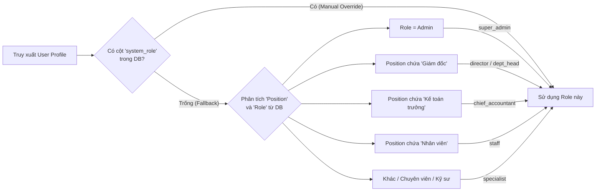

# 🛡️ Tài liệu Phân quyền Hệ thống QLDA ĐTXD ĐDCN

> [!IMPORTANT]
> **Phiên bản:** 2.2 | **Cập nhật:** 2026-05-15  
> Hệ thống phân quyền được thiết kế theo nguyên tắc **Deny-by-default** (từ chối mặc định), đảm bảo mỗi người dùng chỉ truy cập được chức năng và dữ liệu được cấp phép rõ ràng.

---

## 1. 🏗️ Nguyên tắc & Kiến trúc

### 1.1 Nguyên tắc cốt lõi
| Nguyên tắc | Mô tả |
| :--- | :--- |
| 🔒 **Deny-by-default** | Mọi quyền đều bị từ chối cho đến khi được cấp một cách cụ thể. |
| 🎭 **Role-based (RBAC)** | Quyền được cấp theo **System Role** (Vai trò hệ thống) thay vì gán lẻ tẻ. |
| ⚙️ **Customizable** | Quản trị viên (Admin) có thể can thiệp, bật/tắt từng quyền cho từng cá nhân thông qua giao diện. |
| 🌍 **Scope-aware** | Phạm vi dữ liệu động: Toàn ban (Global), Theo phòng/Ban ĐHDA (Project-scoped), hoặc Theo nhà thầu (Contractor-scoped). |
| 👥 **Dual Auth** | Phân tách rạch ròi 2 tệp người dùng: Nhân sự Ban QLDA & Nhân sự Nhà thầu. |

### 1.2 Kiến trúc Luồng Phân quyền

```mermaid
graph TD
    subgraph "1. Xác thực (Authentication)"
        A[Supabase Auth] --> B{Loại tài khoản?}
        B -->|Nhân viên Ban| C[Bảng: employees]
        B -->|Nhà thầu| D[Bảng: contractors]
    end

    subgraph "2. Phân giải Vai trò (Role Resolution)"
        C --> E{Có System Role<br/>(Gán thủ công)?}
        E -->|Có| F[Sử dụng DB System Role]
        E -->|Không| G[Tính toán tự động từ Chức danh]
        G --> F
        D --> H[Role mặc định: 'contractor']
    end

    subgraph "3. Kiểm tra Quyền (Authorization)"
        F --> I[Load Defaults: role_permission_defaults]
        I --> J[Ghi đè cá nhân: user_permissions]
        H --> K[Quyền CDE: cde_permissions]
    end

    subgraph "4. Phạm vi Dữ liệu (Data Scope)"
        J --> L{Phạm vi?}
        L -->|Global| M[Toàn bộ dự án]
        L -->|Project| N[Chỉ dự án của Ban/Phòng]
        K --> O[Chỉ dự án được gán]
    end
```

---

## 2. 🎭 Vai trò hệ thống (System Roles)

Hệ thống quy định **9 vai trò chính**, chia làm 3 nhóm:

### 💼 Nhóm Lãnh đạo (Global Scope - Xem toàn bộ)
| Vai trò | Code | Thẩm quyền |
| :--- | :--- | :--- |
| **Quản trị HT** | `super_admin` | Toàn quyền hệ thống, bỏ qua mọi kiểm tra (Bypass). |
| **Giám đốc** | `director` | Phê duyệt, ký số cuối cùng, xem toàn bộ hệ thống. |
| **Phó Giám đốc** | `deputy_director` | Phê duyệt thay GĐ (theo ủy quyền), xem toàn bộ hệ thống. |
| **Kế toán Trưởng** | `chief_accountant` | Quản lý, phê duyệt module Thanh toán & Hợp đồng. |

### 🏢 Nhóm Chuyên môn (Theo Phòng Ban/Ban ĐHDA)
| Vai trò | Code | Thẩm quyền |
| :--- | :--- | :--- |
| **Trưởng phòng / Trưởng ban** | `dept_head` | Quản lý phòng/ban, duyệt trong phạm vi dự án quản lý. |
| **Phó phòng** | `deputy_head` | Hỗ trợ trưởng phòng, điều hành tác nghiệp. |
| **Chuyên viên / Kỹ sư** | `specialist` | Tác nghiệp chính (Thêm/Sửa tài liệu, lập phiếu). |
| **Nhân viên (Hành chính)** | `staff` | Nhập liệu, xem cơ bản, tải tài liệu. Phân biệt với `specialist` — không có quyền Sửa/Xóa. |

### 👷 Nhóm Nhà thầu
| Vai trò | Code | Thẩm quyền |
| :--- | :--- | :--- |
| **Nhà thầu** | `contractor` | Chỉ truy cập CDE (Nộp hồ sơ), Hợp đồng, Thanh toán của dự án được gán. |

---

## 3. ⚙️ Quy tắc phân giải vai trò (Cập nhật MỚI)

> [!TIP]
> **Ưu tiên gán thủ công:** Để tăng tính linh hoạt và quản trị chặt chẽ, hệ thống ưu tiên thiết lập thủ công từ Admin so với việc tự động phân tích chức danh (fallback).



---

## 4. 📊 Ma trận Quyền hạn (Permissions Matrix)

### 4.1. Nhóm Lãnh đạo & Quản trị
> [!NOTE]
> `super_admin` có toàn quyền ở mọi nơi. Các vai trò dưới đây thể hiện quyền tác nghiệp chính.

| Module | Giám đốc (`director`) | Kế toán trưởng (`chief_accountant`) |
| :--- | :---: | :---: |
| **Dự án, Công việc** | Chỉ Xem | Chỉ Xem |
| **Nhân sự, Nhà thầu** | Chỉ Xem | Chỉ Xem |
| **Hợp đồng** | Duyệt | Duyệt |
| **Thanh toán** | Duyệt | **Thêm/Sửa/Xóa/Duyệt** |
| **CDE (Hồ sơ CĐ)** | Duyệt | Chỉ Xem |
| **Báo cáo, Xuất file** | Xem, Xuất | Xem, Xuất |

### 4.2. Nhóm Chuyên môn
> [!NOTE]
> Quyền dưới đây áp dụng **trong phạm vi phòng ban/dự án** mà nhân sự thuộc về. Admin có thể thay đổi thêm ở tab "Quản trị HT → Phân quyền".

| Module | Trưởng phòng (`dept_head`) | Chuyên viên (`specialist`) | Hành chính (`staff`) |
| :--- | :---: | :---: | :---: |
| **Dự án** | Thêm/Sửa | Thêm/Sửa | Chỉ Xem |
| **Công việc** | Thêm/Sửa/Xóa | Thêm/Sửa | Chỉ Xem |
| **Nhà thầu** | Thêm/Sửa | Thêm/Sửa | Chỉ Xem |
| **Hợp đồng, Thanh toán**| Thêm/Sửa | Thêm/Sửa (HĐ) | Chỉ Xem |
| **CDE (Hồ sơ CĐ)** | Thêm/Sửa/Duyệt | Thêm/Sửa | Chỉ Xem |
| **Hồ sơ tài liệu** | Thêm/Sửa/Xóa | Thêm/Sửa | **Chỉ Thêm** (nhập liệu) |

> [!NOTE]
> `staff` và `specialist` đều là nhân sự phòng ban, nhưng `staff` (code: `'staff'`) bị **hạn chế quyền Sửa/Xóa** để đảm bảo an toàn dữ liệu. Hệ thống phân biệt qua `position`: "Nhân viên..." → `staff`, "Chuyên viên/Kỹ sư..." → `specialist`.

---

## 5. 👷 Phân quyền riêng cho Nhà thầu

> [!CAUTION]
> **Giới hạn truy cập khắt khe:** Nhà thầu **TUYỆT ĐỐI KHÔNG** được truy cập Tổng quan, Nhân sự, Quy chế, Báo cáo và Quản trị hệ thống. 

Nhà thầu chỉ được truy cập **4 module cố định** của các dự án được gán:
1. Môi trường dữ liệu chung (CDE)
2. Hợp đồng
3. Thanh toán
4. Hồ sơ tài liệu

### 5.1 Các mức cấp quyền CDE (Dựa theo ISO 19650)

| Vai trò CDE | Code | Quyền Upload | Quyền Duyệt | Khu vực Container được truy cập |
| :--- | :--- | :---: | :---: | :--- |
| **Chỉ xem** | `viewer` | ❌ | ❌ | `WIP`, `SHARED`, `PUBLISHED` |
| **Nộp hồ sơ** | `contributor` | ✅ | ❌ | `WIP` *(Mặc định khi gán dự án)* |
| **Kiểm tra** | `reviewer` | ✅ | ❌ | `WIP`, `SHARED` |
| **Phê duyệt** | `approver` | ✅ | ✅ | `WIP`, `SHARED`, `PUBLISHED` |
| **Quản trị CDE** | `admin` | ✅ | ✅ | Toàn bộ (bao gồm `ARCHIVED`) |

---

## 6. 🌐 Phạm vi Dữ liệu (Data Scopes)

### 6.1 Lọc dữ liệu tự động
Dữ liệu hiển thị được tính toán tự động dựa trên `Scope` của người dùng:
- **Global Scope:** (Ban GĐ, Kế toán, VP...) -> Nhìn thấy toàn cục `SELECT * FROM projects`.
- **Project Scope:** (Ban ĐHDA 1-5) -> Chỉ thấy các dự án có `management_unit` khớp với phòng ban của mình.
- **Contractor Scope:** Chỉ thấy dự án nằm trong mảng danh sách `allowed_project_ids` của tài khoản nhà thầu.

### 6.2 Cấu trúc Container CDE (ISO 19650)
Quy trình duyệt hồ sơ CDE (Submit -> Check -> Appraise -> Approve -> Sign) sẽ di chuyển hồ sơ qua các luồng Container sau:

| Nhãn | Mã | Trạng thái hồ sơ |
| :--- | :--- | :--- |
| 🟡 **WIP** | Đang xử lý | Hồ sơ đang soạn/bổ sung từ nhà thầu, chưa trình duyệt chính thức. |
| 🔵 **SHARED** | Đang xét duyệt | Hồ sơ đã trình, đang qua các bước Tư vấn / Chuyên viên Ban QLDA kiểm tra. |
| 🟢 **PUBLISHED**| Đã phê duyệt | Hồ sơ đã được Trưởng phòng/Giám đốc ký số (Approve/Sign) chính thức. |
| 🟣 **ARCHIVED** | Lưu trữ | Hồ sơ được đóng gói, lưu trữ dài hạn sau khi hoàn thành. |

---

## 7. 🛠️ Dành cho Developer (Kỹ thuật)

### 7.1 Kiểm tra quyền trong Code (React)
Sử dụng Hook `usePermissionCheck()` để đảm bảo giao diện thích ứng chính xác với mọi Scope và Role (kể cả Impersonation):

```tsx
const { can, canOnProject, isGlobalScope, systemRole } = usePermissionCheck();

// 1. Kiểm tra quyền thực hiện hành động trên Module
if (can('contracts', 'create')) { 
   // Do something 
}

// 2. Ẩn/hiện UI component an toàn bằng PermissionGate
<PermissionGate resource="cde" anyAction={['create', 'approve']}>
  <Button>Thao tác CDE</Button>
</PermissionGate>
```

### 7.2 Luồng kiểm tra quyền nội bộ (Engine Priority):
1. User là `super_admin`? → **ALLOW ALL**.
2. Có quyền ghi đè cá nhân trong `user_permissions`? → Trả về **ALLOW/DENY**.
3. Có quyền theo Template Role trong `role_permission_defaults`? → Trả về **ALLOW/DENY**.
4. Quét mảng quyền cứng định sẵn `DEFAULT_ROLE_PERMISSIONS`? → Trả về **ALLOW/DENY**.

### 7.3 Cấu trúc Bảng DB quan trọng:

| Bảng | Mô tả |
| :--- | :--- |
| `employees` | Nhân sự, có cột `system_role` (TEXT, nullable) để Admin gán role thủ công. |
| `user_accounts` | Tài khoản đăng nhập nhân viên, liên kết `auth_user_id ↔ employee_id`. |
| `contractor_accounts` | Tài khoản đăng nhập nhà thầu, có `allowed_project_ids[]`. |
| `user_permissions` | Quyền ghi đè cá nhân — override mọi role default. |
| `role_permission_defaults` | Template quyền theo role — được seed đầy đủ cho 9 roles. |
| `cde_permissions` | Quyền CDE của nhà thầu theo dự án (5 mức: viewer/contributor/reviewer/approver/admin). |
| `audit_logs` | Nhật ký append-only toàn bộ thao tác phân quyền. |

---

## 8. 📝 Nhật ký Hệ thống (Audit Logs)

Hệ thống ghi nhận (Audit) **MỌI** thao tác liên quan đến rủi ro phân quyền để truy xuất trách nhiệm:
- Gán/Gỡ quyền cá nhân hoặc đổi System Role thủ công (`system_role`).
- Cấp/Hủy quyền CDE cho nhà thầu trong dự án.
- Impersonation (Ghi nhận khi Admin giả lập làm người dùng khác để debug).
- Thay đổi trạng thái khóa/mở tài khoản nhân sự/nhà thầu.

Mọi Logs được lưu trữ tại bảng `audit_logs` (với dữ liệu ID, Action, Changed By) và xem trực tiếp tại: **Quản trị HT → Nhật ký HT**.
