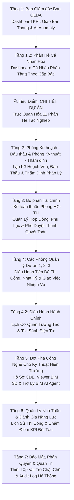

# CHƯƠNG TRÌNH LÀM VIỆC LẦN 2: CHUYÊN ĐỀ CHUYỂN ĐỔI SỐ & TRÌNH DIỄN HỆ THỐNG ĐIỀU HÀNH SỐ (CIC QLDA)
*Giữa Đơn vị tư vấn CIC và Ban QLDA Đầu tư Xây dựng công trình Dân dụng và Hạ tầng khu vực tỉnh Hà Tĩnh (Ban QLDA DDCN HT)*

---

## 📌 THÔNG TIN CHUNG

* **Thời gian thực hiện:** Ngày làm việc theo kế hoạch (Tháng 6)
* **Địa điểm:** Hội trường lớn Ban QLDA (Buổi sáng) và Phòng họp làm việc chuyên môn (Buổi chiều)
* **Thành phần tham dự:**
  * **Phía Ban QLDA:** Ban Giám đốc, đại diện Đảng ủy, Công đoàn, Trưởng/Phó các phòng chuyên môn: Phòng Hành chính – Tổng hợp, Phòng Kế hoạch – Đấu thầu, Phòng Kỹ thuật – Thẩm định, các Phòng QLDA 1, 2, 3 và Phòng Phát triển dịch vụ cùng toàn thể chuyên viên kỹ thuật.
  * **Phía Đơn vị tư vấn CIC:** Tổng giám đốc CIC, Đại diện bộ phận Phát triển phần mềm (Tác giả hệ thống), cùng Tổ chuyên gia chuyển đổi số.

---

## 📅 KHUNG CHƯƠNG TRÌNH LÀM VIỆC TRONG NGÀY

| Thời gian | TT | Nội dung chương trình | Đơn vị chủ trì / Thực hiện | Ghi chú |
|:---|:---:|:---|:---|:---|
| **BUỔI SÁNG** | **A** | **PHIÊN TOÀN THỂ BAN QLDA** | | |
| 07h30 - 08h30 | I - IV | Chào cờ đầu tháng, Đánh giá công tác và Chỉ đạo của Đảng ủy, Ban Giám đốc Ban QLDA. | Văn phòng Đảng ủy, Công đoàn, Phòng HC-TH | Theo chương trình nội bộ của Ban |
| **08h30 - 11h30** | **V** | **Sinh hoạt chuyên đề Chuyển đổi số tại Ban QLDA & Trình diễn Hệ thống CIC QLDA** | **Đơn vị tư vấn CIC** | **TV giới thiệu hệ thống điều hành số thế hệ mới tích hợp 3D BIM & Trợ lý AI (Toàn thể Ban QLDA)** |
| **BUỔI CHIỀU** | **B** | **PHIÊN LÀM VIỆC CHUYÊN SÂU THEO PHÒNG BAN** | | |
| **13h30 - 14h30** | 1 | Tư vấn làm việc chuyên sâu với **Phòng Kế hoạch – Đấu thầu** | Đơn vị tư vấn CIC & Toàn bộ Phòng KH-ĐT | Chi tiết Lập kế hoạch vốn, Kế hoạch đấu thầu và Đồng bộ cổng thông tin |
| **14h30 - 15h30** | 2 | Tư vấn làm việc chuyên sâu với **Phòng Kỹ thuật – Thẩm định** | Đơn vị tư vấn CIC & Toàn bộ Phòng KT-TĐ | Chi tiết thẩm định thiết kế, dự toán, văn bản quy chuẩn xây dựng |
| **15h30 - 16h30** | 3 | Tư vấn làm việc chuyên sâu với **3 Phòng Quản lý Dự án (Phòng QLDA 1, 2, 3)** | Đơn vị tư vấn CIC & Toàn bộ Kỹ sư QLDA | Chi tiết nhật ký thi công, S-Curve tiến độ, cập nhật ảnh hiện trường và BIM |
| **16h30 - 17h30** | 4 | Tư vấn làm việc và kết luận với **Ban Giám đốc, các Trưởng phòng & Phòng Hành chính – Tổng hợp** | Đơn vị tư vấn CIC, Ban Giám đốc, Phòng HC-TH | Chi tiết quản lý tài chính kế toán, phê duyệt thanh quyết toán và ký số |

---

## 🎬 PHẦN V: KỊCH BẢN CHI TIẾT TRÌNH DIỄN HỆ THỐNG ĐIỀU HÀNH SỐ (08h30 - 11h30)
*(Nội dung kịch bản Demo chi tiết được chuyển giao từ Tài liệu Kịch bản Demo CIC QLDA)*

### 📌 TỔNG QUAN VỀ PHIÊN TRÌNH DIỄN
* **Mục tiêu:** Chứng minh năng lực đáp ứng thực tế của hệ thống CIC QLDA, giải quyết triệt để các khó khăn trong quản lý đầu tư xây dựng, đấu thầu, hợp đồng, giải ngân vốn đầu tư công và thi công hiện trường.
* **Tiếp cận Top-Down (Từ trên xuống dưới):** Trình diễn từ bức tranh vĩ mô của Ban Giám đốc xuống quy trình tác nghiệp của các phòng chuyên môn chuyên nghiệp và cuối cùng là công nghệ tích hợp BIM 3D & Trợ lý AI thông minh.
* **Vai trò tham gia (CIC Roleplay):**
  * **Presenter chính (Đại diện tư vấn CIC):** Trình bày mạch kịch bản chính, phân tích lợi ích nghiệp vụ và điều phối cuộc họp.
  * **Kỹ thuật viên hỗ trợ (CIC Tech Support):** Thao tác trực tiếp hệ thống trên màn hình chiếu. Sử dụng tính năng **Giả lập tài khoản (Impersonation)** để chuyển đổi qua lại giữa các vai trò (Giám đốc, Trưởng phòng Kế hoạch - Đấu thầu, Chuyên viên QLDA, Nhà thầu...) mà không cần đăng xuất.

---

### 🗺️ TỔNG THỂ KHUNG TRÌNH DIỄN (TOP-DOWN)

---

## 📋 TỔNG QUAN TÍNH NĂNG 13 PHÂN HỆ THEO TRÌNH TỰ SIDEBAR
*Hệ thống CIC QLDA được thiết kế đồng bộ, liên kết dữ liệu đa tầng nhằm số hóa toàn diện quy trình nghiệp vụ thực tế của Ban QLDA theo đúng giao diện hiển thị trên thanh Sidebar:*

### 1️⃣ Tổng quan (`/` - System Dashboard & Map)
* **Vai trò:** Giao diện điều hành số tập trung dành cho Ban Giám đốc và các lãnh đạo phòng chuyên môn.
* **Tính năng cốt lõi:**
  * **Khối KPI động (Stat Cards):** Giám sát thời gian thực tổng số dự án đang quản lý (phân tách rõ 3 giai đoạn: Chuẩn bị đầu tư, Thực hiện dự án, Kết thúc dự án), Lũy kế giải ngân dòng vốn, Kế hoạch vốn năm và Tình hình giải ngân năm.
  * **AI Summary Widget:** Trợ lý trí tuệ nhân tạo Gemini quét và đưa ra báo cáo nhanh tình trạng hệ thống, tự động cảnh báo các "điểm nóng" (trễ hạn, giải ngân thấp) trong vòng 5 giây.
  * **Biểu đồ điều hành (Charts):** So sánh giải ngân và giám sát tiến độ công việc trực quan của từng Phòng QLDA 1, 2, 3 để đánh giá hiệu suất.
  * **Bản đồ số dự án & Mỏ vật liệu (Interactive Map):** Tích hợp bản đồ số định vị chính xác vị trí công trình và các mỏ vật liệu xây dựng (Đất, Đá, Cát) cấp phép trên địa bàn Hà Tĩnh, hỗ trợ tối ưu cự ly vận chuyển và điều phối nguồn lực tại công trường.

### 2️⃣ Dashboard cá nhân (`/my-dashboard` - Role-based Dashboard)
* **Vai trò:** Không gian làm việc cá nhân hóa, tối ưu hóa năng suất và giảm thiểu nhiễu thông tin cho từng cán bộ.
* **Phân tầng 3 cấp độ tác nghiệp:**
  * **Cấp chuyên viên (Staff):** Tập trung hiển thị danh sách nhiệm vụ được giao (My Tasks), cảnh báo thời hạn hoàn thành (Deadline), lịch công tác cá nhân và hộp thư xử lý nhanh hồ sơ bị phản hồi.
  * **Cấp Trưởng phòng (Manager):** Giám sát biểu đồ tải trọng công việc của phòng (Team Workload) để phân công khoa học, theo dõi tiến độ tổng thể phòng và trạm duyệt hồ sơ trực tuyến cấp phòng (Pending Approvals).
  * **Cấp Lãnh đạo Ban (Director):** Theo dõi tiến trình thực hiện kết luận, chỉ đạo giao ban toàn cơ quan và hộp ký duyệt số trực tuyến các hồ sơ thanh quyết toán đã qua thẩm định.

### 3️⃣ Lịch cơ quan (`/calendar` - Agency Calendar & Lobby Tivi)
* **Vai trò:** Số hóa công tác điều hành hành chính, đăng ký lịch công tác và điều phối phòng họp thông minh.
* **Tính năng cốt lõi:**
  * **Lịch tương tác kéo thả:** Đăng ký lịch họp, lịch đi hiện trường trực quan thông qua Slide Panel trượt. Hỗ trợ thao tác kéo thả (drag-and-drop) để thay đổi thời gian họp nhanh và tự động gửi thông báo qua email/hệ thống cho các thành phần tham dự.
  * **Tivi sảnh điện tử (Lobby Display):** Giao diện Dark Mode chuyên dụng dành riêng cho màn hình Tivi sảnh chính hoặc hành lang cơ quan. Tự động đồng bộ và làm tươi dữ liệu mỗi 60 giây, giúp cán bộ và đối tác dễ dàng theo dõi lịch họp của lãnh đạo Ban trong ngày.

### 4️⃣ Quản lý dự án (`/projects` - Project Detail & 11 Tabs)
* **Vai trò:** Cơ sở dữ liệu tập trung, quản lý xuyên suốt toàn bộ vòng đời của từng dự án từ chuẩn bị đầu tư đến quyết toán hoàn thành.
* **Tích hợp 11 tab tác nghiệp chuyên sâu:**
  1. *Tổng quan (`info`):* Lý lịch dự án, thanh Stepper vòng đời dự án (Stage History), thông tin bàn giao/tiếp nhận dự án từ chủ đầu tư cũ, và biểu đồ chênh lệch dòng vốn (`BudgetVarianceCard`).
  2. *Kế hoạch (`plan`):* Lập tiến độ và phân công công việc với 5 chế độ xem linh hoạt (WBS cấu trúc cây, Gantt đường găng, Kanban kéo thả, Nguồn lực nhân sự, Ma trận RACI). Tự động dịch chuyển ngày kế tiếp (Date Propagation) khi công việc trước bị trễ.
  3. *Gói thầu (`packages`):* Sổ tay quản lý đấu thầu và hợp đồng, so sánh giá gói thầu vs giá trúng thầu để đánh giá hiệu quả tiết kiệm ngân sách.
  4. *Thi công (`construction`):* Quản lý nhật ký thi công trực tuyến, biểu đồ tiến độ thực tế so với kế hoạch (S-Curve), thư viện ảnh hiện trường nghiệm thu và tích hợp Weather Widget dự báo thời tiết bằng AI.
  5. *Vốn & Giải ngân (`capital`):* Lập kế hoạch phân bổ vốn trung hạn và hàng năm, lập hồ sơ giải ngân (tạm ứng, thanh toán khối lượng hoàn thành, thu hồi tạm ứng) tự động điền biểu mẫu Bộ Tài chính (Phụ lục 03a/08b) và import dữ liệu Kho bạc.
  6. *Thanh tra (`inspection`):* Ghi nhận quyết định thanh tra, kiểm toán; trực quan hóa các kết luận khắc phục tài chính (thu hồi nộp ngân sách, giảm trừ quyết toán) dưới dạng biểu đồ.
  7. *Quyết toán (`settlement`):* Theo dõi quy trình 5 bước quyết toán dự án hoàn thành theo Nghị định 99/2021/NĐ-CP, cảnh báo thời hạn pháp lý đếm ngược.
  8. *Quy trình (`workflow`):* Vận hành và giám sát các luồng phê duyệt hồ sơ nội bộ Ban QLDA (duyệt thiết kế 1 bước, 2 bước, 3 bước) tích hợp ký duyệt trực tiếp trên Slide Panel.
  9. *GPMB (`clearance`):* Quản lý đền bù giải phóng mặt bằng với 16 bước Milestone chuẩn hóa, giám sát diện tích bàn giao, số hộ dân tái định cư và tiến độ giải ngân kinh phí đền bù.
  10. *Hồ sơ (`documents`):* Tủ hồ sơ số hóa dự án, tích hợp AI Compliance Panel quét phát hiện các văn bản còn thiếu so với quy định pháp luật xây dựng hiện hành và AI Document Drafter tự động soạn thảo tờ trình.
  11. *Đồng bộ CSDL (`tt24`):* Danh mục hồ sơ chuẩn hóa Phần A & B theo Thông tư 24/2021/TT-BXD, tích hợp AI OCR trích xuất thông tin tự động từ file PDF quyết định ký số để điền vào hệ thống.

### 5️⃣ Quản lý công việc (`/work-plan` - Work Management)
* **Vai trò:** Quản trị kỷ luật công vụ của toàn bộ cán bộ và các phòng ban trực thuộc ngoài phạm vi dự án riêng lẻ.
* **Hệ thống 3 Tab nghiệp vụ chuẩn hóa:**
  * **Công việc (`tasks`):** Khối KPI động toàn cơ quan, 4 bộ lọc nhanh kỷ luật (Việc của tôi, Quá hạn, Chưa cập nhật tuần này, Chờ duyệt đề xuất), và danh sách công việc phân nhóm theo dự án tích hợp xuất/nhập Excel hàng loạt (`exceljs`).
  * **KH khung năm (`annual`):** Lập kế hoạch khung định hướng chiến lược cả năm của phòng ban được lãnh đạo duyệt, làm cơ sở để phân rã nhiệm vụ chi tiết.
  * **Báo cáo tháng (`monthly-report`):** Số hóa quy trình lập kế hoạch tháng mới (`plan`) và tự động tổng hợp kết quả sản lượng hoàn thành để xuất báo cáo giao ban tháng (`report`) định dạng Excel/PDF gửi Ban Giám đốc chỉ trong 1 chạm.

### 6️⃣ Nhân sự (`/employees` - Human Resources)
* **Vai trò:** Quản lý cơ cấu tổ chức, hồ sơ lý lịch cán bộ của toàn Ban QLDA.
* **Tính năng cốt lõi:**
  * Số hóa hồ sơ cán bộ trực tuyến, lưu trữ quá trình công tác, bằng cấp chuyên môn và chứng chỉ hành nghề xây dựng.
  * Quản trị phân quyền tài khoản chặt chẽ theo ma trận vai trò, kết nối chặt chẽ với Team Workload trên các Dashboard cấp quản lý để theo dõi định mức tải công việc và đánh giá KPI cuối tháng.

### 7️⃣ Tài sản công (`/assets` - Public Assets)
* **Vai trò:** Quản lý chặt chẽ vòng đời của toàn bộ tài sản công được giao cho Ban QLDA quản lý và sử dụng.
* **Tính năng cốt lõi:**
  * Quản lý danh mục tài sản văn phòng, phương tiện công tác (xe công), thiết bị đo đạc hiện trường chuyên dụng.
  * Ghi vết toàn bộ quá trình từ mua sắm, cấp phát sử dụng cho từng phòng ban/cán bộ, bảo dưỡng định kỳ, tính toán khấu hao tài sản tự động đến khi làm thủ tục thanh lý tài sản theo đúng quy chuẩn Nghị định Tài sản công.

### 8️⃣ Nhà thầu (`/contractors` - Contractor Management)
* **Vai trò:** Quản lý cơ sở dữ liệu đối tác thi công, tư vấn và đánh giá năng lực nhà thầu.
* **Tính năng cốt lõi:**
  * Số hóa hồ sơ năng lực của từng nhà thầu đơn lẻ hoặc liên danh, lưu vết lịch sử thực hiện các gói thầu tại Ban QLDA.
  * Hệ thống chấm điểm KPI nhà thầu tự động dựa trên kết quả nghiệm thu thực tế hiện trường (chất lượng thi công, mức độ tuân thủ tiến độ, an toàn lao động, sự phối hợp thanh quyết toán) làm cơ sở tham chiếu khách quan cho công tác đấu thầu trong tương lai.

### 9️⃣ Đấu thầu & Hợp đồng (`/bidding` - Bidding & Contracts)
* **Vai trò:** Số hóa toàn diện quy trình lựa chọn nhà thầu và quản lý hợp đồng kinh tế.
* **Tính năng cốt lõi:**
  * Quản lý tiến trình đấu thầu qua mạng (lập hồ sơ mời thầu, hồ sơ yêu cầu, làm rõ thầu, mở thầu và phê duyệt quyết định trúng thầu).
  * Quản lý chặt chẽ thông tin hợp đồng kinh tế, theo dõi bảo lãnh thực hiện hợp đồng, thời hạn hiệu lực hợp đồng. Ghi nhận chính xác các Phụ lục hợp đồng điều chỉnh quy mô, phát sinh khối lượng và gia hạn tiến độ.

### 🔟 KH Vốn & Giải ngân (`/capital-planning` - Capital & Disbursement)
* **Vai trò:** Kiểm soát tối cao nguồn lực tài chính đầu tư công của toàn Ban QLDA.
* **Tính năng cốt lõi:**
  * Lập kế hoạch vốn đầu tư trung hạn 5 năm của Ban và phân bổ chi tiết kế hoạch vốn hàng năm được Ủy ban tỉnh giao.
  * Tự động hóa tính toán giá trị tạm ứng, theo dõi tỷ lệ thu hồi tạm ứng tự động và kết xuất phụ lục thanh toán khối lượng hoàn thành theo Biểu mẫu Phụ lục 03a và 08b của Bộ Tài chính gửi Kho bạc Nhà nước. Tích hợp thanh cảnh báo rủi ro dòng vốn (`CapitalAlertBanner`).

### 1️⃣1️⃣ Môi trường dữ liệu chung CDE (`/cde` - Common Data Environment)
* **Vai trò:** Nền tảng số quản lý và lưu trữ tập trung toàn bộ hồ sơ thiết kế, bản vẽ và văn bản dự án.
* **Tính năng cốt lõi:**
  * Cấu trúc cây thư mục hồ sơ khoa học phân tầng theo giai đoạn dự án. Hỗ trợ xem trực tuyến các định dạng bản vẽ 2D/3D (PDF, DWG...) trực tiếp trên Web với tốc độ cực nhanh mà không cần cài đặt phần mềm chuyên ngành.
  * Quản lý phiên bản tài liệu (Version Control) chặt chẽ, tự động ghi vết người sửa đổi và hỗ trợ so sánh nhanh sự khác biệt giữa các phiên bản bản vẽ thiết kế kỹ thuật.

### 1️⃣2️⃣ Mô hình BIM (`/bim` - 3D BIM Viewer & AI Agent)
* **Vai trò:** Ứng dụng công nghệ số hóa mô hình 3D công trình tích hợp Trí tuệ nhân tạo (Generative AI).
* **Tính năng cốt lõi:**
  * Nền tảng Web Viewer BIM 3D chuẩn IFC mượt mà, hỗ trợ các thao tác xoay, zoom, cắt lớp trực quan, nhấp chọn cấu kiện để xem thuộc tính kỹ thuật chi tiết.
  * **Trợ lý BIM AI Agent (BIM Chatbot):** Tích hợp hộp chat AI thông minh, cho phép kỹ sư/lãnh đạo gõ câu hỏi bằng Tiếng Việt tự nhiên (Ví dụ: *"Tính thể tích dầm sàn tầng 3?"*) để AI tự động truy vấn dữ liệu BIM trả về kết quả số liệu tức thì, hoặc yêu cầu AI tự động tô màu đỏ (Highlight) trực quan các cấu kiện chưa được nghiệm thu trực tiếp trên mô hình 3D.

### 1️⃣3️⃣ Văn bản pháp luật (`/legal-documents` hoặc `/regulations`)
* **Vai trò:** Thư viện số hóa toàn bộ hệ thống văn bản quy phạm pháp luật xây dựng và quyết định pháp lý của Ban QLDA.
* **Tính năng cốt lõi:**
  * Lưu trữ tập trung các Nghị định, Thông tư, Quy chuẩn kỹ thuật xây dựng và các Quyết định nội bộ của Ban QLDA.
  * Tích hợp công nghệ AI OCR trích xuất thông tin tự động khi tải lên file PDF đã ký số, giúp tự động điền các thông tin pháp lý (số hiệu, ngày ban hành, người ký) vào cơ sở dữ liệu hệ thống, phục vụ công tác tra cứu nhanh của cán bộ.

---

### 🔑 Giai đoạn khởi động: Thiết lập bối cảnh demo (5 phút)
* **Thao tác:** Presenter truy cập vào màn hình đăng nhập hệ thống (`/login`).
* **Lời thoại Presenter:** 
  > *"Kính thưa Ban Giám đốc cùng toàn thể các đồng chí cán bộ, Trưởng, Phó phòng chuyên môn Ban QLDA Đầu tư Xây dựng công trình Dân dụng và Hạ tầng khu vực tỉnh Hà Tĩnh.
  > 
  > Nhằm thực hiện có hiệu quả Kế hoạch chuyển đổi số trong công tác quản lý dự án đầu tư xây dựng sử dụng vốn đầu tư công, Đơn vị tư vấn CIC đã phối hợp cùng Ban QLDA triển khai giải pháp Hệ thống điều hành số thống nhất CIC QLDA. Hệ thống được xây dựng đồng bộ nhằm tối ưu hóa quy trình tác nghiệp, củng cố kỷ cương công vụ và bảo đảm tính tuân thủ pháp luật nghiêm túc trong hoạt động đầu tư xây dựng của Ban.
  > 
  > Báo cáo Ban Giám đốc và hội nghị, trước khi đi vào trình diễn chi tiết các kịch bản nghiệp vụ tác nghiệp thực tế, tôi xin phép được giới thiệu khái quát cơ cấu vận hành của hệ thống thông qua **13 phân hệ chức năng cốt lõi** được sắp xếp đồng bộ theo đúng trình tự trên thanh Sidebar điều hành bên trái màn hình như sau:
  > 
  > * **Phân hệ thứ 1 - Tổng quan:** Đóng vai trò là trung tâm điều hành số tích hợp bản đồ số GIS và trợ lý trí tuệ nhân tạo Gemini, cung cấp cho Ban Giám đốc bức tranh tổng thể thời gian thực về sức khỏe các dự án, tiến độ giải ngân dòng vốn và định vị các mỏ vật liệu xây dựng (Đất, Đá, Cát) cấp phép trên địa bàn tỉnh.
  > * **Phân hệ thứ 2 - Dashboard cá nhân:** Thiết lập không gian làm việc chuyên biệt, cá nhân hóa phân tầng theo 3 cấp độ (Chuyên viên tác nghiệp, Trưởng phòng chuyên môn, và Lãnh đạo Ban) nhằm phân định rõ thẩm quyền và trách nhiệm công vụ của từng cán bộ.
  > * **Phân hệ thứ 3 - Lịch cơ quan:** Thực hiện số hóa toàn diện công tác đăng ký, phê duyệt lịch họp, điều phối phòng họp trực quan và hỗ trợ phương thức trình chiếu lịch công tác tự động trên hệ thống Tivi sảnh điện tử treo tại trụ sở Ban.
  > * **Phân hệ thứ 4 - Quản lý dự án:** Đây là trọng tâm tác nghiệp chuyên sâu, quản lý toàn diện vòng đời công trình qua 11 tab liên thông: từ lý lịch dự án, kế hoạch WBS/Gantt, theo dõi thi công thực tế (S-Curve & thời tiết AI), lập hồ sơ vốn giải ngân, đến thanh tra kiểm toán, giải phóng mặt bằng, quản lý quy trình, hồ sơ và quyết toán vốn hoàn thành.
  > * **Phân hệ thứ 5 - Quản lý công việc:** Trạm kiểm soát và đánh giá kỷ luật công vụ của toàn bộ các phòng ban trực thuộc thông qua 3 tab nghiệp vụ thống nhất: Công việc tác nghiệp hàng ngày, Kế hoạch khung năm định hướng và Báo cáo giao ban tháng.
  > * **Phân hệ thứ 6 - Nhân sự:** Quản lý cơ cấu tổ chức, quá trình công tác, năng lực chuyên môn của đội ngũ cán bộ, đồng thời theo dõi Team Workload làm cơ sở khoa học để đánh giá KPI hàng tháng.
  > * **Phân hệ thứ 7 - Tài sản công:** Giám sát chặt chẽ toàn bộ vòng đời tài sản công của Ban từ khâu mua sắm, cấp phát sử dụng, bảo dưỡng định kỳ, tính khấu hao tự động đến thanh lý theo đúng Nghị định của Chính phủ.
  > * **Phân hệ thứ 8 - Nhà thầu:** Lưu trữ cơ sở dữ liệu hồ sơ năng lực và tự động chấm điểm KPI nhà thầu dựa trên kết quả thi công, nghiệm thu thực tế tại hiện trường các gói thầu.
  > * **Phân hệ thứ 9 - Đấu thầu & Hợp đồng:** Số hóa quy trình đấu thầu qua mạng, quản lý hồ sơ mời thầu, thông tin hợp đồng kinh tế và các phụ lục điều chỉnh phát sinh quy mô xây lắp, thiết bị.
  > * **Phân hệ thứ 10 - KH Vốn & Giải ngân:** Kiểm soát kế hoạch phân bổ vốn đầu tư trung hạn và hàng năm được giao, tự động hóa tính toán giá trị thanh quyết toán và kết xuất biểu mẫu Phụ lục 03a/08b của Bộ Tài chính để gửi Kho bạc Nhà nước.
  > * **Phân hệ thứ 11 - Môi trường dữ liệu chung CDE:** Quản lý tập trung toàn bộ bản vẽ thiết kế 2D/3D, bảo đảm lưu vết lịch sử phiên bản và tích hợp trình xem bản vẽ trực tuyến tốc độ cao không cần phần mềm chuyên dụng.
  > * **Phân hệ thứ 12 - Mô hình BIM:** Tích hợp Viewer BIM 3D trực tuyến chuẩn IFC kết hợp Trợ lý BIM AI Agent giúp bóc tách khối lượng và highlight trực quan cấu kiện trên mô hình 3D qua câu hỏi Tiếng Việt tự nhiên.
  > * **Phân hệ thứ 13 - Văn bản pháp luật:** Thư viện số hóa toàn bộ hệ thống văn bản quy phạm pháp luật xây dựng và quyết định pháp lý của Ban QLDA, tích hợp công nghệ AI OCR trích xuất thông tin tự động từ file PDF quyết định đã ký số.
  > 
  > Kính thưa Ban Giám đốc, sau đây đơn vị tư vấn xin phép bắt đầu phiên trình diễn chi tiết bằng góc nhìn điều hành vĩ mô của Giám đốc Ban QLDA."*
* **Thao tác phần mềm:** Đăng nhập với vai trò **Giám đốc Ban QLDA** để vào màn hình Dashboard chính (`/`).

---

### 📊 TẦNG 1: DÀNH CHO BAN GIÁM ĐỐC BAN QLDA (15 Phút)
#### Phân hệ: Dashboard Điều Hành, Phòng Giao Ban Tháng & Phân Tích AI

Presenter lần lượt trình bày qua 3 Tab tương tác cốt lõi trên Dashboard điều hành:

##### 📌 TAB 1: TỔNG QUAN HỆ THỐNG (`overview`)
* **Mục tiêu:** Kiểm soát tức thời sức khỏe các dự án, tiến độ giải ngân dòng vốn và điểm nóng hiện trường.

1. **Khối 4 Chỉ số KPI chính (Stat Cards):**
   * **Dự án đang quản lý:** Hiển thị tổng số lượng dự án đang triển khai, phân loại theo 3 giai đoạn: Chuẩn bị đầu tư, Thực hiện dự án, và Kết thúc dự án.
   * **Lũy kế giải ngân:** Tổng giá trị đã giải ngân lũy kế kèm thanh tiến trình trực quan thể hiện Tỷ lệ giải ngân lũy kế trên tổng mức đầu tư.
   * **Kế hoạch vốn năm:** Tổng số vốn được phân bổ trong năm kế hoạch hiện tại.
   * **Giải ngân năm:** Thực tế đã giải ngân trong năm hiện tại so với kế hoạch năm, đi kèm thanh tiến trình Tiến độ giải ngân năm.

2. **Các Biểu đồ Điều hành Thông minh (Charts):**
   * **AI Summary Widget:** Trợ lý AI tự động quét dữ liệu và đưa ra tóm tắt thông minh bằng văn bản giúp lãnh đạo nắm bắt "điểm nóng" trong 5 giây.
   * **Biểu đồ Trạng thái Dự án theo Phòng Quản lý:** Biểu đồ cột chồng thể hiện cơ cấu trạng thái dự án (Chuẩn bị, Thực hiện, Kết thúc) được phân bổ cụ thể cho Phòng QLDA 1, Phòng QLDA 2, và Phòng QLDA 3.
   * **Biểu đồ So sánh Giải ngân theo các Phòng QLDA:** Trực quan hóa số vốn kế hoạch và số vốn thực tế đã giải ngân dưới dạng cột kép.
   * **Biểu đồ Trạng thái Công việc (Task Completion Chart):** Biểu đồ thể hiện phần trăm công việc Hoàn thành đúng hạn, Trễ hạn, Đang thực hiện của các phòng ban để theo dõi trạng thái công việc chứ không xếp hạng thi đua.

3. **Bản đồ số Vị trí Dự án & Mỏ vật liệu (Interactive Map):**
   * **Thao tác:** Bật/tắt các lớp bản đồ dự án và mỏ vật liệu. Tìm kiếm một mỏ cát trên bản đồ.
   * **Điểm nhấn đột phá:** Định vị vị trí dự án và các **Mỏ vật liệu xây dựng (Đất, Đá, Cát)**. Giúp Giám đốc Ban QLDA theo dõi trực quan cự ly vận chuyển phục vụ công tác điều phối vật liệu cấp bách tại hiện trường.

##### 📌 TAB 2: BÁO CÁO GIAO BAN THÁNG (`monthly`)
* **Mục tiêu:** Chuyển đổi cuộc họp giao ban tháng thành không gian làm việc điều hành số trực tiếp thời gian thực.
* **Các điểm nhấn thao tác:**
  * **Khối KPI Giao ban & Thanh công cụ:** Thay đổi tháng trên thanh công cụ giao ban để hiển thị dữ liệu tức thời. Click nút "Xem Báo cáo giao ban" để hiển thị cửa sổ `MonthlyReportModal`.
  * **DeptTaskSummary:** Trực quan hóa tiến độ xử lý công việc của từng phòng trực thuộc, phân nhóm theo loại nhiệm vụ.
  * **ProjectAccordion (Hiện trường & Chỉ đạo giao ban):** Hiển thị các phản ánh vướng mắc từ công trường. Giám đốc trực tiếp gõ ý kiến chỉ đạo kết luận ngay trên giao diện giao ban. Click nút **"Giao việc nhanh"** phân công cho cán bộ và ấn định thời hạn xử lý.

##### 📌 TAB 3: TRỢ LÝ TRÍ TUỆ NHÂN TẠO AI (`ai`)
* **Mục tiêu:** Trình diễn năng lực phân tích dữ liệu thông minh đỉnh cao của hệ thống hỗ trợ ra quyết định.
* **Nghiệp vụ:**
  * **AIRiskDashboard (Dự báo rủi ro):** Dự báo nguy cơ trễ hạn tiến độ, rủi ro vượt dự toán ngân sách, rủi ro biến động giá vật liệu.
  * **AIAnomalyDetector (Phát hiện điểm bất thường):** Cảnh báo khối lượng nghiệm thu thanh toán tăng vọt bất thường hoặc dự toán phát sinh vượt quá hạn mức định mức xây dựng.
  * **AIContractorScoring (Chấm điểm nhà thầu):** Đánh giá uy tín nhà thầu dựa trên lịch sử thi công để lãnh đạo lựa chọn đối tác tin cậy.

---

### 👤 TẦNG 1.2: DASHBOARD CÁ NHÂN PHÂN TẦNG THÔNG MINH (`/my-dashboard`) (10 Phút)
* **Mục tiêu:** Chứng minh hệ thống được thiết kế theo hướng cá nhân hóa tối đa (Role-based Personalization), khớp hoàn toàn với vị trí công tác và thẩm quyền chuyên môn.
* **Trình diễn qua 3 cấp độ Dashboard cá nhân:**
  1. **Cấp độ Chuyên viên / Cán bộ kỹ thuật (`StaffDashboard`):** Hiển thị công việc được giao trực tiếp (My Tasks), cảnh báo deadline khẩn, lịch công tác cá nhân, và hộp thư hành động nhận hồ sơ bị trả về cần sửa đổi.
  2. **Cấp độ Trưởng phòng / Phó phòng chuyên môn (`ManagerDashboard`):** Biểu đồ tải trọng công việc của phòng (Team Workload Chart) để điều phối nhân sự, giám sát tiến độ phòng ban, và hộp phê duyệt cấp phòng (Pending Approvals).
  3. **Cấp độ Lãnh đạo Ban QLDA (`DirectorDashboard`):** Theo dõi tiến độ thực hiện chỉ đạo giao ban của các phòng ban, hộp ký duyệt trực tuyến cấp Ban các hồ sơ thanh toán, tờ trình đấu thầu đã được thẩm định xong.

---

### 🔍 TIÊU ĐIỂM: KHÁM PHÁ CHI TIẾT DỰ ÁN (PROJECT DETAIL)
#### Trực Quan Hóa 11 Phân Hệ Tác Nghiệp Chuyên Sâu (30 Phút)

* **Mục tiêu:** Giới thiệu cơ sở dữ liệu tích hợp của một dự án được phân chia thành **11 tab tác nghiệp chuyên sâu**, quản lý liên thông toàn bộ vòng đời công trình từ giai đoạn chuẩn bị đầu tư đến quyết toán hoàn thành.
* **Giao diện Header Dự án:** Giới thiệu nút **"Tóm tắt AI"** (quét toàn bộ dự án xuất tóm tắt bằng Gemini trong 5 giây) và nút **"3D BIM"** (kết nối nhanh tới bản vẽ 3D).

#### 📌 CHI TIẾT 11 TAB TÁC NGHIỆP:

##### Tab 1️⃣: TỔNG QUAN (`info`) - Bức Tranh Toàn Cảnh
* **Bố cục:** Layout 3 cột cực kỳ hiện đại (2/3 bên trái dành cho thông tin kỹ thuật & tiến độ, 1/3 bên phải dành cho nhân sự, mốc thời gian và hành động nhanh).
* **Hiển thị:** Stepper vòng đời dự án (Stage History), lý lịch dự án (nhóm dự án, chuyên ngành, tổng dự toán, quy mô đất đai, số tầng), thông tin bàn giao tiếp nhận (ngày bàn giao, công nợ trước/sau bàn giao, chậm tiến độ, nguyên nhân), biểu đồ tiến độ dòng vốn (`BudgetVarianceCard`).
* **Hành động:** Nút "Đồng bộ CSDL QG", nút "Tạo báo cáo giám sát" tự động xuất file Word.

##### Tab 2️⃣: KẾ HOẠCH (`plan`) - Phân Rã Công Việc & Biểu Đồ Gantt
* **5 Chế độ xem:** WBS (cấu trúc hình cây), Gantt (timeline đường găng), Kanban (kéo thả trạng thái công việc), Nguồn lực (giao việc theo cán bộ), RACI (ma trận phân định trách nhiệm).
* **Tương tác:** Khởi tạo kế hoạch tổng thể từ template mẫu theo Nghị định 15 hoặc quy định ODA. Tính năng tự động dịch chuyển ngày (Date Propagation) khi công việc trước bị chậm trễ.

##### Tab 3️⃣: GÓI THẦU (`packages`) - Đấu Thầu & Hợp Đồng
* **Hiển thị:** Bảng danh sách gói thầu phẳng cho phép kéo thả sắp xếp thứ tự ưu tiên. Hiển thị giá gói thầu vs giá trúng thầu để so sánh hiệu quả tiết kiệm ngân sách.
* **Tác nghiệp:** Click chọn gói thầu trượt ra Slide Panel chi tiết (HSMT, quyết định trúng thầu, thông tin hợp đồng). Hỗ trợ xuất danh mục gói thầu ra Excel báo cáo Sở KH&ĐT.

##### Tab 4️⃣: THI CÔNG (`construction`) - Nhật Ký & Tiến Độ Hiện Trường
* **4 Sub-tab đặc dụng:**
  1. *Tổng quan:* Điểm sức khỏe công trường, tỷ lệ lệch tiến độ (`Slippage`), **Biểu đồ S-Curve** đường cong tiến độ thực tế vs kế hoạch. Tích hợp **Weather Widget** dự báo thời tiết 7 ngày qua API và đề xuất thi công bằng AI.
  2. *Nhật ký thi công:* Lập nhật ký hàng ngày trực tuyến, sao chép nhật ký từ ngày hôm trước, xuất nhật ký thi công ra file Word (.docx).
  3. *Tiến độ nhà thầu:* Khối lượng chi tiết từng hạng mục, biểu đồ biến động nhân lực thi công theo từng ngày.
  4. *Ảnh hiện trường:* Thư viện ảnh chụp thực tế thi công tải lên trực tiếp bằng điện thoại di động làm bằng chứng nghiệm thu trực quan.

##### Tab 5️⃣: VỐN & GIẢI NGÂN (`capital`) - Kiểm Soát Dòng Tiền
* **Giao diện:** Banner cảnh báo tự động rủi ro vốn (`CapitalAlertBanner`). Biểu đồ tròn Donut cơ cấu nguồn vốn (Vốn trung ương, tỉnh, ODA...). Biểu đồ so sánh kế hoạch giải ngân theo tháng vs thực tế.
* **Tương tác:** Thêm/sửa/xóa kế hoạch vốn trung hạn và hàng năm (validate không vượt tổng mức đầu tư). Lập hồ sơ giải ngân chi tiết (Tạm ứng, Thanh toán khối lượng hoàn thành, Thu hồi tạm ứng). Hỗ trợ import giải ngân từ Excel Kho bạc Nhà nước.

##### Tab 6️⃣: THANH TRA (`inspection`) - Quản Lý Kiểm Tán & Thanh Tra
* **VisualConclusion Dashboard:** Trực quan hóa kết luận thanh tra, kiểm toán thành biểu đồ trực quan (kiến nghị thu hồi nộp ngân sách, số tiền giảm trừ khi quyết toán hợp đồng, trạng thái xử lý hành chính).
* **Tác nghiệp:** Cập nhật quyết định thanh tra, biên bản giải trình, và theo dõi tiến độ khắc phục sai phạm trực tuyến.

##### Tab 7️⃣: QUYẾT TOÁN (`settlement`) - Quyết Toán Vốn Hoàn Thành
* **Quy trình:** Stepper 5 bước quyết toán chuẩn Nghị định 99/2021/NĐ-CP (Hoàn công -> Kiểm toán nội bộ -> Kiểm toán độc lập -> Phê duyệt quyết toán -> Bàn giao & Lưu trữ).
* **Bảng quyết toán:** Tổng hợp và đối chiếu giá trị hợp đồng gốc vs thực tế đã thanh toán vs giá trị đề nghị quyết toán vs giá trị phê duyệt quyết toán. Cảnh báo thời hạn pháp lý đếm ngược ngày phải hoàn thành phê duyệt quyết toán.

##### Tab 8️⃣: QUY TRÌNH (`workflow`) - Công Cụ Vận Hành Chuẩn Hóa
* **Vận hành:** Thiết lập luồng phê duyệt hồ sơ nội bộ Ban QLDA (quy trình duyệt thiết kế 1 bước, 2 bước, 3 bước tuân thủ Luật Xây dựng mới nhất).
* **WorkflowVisualizer:** Trực quan hóa sơ đồ phê duyệt (flowchart) thể hiện rõ hồ sơ đang nằm ở bước nào, cán bộ nào thụ lý. Cho phép Phê duyệt (Approve) hoặc Từ chối (Reject) ngay trên Slide Panel trượt.

##### Tab 9️⃣: GPMB (`clearance`) - Bồi Thường & Tái Định Cư
* **KPI GPMB:** Diện tích đất cần thu hồi vs thực tế đã bàn giao, số hộ dân tái định cư, kinh phí bồi thường được duyệt vs lũy kế chi trả bồi thường.
* **Thủ tục:** Trực quan hóa 16 bước Milestone GPMB theo quy chuẩn địa phương (áp giá bồi thường, đo đạc địa chính, bồi thường, cưỡng chế nếu có). Cho phép cập nhật trạng thái và ghi chú vướng mắc từng bước.

##### Tab 🔟: HỒ SƠ (`documents`) - Kho Tàng Bản Vẽ & AI Trích Xuất
* **Quản lý:** Phân loại tài liệu tự động vào 3 ngăn kéo tương ứng 3 giai đoạn: Chuẩn bị đầu tư, Thực hiện dự án, Kết thúc dự án.
* **Trí tuệ nhân tạo:**
  * *AI Compliance Panel:* AI tự động quét danh mục tài liệu đối chiếu pháp luật hiện hành và cảnh báo các văn bản còn thiếu.
  * *AI Document Drafter:* AI tự động đọc dữ liệu dự án để soạn thảo dự thảo tờ trình, báo cáo tuần chuẩn thể thức hành chính.

##### Tab 1️⃣1️⃣: ĐỒNG BỘ CSDL (`tt24`) - Tuân Thủ Thông Tư 24
* **Số hóa:** Mục lục hồ sơ chuẩn Phần A (dữ liệu chung) & Phần B (thiết kế triển khai sau thiết kế cơ sở) theo Thông tư 24/2021/TT-BXD.
* **AI OCR Extraction:** Người dùng upload tệp PDF quyết định ký số, AI tự động quét (OCR) bóc tách số quyết định, ngày ban hành, tổng mức đầu tư được duyệt để tự động điền vào cơ sở dữ liệu hệ thống mà không cần gõ tay.

---

### 📂 PHÂN HỆ QUẢN LÝ CÔNG VIỆC TOÀN BAN (`/work-plan`)
#### Kiểm Soát Kỷ Luật Công Vụ Qua 3 Tab Nghiệp Vụ Toàn Diện (15 Phút)

* **Mục tiêu:** Trình diễn năng lực quản trị công việc toàn cơ quan ngoài phạm vi dự án riêng lẻ. Phân hệ giúp Ban Giám đốc kiểm soát kỷ luật công vụ của toàn bộ các phòng ban thông qua **3 Tab nghiệp vụ chuẩn hóa** khớp 100% giao diện thực tế.
* **Thao tác:** Presenter click vào menu **"Quản lý công việc"** ở Sidebar bên trái để chuyển sang trang `/work-plan`.

---

#### 📌 TAB 1️⃣: CÔNG VIỆC (`tasks`) - Trung Tâm Kiểm Soát & Rà Soát Tác Nghiệp
* **Giao diện tổng quan:** Giao diện bảng lưới hiện đại, tích hợp các bộ lọc thông minh ở góc phải (Dự án, Loại công việc, Trạng thái, Phòng ban thụ lý, Tháng, Năm).
* **Nghiệp vụ:**
  * **Khối KPI Sức khỏe Công vụ:** Tổng số việc đang giao (phòng HC-TH: *59 việc*), tỷ lệ hoàn thành công việc toàn cơ quan (*68%*), và các đầu việc mới (*0 việc*), đang thực hiện (*0 việc*), hoàn thành (*41 việc*), chưa hoàn thành (*19 việc*), quá hạn (*0 việc*).
  * **4 Bộ lọc nhanh Kỷ luật Công vụ:** Click chọn các bộ lọc *Việc của tôi*, *Quá hạn*, *Chưa cập nhật tuần này* (phát hiện việc bỏ quên), và *Chờ duyệt đề xuất* (cán bộ tự lập đề xuất công việc).
  * **Bảng Danh sách Công việc Phân nhóm theo Dự án:** Tên công việc (Lập hồ sơ KB, BCR quyết toán...), Phân loại (Thanh toán, Điều hành, Quyết toán, Điều chỉnh, Báo cáo), Phòng ban (HC-TH), Tiến độ (progress bar), Phụ trách, Trạng thái (CHƯA HOÀN THÀNH/HOÀN THÀNH), Hạn chót và Độ ưu tiên (Trung bình/Cao).
  * **Tác vụ nhanh:** Nhập Excel và Xuất Excel chuyên nghiệp định dạng tự động (`exceljs`) chỉ bằng 1 click.

---

#### 📌 TAB 2️⃣: KH KHUNG NĂM (`annual`) - Định Hướng Chiến Lược Toàn Ban
* **Mục tiêu:** Lập kế hoạch khung cả năm của phòng ban/cơ quan (kế hoạch công tác năm, nhiệm vụ trọng tâm được giao) làm nền tảng pháp lý và định hướng phân rã công việc.

---

#### 📌 TAB 3️⃣: BÁO CÁO THÁNG (`monthly-report`) - Đánh Giá & Xuất Bản Báo Cáo Tự Động
* **Mục tiêu:** Số hóa toàn diện quy trình lập kế hoạch và báo cáo sản lượng hàng tháng của toàn Ban QLDA.
* **2 Phân hệ con (Sub-tabs):**
  * *Kế hoạch tháng (plan)*: Lập kế hoạch làm việc chi tiết cho tháng mới theo từng phòng ban chuyên môn.
  * *Báo cáo tháng (report)*: Hệ thống tự động tổng hợp toàn bộ sản lượng, tiến độ thực tế đã hoàn thành trong tháng để **Xuất báo cáo giao ban tự động (file Excel/PDF)** gửi Ban Giám đốc, giúp tiết kiệm 100% thời gian viết báo cáo giấy thủ công.

---

### 📁 TẦNG 2: DÀNH CHO PHÒNG KẾ HOẠCH - ĐẤU THẦU & PHÒNG KỸ THUẬT - THẨM ĐỊNH (10 Phút)
#### Phân hệ: Lập Kế Hoạch Vốn, Tổ Chức Đấu Thầu & Thẩm Định Pháp Lý (`/capital-planning`, `/bidding` & `/legal-documents`)

* **Mục tiêu:** Trình diễn công cụ hỗ trợ phòng Kế hoạch – Đấu thầu lập kế hoạch nguồn vốn trung hạn/hàng năm, quản lý thủ tục đấu thầu; và phòng Kỹ thuật – Thẩm định quản lý hồ sơ thẩm định thiết kế bản vẽ thi công, dự toán.
* **Các điểm nhấn thao tác trên màn hình:**
  1. **Kế hoạch vốn trung hạn (`/capital-planning`):** Quản lý kế hoạch vốn 5 năm và phân bổ chi tiết theo từng năm tài khóa. Theo dõi sát sao kế hoạch giao vốn của tỉnh.
  2. **Quản lý đấu thầu (`/bidding`):** 
     * Phân nhóm gói thầu theo hình thức đấu thầu (Đấu thầu rộng rãi qua mạng, Chỉ định thầu, Chào hàng cạnh tranh...).
     * Quản lý tiến trình lập hồ sơ mời thầu (HSMT), hồ sơ yêu cầu (HSYC), quá trình làm rõ và mở thầu trực tuyến.
  3. **Thẩm định pháp lý & Kỹ thuật (`/legal-documents` & `/regulations`):**
     * Phòng Kỹ thuật – Thẩm định kiểm tra các Quyết định phê duyệt dự án, Quyết định phê duyệt thiết kế bản vẽ thi công và dự toán.
     * Lưu trữ tập trung toàn bộ văn bản pháp lý từ khâu chủ trương đầu tư, quyết định đầu tư đến kết quả lựa chọn nhà thầu.

---

### 💳 TẦNG 3: DÀNH CHO BỘ PHẬN TÀI CHÍNH - KẾ TOÁN (PHÒNG HÀNH CHÍNH - TỔNG HỢP) (13 Phút)
#### Phân hệ: Quản Lý Hợp Đồng, Phụ Lục Phát Sinh & Phê Duyệt Thanh Quyết Toán (`/bidding?tab=contracts` & `/contracts/:id`)

> [!IMPORTANT]
> Theo Quy chế làm việc thực tế của Ban QLDA, công tác quản lý tài chính, kế toán và giải ngân được giao cho bộ phận chuyên môn trực thuộc **Phòng Hành chính – Tổng hợp**. Phòng này phối hợp chặt chẽ với Kế toán trưởng để kiểm soát dòng tiền và giải ngân.

* **Mục tiêu:** Trình diễn năng lực quản lý hợp đồng chặt chẽ, tự động hóa tính toán giá trị tạm ứng, thu hồi tạm ứng và lập hồ sơ thanh toán khối lượng hoàn thành.
* **Tình huống Demo:** Kế toán kiểm tra hồ sơ thanh toán đợt 2 của Nhà thầu Xây dựng A. Nhà thầu nộp hồ sơ nghiệm thu khối lượng hoàn thành.
* **Các điểm nhấn thao tác trên màn hình:**
  1. **Danh sách Hợp đồng (`/bidding?tab=contracts`):** Xem toàn bộ hợp đồng xây lắp, tư vấn, mua sắm thiết bị. Phân loại theo trạng thái thực hiện.
  2. **Chi tiết Hợp đồng (`/contracts/:id`):**
     * Quản lý thông tin nhà thầu (hoặc liên danh nhà thầu), giá trị hợp đồng gốc, tỷ lệ bảo lãnh thực hiện hợp đồng.
     * Quản lý **Phụ lục hợp đồng**: Ghi nhận toàn bộ việc điều chỉnh quy mô thiết kế, phát sinh tăng/giảm khối lượng và gia hạn thời gian thực hiện.
  3. **Hồ sơ Thanh toán & Biểu mẫu Bộ Tài chính (`/bidding?tab=payments`):**
     * Quản lý giá trị tạm ứng ban đầu và theo dõi tỷ lệ thu hồi tạm ứng tự động qua các đợt thanh toán.
     * **Kết xuất phụ lục thanh toán:** Tự động điền dữ liệu khối lượng nghiệm thu hoàn thành vào **Biểu mẫu Phụ lục 03a** (thanh toán theo hợp đồng) và **Phụ lục 08b** (thanh toán khối lượng phát sinh ngoài hợp đồng) theo đúng quy định hiện hành của Bộ Tài chính.
  4. **Quy trình Phê duyệt Điện tử (Workflow - `/quy-trinh`):**
     * Trình diễn luồng phê duyệt hồ sơ thanh toán trực tuyến: Kỹ sư Phòng QLDA xác nhận hiện trường -> Kế toán Phòng Hành chính – Tổng hợp kiểm tra chứng từ -> Kế toán trưởng soát xét -> Giám đốc Ban ký duyệt.

---

### 📅 TẦNG 4: DÀNH CHO CÁC PHÒNG QUẢN LÝ DỰ ÁN 1, 2, 3 (10 Phút)
#### Phân hệ: Điều Hành Tiến Độ Hiện Trường, Nhật Ký Công Việc & Phân Công Giao Việc (`/work-plan`)

> [!IMPORTANT]
> Ban QLDA gồm có 3 phòng QLDA chuyên biệt: **Phòng QLDA 1** (văn hóa, y tế, giáo dục, khu vực Đức Thọ, Vũ Quang), **Phòng QLDA 2** (dự án ODA, BIG2, khu vực Can Lộc, Cẩm Xuyên), **Phòng QLDA 3** (khu vực Thạch Hà, Hương Khê). Các phòng này trực tiếp bám sát hiện trường thi công.

* **Mục tiêu:** Chứng minh năng lực điều hành chi tiết tiến độ thi công của các kỹ sư QLDA và công tác phối hợp giao việc nội bộ phòng ban.
* **Tình huống Demo:** Trưởng phòng QLDA 2 kiểm tra tiến độ dự án ODA đang thi công và phân công cán bộ kỹ thuật đi kiểm tra hiện trường xử lý sự cố.
* **Các điểm nhấn thao tác trên màn hình:**
  1. **Kế hoạch Công việc Tích hợp (`/work-plan`):**
     * **Annual & Monthly Plan:** Theo dõi kế hoạch khung của dự án đã được Phòng Kế hoạch - Đấu thầu duyệt theo năm/tháng.
     * **Tasks (Phân rã công việc):** Xem chi tiết tiến độ thi công thực tế tại hiện trường (phần móng, phần thân, hoàn thiện) dưới dạng danh sách hoặc biểu đồ Gantt tiến độ.
  2. **Chi tiết Công việc Hiện trường (`/tasks/:id`):** 
     * Kỹ sư QLDA cập nhật phần trăm hoàn thành (% Progress) công việc trực tiếp từ điện thoại di động khi đi hiện trường.
     * Tải ảnh chụp thực tế thi công làm bằng chứng nghiệm thu, viết nhật ký công trình trực tuyến và trao đổi trực tiếp với nhà thầu.

---

### 🗓️ TẦNG 4.2: ĐIỀU HÀNH HÀNH CHÍNH - PHÂN HỆ LỊCH CƠ QUAN & TIVI SẢNH ĐIỆN TỬ (`/calendar`) (10 Phút)
* **Mục tiêu:** Trình diễn năng lực quản lý lịch họp, điều phối phòng họp nội bộ thông minh và tính năng trình chiếu tivi sảnh điện tử.
* **Tình huống Demo:** Chuyên viên phòng Hành chính – Tổng hợp tiếp nhận yêu cầu đăng nhập lịch họp giao ban điều phối dự án và thực hiện kéo thả thay đổi thời gian họp trực quan.

Presenter giới thiệu qua 2 chế độ hiển thị đặc biệt:

#### 1. Chế độ Quản lý Lịch Tương tác (Kéo thả thông minh)
* **Các điểm nhấn thao tác trên màn hình:**
  1. **Đăng ký Lịch mới (`EventFormPanel`):** Click vào ô ngày bất kỳ trên giao diện lịch tháng, một Slide Panel trượt ra. Điền thông tin: Tiêu đề họp, loại lịch, phòng họp đăng ký, và Thành phần tham dự (Attendees).
  2. **Kéo thả drag-and-drop:** Cầm chuột kéo một cuộc họp từ Thứ Ba sang Thứ Tư. Hệ thống hiển thị hộp thoại xác nhận đổi thời gian họp và tự động thông báo nhắc lịch cho toàn bộ cán bộ tham dự.
  3. **Bộ lọc lịch thông minh:** Lọc nhanh lịch theo Phòng họp hoặc loại lịch công tác để kiểm tra xem phòng họp lớn có bị trùng lịch trong ngày không.

#### 2. Chế độ Tivi Sảnh điện tử (`LobbyDisplay` - Tivi sảnh)
* **Thao tác:** Trên thanh điều khiển lịch, click chuyển sang chế độ **"Tivi Sảnh"**.
* **Hiển thị trực quan:** Giao diện lịch chuyển đổi hoàn toàn sang **giao diện Dark Mode chuyên dụng** với font chữ to rõ nét, độ tương phản cực cao, hiển thị danh sách các phòng họp và lịch họp của cơ quan diễn ra trong ngày hôm nay. Treo ở sảnh chính hoặc hành lang cơ quan Ban QLDA. Tự động cập nhật mỗi 60 giây.

---

### 🌐 TẦNG 5: ỨNG DỤNG CÔNG NGHỆ HIỆN ĐẠI - CDE, BIM & TRỢ LÝ BIM AI AGENT (10 Phút)
#### Phân hệ: Môi Trường Dữ Liệu Chung CDE, Viewer BIM 3D Trực Tuyến & Trợ Lý Hỏi Đáp BIM LLM Agent (`/cde` & `/bim`)

> [!IMPORTANT]
> **ĐÂY LÀ PHẦN ẤN TƯỢNG NHẤT CỦA BUỔI DEMO!**
> Thể hiện năng lực công nghệ đi đầu của đơn vị tư vấn CIC trong việc tích hợp công nghệ BIM (theo lộ trình bắt buộc của Bộ Xây dựng) kết hợp với Trí tuệ nhân tạo (Generative AI) để quản lý dự án thông minh.

* **Bối cảnh:** Dự án Chung cư tái định cư hoặc Công trình văn hóa công cộng của Ban QLDA được số hóa toàn diện bằng mô hình thông tin công trình BIM.
* **Các điểm nhấn thao tác trên màn hình:**
  1. **Môi trường dữ liệu chung CDE (`/cde`):**
     * Quản lý cây thư mục hồ sơ bản vẽ thiết kế 2D và 3D. 
     * Xem bản vẽ thiết kế PDF/DWG trực tiếp trên trình duyệt Web với tốc độ cực nhanh.
     * Quản lý phiên bản bản vẽ (Version Control) - Tự động ghi vết và so sánh sự khác biệt giữa bản vẽ thiết kế kỹ thuật đợt 1 và đợt 2 của đơn vị tư vấn.
  2. **Viewer BIM 3D trực tuyến (`/bim`):**
     * Tải mô hình 3D (tệp IFC tiêu chuẩn mở) trực tiếp trên Web. Thực hiện xoay, zoom, mặt cắt (Sectioning) mượt mà.
     * Nhấp chuột chọn một cấu kiện bất kỳ (ví dụ: Dầm D3, Cột C1) -> Xem toàn bộ thuộc tính kỹ thuật: Kích thước, mác bê tông, thể tích thiết kế, khối lượng cốt thép đính kèm.
  3. **Trợ lý BIM AI Agent (BIM Chatbot):**
     * Mở khung Chatbot AI ngay cạnh mô hình 3D.
     * **Gõ câu hỏi tiếng Việt:** *"Tính tổng thể tích bê tông của tất cả dầm sàn tầng 3?"* -> AI tự động phân tích tệp IFC, chạy thuật toán truy vấn dữ liệu BIM và trả về bảng số liệu chi tiết trong vài giây.
     * **Gõ câu hỏi kiểm tra:** *"Cột nào ở tầng 2 chưa được nghiệm thu khối lượng?"* -> AI tự động lọc dữ liệu và **Tô màu đỏ (Highlight)** trực tiếp cấu kiện đó trên mô hình 3D để Lãnh đạo nhìn thấy ngay lập tức.

---

### 🤝 TẦNG 6: NGHIỆP VỤ PHỤ TRỢ & ĐỐI TÁC (5 Phút)
#### Phân hệ: Quản Lý Nhà Thầu & Đánh Giá Năng Lực KPI (`/contractors`)

* **Mục tiêu:** Quản lý chặt chẽ năng lực thi công của các nhà thầu liên danh/đơn lẻ và nâng cao chất lượng lựa chọn nhà thầu cho các dự án tương lai.
* **Các điểm nhấn thao tác trên màn hình:**
  1. **Hồ sơ Nhà thầu (`/contractors`):** Xem lịch sử thi công các gói thầu mà nhà thầu đã và đang thực hiện tại Ban QLDA.
  2. **Hệ thống Chấm điểm KPI Đối tác (`/contractors/:id`):** 
     * Chấm điểm năng lực nhà thầu theo các tiêu chí: Tiến độ thi công, chất lượng công trình, an toàn lao động, và tính hợp tác trong thanh quyết toán.
     * Điểm số KPI này sẽ tự động liên kết ngược lại làm cơ sở tham khảo cho Tổ chuyên gia đấu thầu của Ban khi chấm điểm kỹ thuật ở các gói thầu sau.

---

### 🛡️ TẦNG 7: BÁO CÁO & QUẢN TRỊ HỆ THỐNG (5 Phút)
#### Phân hệ: Quản Lý Tài Khoản, Phân Quyền Vai Trò & Nhật Ký Audit Log (`/settings`)

* **Mục tiêu:** Đảm bảo hệ thống vận hành an toàn tuyệt đối, phân định rõ vai trò và nâng cao trách nhiệm giải trình.
* **Các điểm nhấn thao tác trên màn hình:**
  1. **Ma trận Phân quyền (`/settings?tab=permissions`):** Thiết lập quyền chi tiết cho các nhóm vai trò: Ban Giám đốc, Trưởng phòng Kế hoạch, Kế toán, Kỹ sư QLDA, Tư vấn giám sát, Nhà thầu. Định rõ ai được Xem, Sửa, Phê duyệt tài liệu hoặc Ký số thanh toán.
  2. **Nhật ký Hệ thống (`/settings?tab=audit-log`):** Ghi nhận 100% lịch sử thao tác. Dữ liệu này được mã hóa bảo mật, không thể chỉnh sửa hay xóa bỏ.

---

## 🏁 KẾT THÚC BUỔI DEMO & KẾ HOẠCH BÀN GIAO (5 Phút)
* **Presenter tổng kết:**
  > *"Kính thưa Ban Giám đốc cùng toàn thể hội nghị. Trải qua các phiên làm việc trong chương trình, Đơn vị tư vấn CIC đã giới thiệu trọn vẹn giải pháp CIC QLDA. Hệ thống không chỉ mang đến các biểu đồ điều hành thông minh cho Ban Giám đốc mà còn hỗ trợ đắc lực công tác nghiệp vụ hàng ngày của các Phòng chuyên môn. Sự kết hợp đột phá giữa mô hình BIM 3D trực tuyến và Trợ lý AI thông minh sẽ là bệ phóng giúp Ban QLDA dẫn đầu trong công cuộc chuyển đổi số ngành Xây dựng của tỉnh nhà. Rất mong nhận được các ý kiến đóng góp và chỉ đạo của Ban Giám đốc. Xin trân trọng cảm ơn!"*

---

> [!TIP]
> **Kinh Nghiệm Thực Tế Cho Tổ Công Tác CIC:**
> 1. **Nhấn mạnh vai trò các Phòng chuyên môn buổi chiều:** Hãy bám sát lịch làm việc buổi chiều để hướng dẫn chi tiết nghiệp vụ sâu cho từng phòng (KH-ĐT, KT-TĐ, 3 phòng QLDA và HC-TH) theo đúng các Tầng tương ứng trong kịch bản.
> 2. **Kiểm tra mô hình BIM:** Kỹ thuật viên hỗ trợ cần chuẩn bị sẵn mô hình BIM mượt mà để chạy thử nghiệm tại hội trường lớn trong phiên sinh hoạt chuyên đề buổi sáng.
