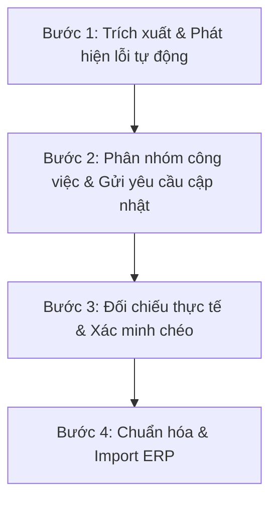

# KẾ HOẠCH RÀ SOÁT & ĐÁNH GIÁ BÁO CÁO DỰ ÁN CÁC HUYỆN CHUYỂN VỀ
*(Kèm theo phân tích hiện trạng dữ liệu từ file: `28.5.26 BC  dự án các huyện chuyển về.xlsx`)*

---

## I. TỔNG QUAN VỀ DỮ LIỆU BÁO CÁO

Báo cáo tổng hợp tình hình các dự án cấp huyện chuyển về cho Ban Quản lý Dự án Đầu tư Xây dựng Công trình Dân dụng và Công nghiệp tỉnh (Ban DD và HTKV tỉnh) là tài liệu đặc biệt quan trọng để phục vụ công tác bàn giao, tiếp quản và quản lý dự án tập trung.

Qua phân tích cấu trúc file Excel `28.5.26 BC  dự án các huyện chuyển về.xlsx`, hệ thống dữ liệu bao gồm **09 bảng biểu (Sheet)** chính:

| STT | Tên Sheet | Nội dung chính | Số dòng | Ghi chú |
| :--- | :--- | :--- | :--- | :--- |
| 1 | **PL01** | Tổng hợp các văn bản chỉ đạo của UBND tỉnh (giai đoạn từ 01/03/2025) | 39 | |
| 2 | **PL02** | Tổng hợp văn bản chỉ đạo xử lý chậm tiến độ, quyết toán gói thầu | 33 | |
| 3 | **02.1** | Tổng hợp các dự án, công trình đầu tư công | 11 | Bảng mẫu tổng hợp chung |
| 4 | **02.2** | Tổng hợp các dự án đầu tư theo phương thức PPP | 9 | Bảng mẫu tổng hợp dự án PPP |
| 5 | **PL03** | **Danh mục dự án cấp huyện chuyển về đã thi công hoàn thành bàn giao** | 448 | **Trọng tâm rà soát nhóm 1** |
| 6 | **PL04** | **Danh mục dự án cấp huyện chuyển về đang thi công, chuẩn bị đầu tư** | 151 | **Trọng tâm rà soát nhóm 2** |
| 7 | **PL05 (2)** | Kết quả thực hiện kết luận, kiến nghị kiểm tra, kiểm toán, thanh tra | 32 | Theo dõi xử lý tài chính |
| 8 | **04.1** | Tình hình quản lý, sử dụng tài sản nhà nước (Đất, nhà, xe...) | 101 | Theo dõi tài sản công |
| 9 | **04.2** | Kết quả sắp xếp lại, xử lý nhà, đất | 10 | Phương án xử lý nhà đất |

---

## II. ĐÁNH GIÁ HIỆN TRẠNG CHẤT LƯỢNG DỮ LIỆU (DATA AUDIT)

Qua quét dữ liệu tự động, phát hiện một số vấn đề nghiêm trọng về chất lượng dữ liệu cần được xử lý trong quá trình rà soát:

### 1. Thiếu thông tin Mã dự án (Mã TABMIS/Mã số đầu tư)
Mã dự án là trường thông tin định danh duy nhất để đồng bộ lên hệ thống phần mềm QLDA. Tuy nhiên, nhiều dự án hiện đang để trống trường này:
*   **Sheet PL03 (Đã hoàn thành):** Phát hiện **03 dự án** thiếu mã số:
    *   *Dòng 124:* "Đường dọc bờ biển Thiên Cầm đoạn từ Khách sạn Công Đoàn đến chân núi Thiên Cầm, huyện Cẩm Xuyên..."
    *   *Dòng 416:* "Củng cố, nâng cấp Đê Tả Nghèn đoạn K26-K35+700 huyện Lộc Hà, tỉnh Hà Tĩnh"
    *   *Dòng 433:* "Dự án đầu tư xây dựng công trình Nghĩa trang Liệt sỹ huyện Lộc Hà"
*   **Sheet PL04 (Đang thi công):** Phát hiện **10 dự án** thiếu mã số, ví dụ:
    *   *Dòng 76:* "Khối phòng học tập kết hợp hỗ trợ, phụ trợ học tập Trường THCS Hương Trạch"
    *   *Dòng 77:* "Khối phụ trợ học tập 02 tầng Trường tiểu học Phú Phong"
    *   *Dòng 78:* "Cầu Cây Soi, xã Hương Giang"
    *   *Dòng 84:* "Cầu Từ Văn và cầu Làng Mướp, xã Hòa Hải"

### 2. Thiếu thông tin Quyết định đầu tư/Quyết định chủ trương đầu tư
*   **Sheet PL03:** Có **09 dự án** chưa cập nhật thông tin quyết định đầu tư, gây khó khăn cho việc kiểm tra tính pháp lý:
    *   *Dòng 159:* "Nhà học 3 tầng trường tiểu học Mỹ Lộc"
    *   *Dòng 160:* "Đường trung tâm thị trấn Nghèn đoạn từ QL 1a giao với đường Xuân Diệu (GĐ 2)"
    *   *Dòng 161:* "Đường liên thôn xóm Tài năm - Tùng Sơn và xóm Tân Hương - Tây Vinh"
    *   *Dòng 327:* "Đường vào các xã Hà Linh, Hương Thủy, Hương Giang..."
    *   *Dòng 428:* "Xây dựng nhà 03 tầng, 14 phòng và các hạng mục phụ trợ Trường Tiểu học Thịnh Lộc"

### 3. Không nhất quán trong cách đánh chỉ mục (Index Formatting)
*   Dữ liệu tại các huyện được nhập thô và ghép lại nên không đồng bộ:
    *   *Huyện Vũ Quang, Cẩm Xuyên, Can Lộc:* Sử dụng số thứ tự dạng số nguyên thẳng (`1`, `2`, `3`).
    *   *Huyện Đức Thọ (PL03):* Sử dụng ký tự phân cấp phức tạp (`I.1`, `I.2`, `I.10`...) dẫn đến lỗi khi lọc hoặc phân loại tự động.
    *   *Huyện Lộc Hà:* Một số dòng không có số thứ tự (`null`) mặc dù là dòng chứa tên dự án độc lập.

### 4. Lỗi định dạng ngày tháng và hiển thị dữ liệu
*   Tại sheet **PL02**, cột ngày ban hành xuất hiện giá trị dạng số thô của Excel (Ví dụ dòng 5: giá trị ngày hiển thị là số `46299` thay vì `10/04/2026`).

> [!WARNING]
> Các lỗi dữ liệu trên sẽ trực tiếp gây lỗi khi import dữ liệu vào Cơ sở dữ liệu Supabase của hệ thống ERP. Việc rà soát và làm sạch dữ liệu là điều kiện tiên quyết trước khi tiến hành chuyển đổi số.

---

## III. MỤC TIÊU CỦA KẾ HOẠCH RÀ SOÁT

1.  **Chuẩn hóa dữ liệu:** Điền khuyết toàn bộ các trường thông tin trống (Mã dự án, Số quyết định phê duyệt, Tổng mức đầu tư, Nguồn vốn chi tiết).
2.  **Xác minh tính chính xác:** Đối chiếu số liệu tài chính (Tổng mức đầu tư, kế hoạch vốn đã bố trí, lũy kế giải ngân) với Kho bạc Nhà nước và các quyết định phê duyệt thực tế.
3.  **Làm sạch dữ liệu:** Loại bỏ các dòng trống, sửa lỗi định dạng ngày tháng, chuẩn hóa danh mục các huyện thành một định dạng chung thống nhất.
4.  **Sẵn sàng import dữ liệu:** Xuất bản dữ liệu sạch sang dạng bảng có cấu trúc chuẩn để nạp trực tiếp vào cơ sở dữ liệu ERP.

---

## IV. NỘI DUNG RÀ SOÁT CHI TIẾT THEO TỪNG PHÂN HỆ

### Phân hệ 1: Rà soát pháp lý & Thông tin định danh (PL01, PL02, PL03, PL04)
*   **Mã dự án:** Đối chiếu mã dự án với hệ thống mã số của Sở Kế hoạch & Đầu tư hoặc mã TABMIS của Bộ Tài chính.
*   **Văn bản pháp lý:** Thu thập và kiểm tra bản scan các Quyết định phê duyệt chủ trương đầu tư, Quyết định phê duyệt dự án đầu tư, Quyết định phê duyệt thiết kế bản vẽ thi công - dự toán.
*   **Chủ thể liên quan:** Xác định rõ chủ đầu tư cũ (Ban QLDA Huyện, UBND Xã...) và bộ phận tiếp nhận mới tại Ban Tỉnh.

### Phân hệ 2: Rà soát Số liệu Tài chính & Giải ngân (PL03, PL04)
*   **Tổng mức đầu tư (TMDT):** So sánh giá trị TMDT trên báo cáo với TMDT trên Quyết định đầu tư cuối cùng (bao gồm cả các quyết định điều chỉnh nếu có).
*   **Cơ cấu nguồn vốn:** Rà soát chi tiết nguồn vốn đã bố trí: Ngân sách Trung ương (NSTW), Ngân sách Tỉnh (NST), Ngân sách Huyện (NSH) và nguồn đóng góp khác.
*   **Đối chiếu số liệu Kho bạc:**
    *   Lũy kế vốn đã bố trí đến ngày 30/6/2025.
    *   Lũy kế giá trị giải ngân thực tế (đảm bảo khớp số liệu xác nhận của Kho bạc Nhà nước tỉnh/huyện).
    *   Số dư tạm ứng chưa thu hồi và số vốn còn lại chưa giải ngân.

### Phân hệ 3: Rà soát Kết luận Thanh tra/Kiểm toán (PL05)
*   Đăng ký chi tiết danh sách các dự án đang có kết luận của Kiểm toán Nhà nước hoặc Thanh tra Tỉnh.
*   Rà soát số tiền kiến nghị xử lý tài chính (Thu hồi nộp NSNN, giảm trừ khi thanh quyết toán).
*   Xác minh số tiền thực tế đã thực hiện (đã nộp NSNN hoặc đã giảm trừ thông qua quyết toán đợt cuối), đối chiếu với các Chứng từ, Giấy nộp tiền vào NSNN.

### Phân hệ 4: Rà soát Tài sản công bàn giao (04.1, 04.2)
*   Xác định diện tích đất, diện tích nhà làm việc của các ban quản lý dự án cấp huyện chuyển về.
*   Kiểm tra tính pháp lý của đất đai (Giấy chứng nhận quyền sử dụng đất, biên bản bàn giao đất).
*   Khảo sát thực tế hiện trạng sử dụng đất (Đang sử dụng làm việc, cho thuê, bỏ trống...) để lên phương án sắp xếp lại theo Nghị định của Chính phủ.

---

## V. QUY TRÌNH THỰC HIỆN RÀ SOÁT (4 BƯỚC CHUẨN)

### Bước 1: Trích xuất & Phát hiện lỗi tự động (Hệ thống)
*   Sử dụng công cụ lập trình (Python/Node.js) để xuất toàn bộ danh mục dự án bị lỗi thiếu mã, thiếu quyết định phê duyệt ra các danh sách riêng (Danh sách truy vấn nhanh).

### Bước 2: Phân nhóm công việc & Gửi yêu cầu cập nhật (Phòng KH-TH)
*   Phòng Kế hoạch - Tổng hợp làm đầu mối gửi danh sách truy vấn dữ liệu sang các Huyện hoặc các phòng chuyên môn phụ trách địa bàn để yêu cầu cung cấp hồ sơ bổ sung.

### Bước 3: Đối chiếu thực tế & Xác minh chéo (Tổ công tác rà soát)
*   Thành lập tổ rà soát liên phòng (Kế hoạch, Kế toán, Kỹ thuật) thực hiện đối chiếu chéo số liệu báo cáo với hồ sơ giấy gốc và số liệu xác nhận từ Kho bạc Nhà nước.

### Bước 4: Chuẩn hóa & Import ERP (Phòng IT & Ban Quản trị)
*   Cập nhật dữ liệu sạch vào file Master.
*   Chuyển đổi file Excel Master thành mã SQL để cập nhật trực tiếp vào cơ sở dữ liệu của phần mềm Quản lý Dự án Đầu tư Xây dựng (CIC ERP).

---

## VI. PHÂN CÔNG TRÁCH NHIỆM & TIẾN ĐỘ THỰC HIỆN

| Bộ phận thực hiện | Nhiệm vụ chi tiết | Thời hạn hoàn thành | Kết quả đầu ra |
| :--- | :--- | :--- | :--- |
| **Phòng Kế hoạch - Tổng hợp** | - Làm đầu mối tổng hợp, điều phối kế hoạch. - Rà soát tính pháp lý, mã dự án, số quyết định phê duyệt. - Chuẩn hóa danh mục huyện và định dạng số thứ tự. | **05/06/2026** | File Excel danh mục dự án đã làm sạch thông tin pháp lý. |
| **Các phòng Quản lý Dự án (QLDA 1, 2, 3)** | - Tiếp nhận danh mục dự án theo địa bàn phân công. - Trực tiếp làm việc với các ban QLDA huyện cũ để thu thập hồ sơ thiết kế, bản vẽ, biên bản nghiệm thu bàn giao. | **12/06/2026** | Hồ sơ dự án dạng file scan và các tài liệu nghiệm thu đầy đủ. |
| **Phòng Kế toán - Tài vụ** | - Chủ trì rà soát số liệu vốn, giải ngân, tạm ứng với Kho bạc. - Rà soát số liệu thực hiện kết luận kiểm toán (PL05). - Kiểm kê, rà soát hồ sơ tài sản đất đai, nhà làm việc (04.1, 04.2). | **15/06/2026** | Biên bản đối chiếu số liệu tài chính và báo cáo kiểm kê tài sản. |
| **Ban Quản trị ERP / Phòng IT** | - Thiết lập cấu trúc cơ sở dữ liệu dự án chuyển về trên ERP. - Thực hiện viết script import dữ liệu tự động. - Kiểm tra tính toàn vẹn dữ liệu sau import. | **20/06/2026** | Dữ liệu dự án hiển thị đầy đủ, chính xác trên Dashboard phần mềm ERP. |

---

## VII. ĐỀ XUẤT GIẢI PHÁP ĐỒNG BỘ LÊN ERP HỆ THỐNG

Để quá trình rà soát và đồng bộ dữ liệu diễn ra nhanh chóng, chính xác, đề xuất triển khai tính năng **"Excel Data Importer v2"** trên hệ thống ERP với quy trình:

1.  **Giao diện Tải file tạm:** Cho phép tải trực tiếp file Excel đang rà soát lên hệ thống để phân tích cú pháp.
2.  **Bộ lọc cảnh báo lỗi trực quan (Validation View):** Hệ thống tự động đánh dấu đỏ các dòng thiếu Mã dự án, thiếu Quyết định, hoặc số liệu tài chính lệch công thức (Ví dụ: `NS TW + NS Tỉnh + NS Huyện != Kế hoạch vốn`).
3.  **Cho phép sửa lỗi trực tiếp trên giao diện Web (Inline Editing):** Người dùng có thể điền mã dự án thiếu trực tiếp trên web mà không cần sửa ngược lại file Excel nhiều lần.
4.  **Nút bấm Phê duyệt & Đồng bộ chính thức:** Khi tỷ lệ dữ liệu sạch đạt 100%, nhấn nút để chuyển đổi toàn bộ vào bảng chính thức của dự án.
