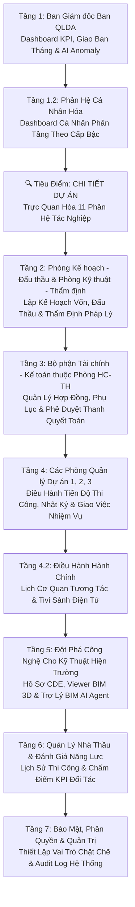

# KỊCH BẢN DEMO CHI TIẾT HỆ THỐNG QUẢN LÝ DỰ ÁN ĐẦU TƯ XÂY DỰNG (CIC QLDA)
*Áp dụng chuẩn Quy chế hoạt động của Ban QLDA Đầu tư Xây dựng công trình Dân dụng và Hạ tầng khu vực (Ban QLDA DDCN HT) - Đơn vị tư vấn CIC báo cáo*

---

## 📌 TỔNG QUAN VỀ BUỔI DEMO

### 1. Mục tiêu buổi Demo
* **Chứng minh năng lực đáp ứng:** Thuyết phục Ban Giám đốc và các Phòng chuyên môn của Ban QLDA rằng hệ thống **CIC QLDA** giải quyết triệt để các khó khăn trong quản lý đầu tư xây dựng, đấu thầu, hợp đồng, giải ngân vốn đầu tư công và thi công hiện trường.
* **Tiếp cận Top-Down (Từ trên xuống dưới):** Trình diễn từ bức tranh vĩ mô (Ban Giám đốc) xuống quy trình quản lý của các phòng chuyên môn chuyên nghiệp và cuối cùng là công cụ tác nghiệp hiện đại tích hợp BIM 3D & Trợ lý AI thông minh.
* **Khẳng định tính thực tế:** Sử dụng chính xác 100% cơ cấu tổ chức, tên phòng ban và chức năng nhiệm vụ theo Quy chế làm việc thực tế của Ban QLDA.

### 2. Vai trò tham gia Demo (CIC Roleplay)
* **Tổng giám đốc CIC (Chủ trì):** Trình bày chiến lược chuyển đổi số, phân tích lợi ích vĩ mô và phối hợp điều hành cuộc họp với Ban Giám đốc Ban QLDA.
* **Người phát triển phần mềm (Tác giả hệ thống - Presenter & Tech Support):** Trực tiếp thực hiện trình diễn (demo) kỹ thuật trên màn hình chiếu toàn bộ 11 phân hệ tác nghiệp, BIM 3D và Trợ lý AI. Sử dụng tính năng **Giả lập tài khoản (Impersonation)** để chuyển đổi qua lại linh hoạt giữa các vai trò (Giám đốc, Trưởng phòng, Chuyên viên...) để phản hồi tức thời các câu hỏi nghiệp vụ.

### 3. Thời lượng dự kiến
* **Tổng thời gian:** 90 phút (60 phút trình diễn trực quan + 30 phút thảo luận và giải đáp câu hỏi).

---

## 🗺️ TỔNG THỂ KHUNG KỊCH BẢN (TOP-DOWN APPROACH)

---

## 📋 TỔNG QUAN TÍNH NĂNG 13 PHÂN HỆ THEO TRÌNH TỰ SIDEBAR
*Hệ thống CIC QLDA được thiết kế đồng bộ, liên kết dữ liệu đa tầng nhằm số hóa toàn diện quy trình nghiệp vụ thực tế của Ban QLDA theo đúng giao diện hiển thị trên thanh Sidebar:*

### 1️⃣ Tổng quan (`/` - System Dashboard & Map)
* **Vai trò:** Trung tâm chỉ huy số dành cho Ban Giám đốc và các lãnh đạo phòng ban chuyên môn.
* **Tính năng cốt lõi:**
  * **Khối KPI động (Stat Cards):** Giám sát thời gian thực tổng số dự án đang quản lý (phân tách rõ 3 giai đoạn: Chuẩn bị đầu tư, Thực hiện dự án, Kết thúc dự án), Lũy kế giải ngân dòng vốn, Kế hoạch vốn năm và Tình hình giải ngân năm.
  * **AI Summary Widget:** Trợ lý trí tuệ nhân tạo Gemini quét và đưa ra báo cáo nhanh tình trạng hệ thống, tự động cảnh báo các "điểm nóng" (trễ hạn, giải ngân thấp) trong vòng 5 giây.
  * **Biểu đồ điều hành (Charts):** So sánh giải ngân và giám sát tiến độ công việc trực quan của từng Phòng QLDA 1, 2, 3 để đánh giá hiệu suất.
  * **Bản đồ số dự án & Mỏ vật liệu (Interactive Map):** Tích hợp bản đồ số định vị chính xác vị trí công trình và các mỏ vật liệu xây dựng (Đất, Đá, Cát) cấp phép trên địa bàn Hà Tĩnh, hỗ trợ tối ưu cự ly vận chuyển và điều phối nguồn lực tại công trường.

### 2️⃣ Dashboard cá nhân (`/my-dashboard` - Role-based Dashboard)
* **Vai trò:** Không gian làm việc cá nhân hóa, tối ưu hóa năng suất và giảm thiểu nhiễu thông tin cho từng cán bộ.
* **Phân tầng 3 cấp độ tác nghiệp:**
  * **Cấp chuyên viên (Staff):** Tập trung hiển thị danh sách nhiệm vụ được giao (My Tasks), cảnh báo thời hạn hoàn thành (Deadline), lịch công tác cá nhân và hộp thư xử lý nhanh hồ sơ bị phản hồi.
  * **Cấp Trưởng phòng (Manager):** Giám sát biểu đồ tải trọng công việc của phòng (Team Workload) để phân công khoa học, theo dõi tiến độ tổng thể phòng và trạm duyệt hồ sơ trực tuyến cấp phòng (Pending Approvals).
  * **Cấp Lãnh đạo Ban (Director):** Theo dõi tiến trình thực hiện kết luận, chỉ đạo giao ban toàn cơ quan và hộp ký duyệt số trực tuyến các hồ sơ thanh quyết toán đã qua thẩm định.

### 3️⃣ Lịch cơ quan (`/calendar` - Agency Calendar & Lobby Tivi)
* **Vai trò:** Số hóa công tác điều hành hành chính, đăng ký lịch công tác và điều phối phòng họp thông minh.
* **Tính năng cốt lõi:**
  * **Lịch tương tác kéo thả:** Đăng ký lịch họp, lịch đi hiện trường trực quan thông qua Slide Panel trượt. Hỗ trợ thao tác kéo thả (drag-and-drop) để thay đổi thời gian họp nhanh và tự động gửi thông báo qua email/hệ thống cho các thành phần tham dự.
  * **Tivi sảnh điện tử (Lobby Display) 🌟 [WOW EFFECT]:** Giao diện Dark Mode chuyên dụng dành riêng cho màn hình Tivi sảnh chính hoặc hành lang cơ quan. Tự động đồng bộ và làm tươi dữ liệu mỗi 60 giây, giúp cán bộ và đối tác dễ dàng theo dõi lịch họp của lãnh đạo Ban trong ngày.

### 4️⃣ Quản lý dự án (`/projects` - Project Detail & 11 Tabs)
* **Vai trò:** Cơ sở dữ liệu tập trung, quản lý xuyên suốt toàn bộ vòng đời của từng dự án từ chuẩn bị đầu tư đến quyết toán hoàn thành.
* **Tích hợp 11 tab tác nghiệp chuyên sâu:**
  1. *Tổng quan (`info`):* Lý lịch dự án, thanh Stepper vòng đời dự án (Stage History), thông tin bàn giao/tiếp nhận dự án từ chủ đầu tư cũ, và biểu đồ chênh lệch dòng vốn (`BudgetVarianceCard`).
  2. *Kế hoạch (`plan`):* Lập tiến độ và phân công công việc với 5 chế độ xem linh hoạt (WBS cấu trúc cây, Gantt đường găng, Kanban kéo thả, Nguồn lực nhân sự, Ma trận RACI). Tự động dịch chuyển ngày kế tiếp (Date Propagation) khi công việc trước bị trễ.
  3. *Gói thầu (`packages`):* Sổ tay quản lý đấu thầu và hợp đồng, so sánh giá gói thầu vs giá trúng thầu để đánh giá hiệu quả tiết kiệm ngân sách.
  4. *Thi công (`construction`):* Quản lý nhật ký thi công trực tuyến, biểu đồ tiến độ thực tế so với kế hoạch (S-Curve), thư viện ảnh hiện trường nghiệm thu và tích hợp Weather Widget dự báo thời tiết bằng AI.
  5. *Vốn & Giải ngân (`capital`):* Lập kế hoạch phân bổ vốn trung hạn và hàng năm, lập hồ sơ giải ngân (tạm ứng, thanh toán khối lượng hoàn thành, thu hồi tạm ứng) tự động điền biểu mẫu Bộ Tài chính (Phụ lục 03a/08b) và import dữ liệu Kho bạc.
  6. *Thanh tra (`inspection`):* Ghi nhận quyết định thanh tra, kiểm toán; trực quan hóa các kết luận khắc phục tài chính (thu hồi nộp ngân sách, giảm trừ quyết toán) dưới dạng biểu đồ.
  7. *Quyết toán (`settlement`):* Theo dõi quy trình 5 bước quyết toán dự án hoàn thành theo Nghị định 99/2021/NĐ-CP, cảnh báo thời hạn pháp lý đếm ngược.
  8. *Quy trình (`workflow`):* Vận hành và giám sát các luồng phê duyệt hồ sơ nội bộ Ban QLDA (duyệt thiết kế 1 bước, 2 bước, 3 bước) tích hợp ký duyệt trực tiếp trên Slide Panel.
  9. *GPMB (`clearance`):* Quản lý đền bù giải phóng mặt bằng với 16 bước Milestone chuẩn hóa, giám sát diện tích bàn giao, số hộ dân tái định cư và tiến độ giải ngân kinh phí đền bù.
  10. *Hồ sơ (`documents`):* Tủ hồ sơ số hóa dự án, tích hợp AI Compliance Panel quét phát hiện các văn bản còn thiếu so với quy định pháp luật xây dựng hiện hành và AI Document Drafter tự động soạn thảo tờ trình.
  11. *Đồng bộ CSDL (`tt24`):* Danh mục hồ sơ chuẩn hóa Phần A & B theo Thông tư 24/2021/TT-BXD, tích hợp AI OCR trích xuất thông tin tự động từ file PDF quyết định ký số để điền vào hệ thống.

### 5️⃣ Quản lý công việc (`/work-plan` - Work Management)
* **Vai trò:** Quản trị kỷ luật công vụ của toàn bộ cán bộ và các phòng ban trực thuộc ngoài phạm vi dự án riêng lẻ.
* **Hệ thống 3 Tab nghiệp vụ chuẩn hóa:**
  * **Công việc (`tasks`):** Khối KPI động toàn cơ quan, 4 bộ lọc nhanh kỷ luật (Việc của tôi, Quá hạn, Chưa cập nhật tuần này, Chờ duyệt đề xuất), và danh sách công việc phân nhóm theo dự án tích hợp xuất/nhập Excel hàng loạt (`exceljs`).
  * **KH khung năm (`annual`):** Lập kế hoạch khung định hướng chiến lược cả năm của phòng ban được lãnh đạo duyệt, làm cơ sở để phân rã nhiệm vụ chi tiết.
  * **Báo cáo tháng (`monthly-report`):** Số hóa quy trình lập kế hoạch tháng mới (`plan`) và tự động tổng hợp kết quả sản lượng hoàn thành để xuất báo cáo giao ban tháng (`report`) định dạng Excel/PDF gửi Ban Giám đốc chỉ trong 1 chạm.

### 6️⃣ Nhân sự (`/employees` - Human Resources)
* **Vai trò:** Quản lý cơ cấu tổ chức, hồ sơ lý lịch cán bộ của toàn Ban QLDA.
* **Tính năng cốt lõi:**
  * Số hóa hồ sơ cán bộ trực tuyến, lưu trữ quá trình công tác, bằng cấp chuyên môn và chứng chỉ hành nghề xây dựng.
  * Quản trị phân quyền tài khoản chặt chẽ theo ma trận vai trò, kết nối chặt chẽ với Team Workload trên các Dashboard cấp quản lý để theo dõi định mức tải công việc và đánh giá KPI cuối tháng.

### 7️⃣ Tài sản công (`/assets` - Public Assets)
* **Vai trò:** Quản lý chặt chẽ vòng đời của toàn bộ tài sản công được giao cho Ban QLDA quản lý và sử dụng.
* **Tính năng cốt lõi:**
  * Quản lý danh mục tài sản văn phòng, phương tiện công tác (xe công), thiết bị đo đạc hiện trường chuyên dụng.
  * Ghi vết toàn bộ quá trình từ mua sắm, cấp phát sử dụng cho từng phòng ban/cán bộ, bảo dưỡng định kỳ, tính toán khấu hao tài sản tự động đến khi làm thủ tục thanh lý tài sản theo đúng quy chuẩn Nghị định Tài sản công.

### 8️⃣ Nhà thầu (`/contractors` - Contractor Management)
* **Vai trò:** Quản lý cơ sở dữ liệu đối tác thi công, tư vấn và đánh giá năng lực nhà thầu.
* **Tính năng cốt lõi:**
  * Số hóa hồ sơ năng lực của từng nhà thầu đơn lẻ hoặc liên danh, lưu vết lịch sử thực hiện các gói thầu tại Ban QLDA.
  * Hệ thống chấm điểm KPI nhà thầu tự động dựa trên kết quả nghiệm thu thực tế hiện trường (chất lượng thi công, mức độ tuân thủ tiến độ, an toàn lao động, sự phối hợp thanh quyết toán) làm cơ sở tham chiếu khách quan cho công tác đấu thầu trong tương lai.

### 9️⃣ Đấu thầu & Hợp đồng (`/bidding` - Bidding & Contracts)
* **Vai trò:** Số hóa toàn diện quy trình lựa chọn nhà thầu và quản lý hợp đồng kinh tế.
* **Tính năng cốt lõi:**
  * Quản lý tiến trình đấu thầu qua mạng (lập hồ sơ mời thầu, hồ sơ yêu cầu, làm rõ thầu, mở thầu và phê duyệt quyết định trúng thầu).
  * Quản lý chặt chẽ thông tin hợp đồng kinh tế, theo dõi bảo lãnh thực hiện hợp đồng, thời hạn hiệu lực hợp đồng. Ghi nhận chính xác các Phụ lục hợp đồng điều chỉnh quy mô, phát sinh khối lượng và gia hạn tiến độ.

### 🔟 KH Vốn & Giải ngân (`/capital-planning` - Capital & Disbursement)
* **Vai trò:** Kiểm soát tối cao nguồn lực tài chính đầu tư công của toàn Ban QLDA.
* **Tính năng cốt lõi:**
  * Lập kế hoạch vốn đầu tư trung hạn 5 năm của Ban và phân bổ chi tiết kế hoạch vốn hàng năm được Ủy ban tỉnh giao.
  * Tự động hóa tính toán giá trị tạm ứng, theo dõi tỷ lệ thu hồi tạm ứng tự động và kết xuất phụ lục thanh toán khối lượng hoàn thành theo Biểu mẫu Phụ lục 03a và 08b của Bộ Tài chính gửi Kho bạc Nhà nước. Tích hợp thanh cảnh báo rủi ro dòng vốn (`CapitalAlertBanner`).

### 1️⃣1️⃣ Môi trường dữ liệu chung CDE (`/cde` - Common Data Environment)
* **Vai trò:** Nền tảng số quản lý và lưu trữ tập trung toàn bộ hồ sơ thiết kế, bản vẽ và văn bản dự án.
* **Tính năng cốt lõi:**
  * Cấu trúc cây thư mục hồ sơ khoa học phân tầng theo giai đoạn dự án. Hỗ trợ xem trực tuyến các định dạng bản vẽ 2D/3D (PDF, DWG...) trực tiếp trên Web với tốc độ cực nhanh mà không cần cài đặt phần mềm chuyên ngành.
  * Quản lý phiên bản tài liệu (Version Control) chặt chẽ, tự động ghi vết người sửa đổi và hỗ trợ so sánh nhanh sự khác biệt giữa các phiên bản bản vẽ thiết kế kỹ thuật.

### 1️⃣2️⃣ Mô hình BIM (`/bim` - 3D BIM Viewer & AI Agent) 🌟 [WOW EFFECT]
* **Vai trò:** Đột phá công nghệ số hóa mô hình 3D công trình tích hợp Trí tuệ nhân tạo (Generative AI).
* **Tính năng cốt lõi:**
  * Nền tảng Web Viewer BIM 3D chuẩn IFC mượt mà, hỗ trợ các thao tác xoay, zoom, cắt lớp trực quan, nhấp chọn cấu kiện để xem thuộc tính kỹ thuật chi tiết.
  * **Trợ lý BIM AI Agent (BIM Chatbot):** Tích hợp hộp chat AI thông minh, cho phép kỹ sư/lãnh đạo gõ câu hỏi bằng Tiếng Việt tự nhiên (Ví dụ: *"Tính thể tích dầm sàn tầng 3?"*) để AI tự động truy vấn dữ liệu BIM trả về kết quả số liệu tức thì, hoặc yêu cầu AI tự động tô màu đỏ (Highlight) trực quan các cấu kiện chưa được nghiệm thu trực tiếp trên mô hình 3D.

### 1️⃣3️⃣ Văn bản pháp luật (`/legal-documents` hoặc `/regulations`)
* **Vai trò:** Thư viện số hóa toàn bộ hệ thống văn bản quy phạm pháp luật xây dựng và quyết định pháp lý của Ban QLDA.
* **Tính năng cốt lõi:**
  * Lưu trữ tập trung các Nghị định, Thông tư, Quy chuẩn kỹ thuật xây dựng và các Quyết định nội bộ của Ban QLDA.
  * Tích hợp công nghệ AI OCR trích xuất thông tin tự động khi tải lên file PDF đã ký số, giúp tự động điền các thông tin pháp lý (số hiệu, ngày ban hành, người ký) vào cơ sở dữ liệu hệ thống, phục vụ công tác tra cứu nhanh của cán bộ.

---

## 🎬 KỊCH BẢN CHI TIẾT TỪNG PHÂN HỆ (MODULE-BY-MODULE)

### 🔑 Giai đoạn khởi động: Thiết lập bối cảnh demo (5 phút)
* **Thao tác:** Presenter truy cập vào màn hình đăng nhập hệ thống (`/login`).
* **Lời thoại Presenter:** 
  > *"Kính thưa Ban Giám đốc cùng toàn thể các đồng chí cán bộ, Trưởng, Phó phòng chuyên môn Ban QLDA Đầu tư Xây dựng công trình Dân dụng và Hạ tầng khu vực tỉnh Hà Tĩnh.
  > 
  > Nhằm thực hiện có hiệu quả Kế hoạch chuyển đổi số trong công tác quản lý dự án đầu tư xây dựng sử dụng vốn đầu tư công, Đơn vị tư vấn CIC đã phối hợp cùng Ban QLDA triển khai giải pháp Hệ thống điều hành số thống nhất CIC QLDA. Hệ thống được xây dựng đồng bộ nhằm tối ưu hóa quy trình tác nghiệp, củng cố kỷ cương công vụ và bảo đảm tính tuân thủ pháp luật nghiêm túc trong hoạt động đầu tư xây dựng của Ban.
  > 
  > Báo cáo Ban Giám đốc và hội nghị, trước khi đi vào trình diễn chi tiết các kịch bản nghiệp vụ tác nghiệp thực tế, tôi xin phép được giới thiệu khái quát cơ cấu vận hành của hệ thống thông qua **13 phân hệ chức năng cốt lõi** được sắp xếp đồng bộ theo đúng trình tự trên thanh Sidebar điều hành bên trái màn hình như sau:
  > 
  > * **Phân hệ thứ 1 - Tổng quan:** Đóng vai trò là trung tâm điều hành số tích hợp bản đồ số GIS và trợ lý trí tuệ nhân tạo Gemini, cung cấp cho Ban Giám đốc bức tranh tổng thể thời gian thực về sức khỏe các dự án, tiến độ giải ngân dòng vốn và định vị các mỏ vật liệu xây dựng (Đất, Đá, Cát) cấp phép trên địa bàn tỉnh.
  > * **Phân hệ thứ 2 - Dashboard cá nhân:** Thiết lập không gian làm việc chuyên biệt, cá nhân hóa phân tầng theo 3 cấp độ (Chuyên viên tác nghiệp, Trưởng phòng chuyên môn, và Lãnh đạo Ban) nhằm phân định rõ thẩm quyền và trách nhiệm công vụ của từng cán bộ.
  > * **Phân hệ thứ 3 - Lịch cơ quan:** Thực hiện số hóa toàn diện công tác đăng ký, phê duyệt lịch họp, điều phối phòng họp trực quan và hỗ trợ phương thức trình chiếu lịch công tác tự động trên hệ thống Tivi sảnh điện tử treo tại trụ sở Ban.
  > * **Phân hệ thứ 4 - Quản lý dự án:** Đây là trọng tâm tác nghiệp chuyên sâu, quản lý toàn diện vòng đời công trình qua 11 tab liên thông: từ lý lịch dự án, kế hoạch WBS/Gantt, theo dõi thi công thực tế (S-Curve & thời tiết AI), lập hồ sơ vốn giải ngân, đến thanh tra kiểm toán, giải phóng mặt bằng, quản lý quy trình, hồ sơ và quyết toán vốn hoàn thành.
  > * **Phân hệ thứ 5 - Quản lý công việc:** Trạm kiểm soát và đánh giá kỷ luật công vụ của toàn bộ các phòng ban trực thuộc thông qua 3 tab nghiệp vụ thống nhất: Công việc tác nghiệp hàng ngày, Kế hoạch khung năm định hướng và Báo cáo giao ban tháng.
  > * **Phân hệ thứ 6 - Nhân sự:** Quản lý cơ cấu tổ chức, quá trình công tác, năng lực chuyên môn của đội ngũ cán bộ, đồng thời theo dõi Team Workload làm cơ sở khoa học để đánh giá KPI hàng tháng.
  > * **Phân hệ thứ 7 - Tài sản công:** Giám sát chặt chẽ toàn bộ vòng đời tài sản công của Ban từ khâu mua sắm, cấp phát sử dụng, bảo dưỡng định kỳ, tính khấu hao tự động đến thanh lý theo đúng Nghị định của Chính phủ.
  > * **Phân hệ thứ 8 - Nhà thầu:** Lưu trữ cơ sở dữ liệu hồ sơ năng lực và tự động chấm điểm KPI nhà thầu dựa trên kết quả thi công, nghiệm thu thực tế tại hiện trường các gói thầu.
  > * **Phân hệ thứ 9 - Đấu thầu & Hợp đồng:** Số hóa quy trình đấu thầu qua mạng, quản lý hồ sơ mời thầu, thông tin hợp đồng kinh tế và các phụ lục điều chỉnh phát sinh quy mô xây lắp, thiết bị.
  > * **Phân hệ thứ 10 - KH Vốn & Giải ngân:** Kiểm soát kế hoạch phân bổ vốn đầu tư trung hạn và hàng năm được giao, tự động hóa tính toán giá trị thanh quyết toán và kết xuất biểu mẫu Phụ lục 03a/08b của Bộ Tài chính để gửi Kho bạc Nhà nước.
  > * **Phân hệ thứ 11 - Môi trường dữ liệu chung CDE:** Quản lý tập trung toàn bộ bản vẽ thiết kế 2D/3D, bảo đảm lưu vết lịch sử phiên bản và tích hợp trình xem bản vẽ trực tuyến tốc độ cao không cần phần mềm chuyên dụng.
  > * **Phân hệ thứ 12 - Mô hình BIM:** Tích hợp Viewer BIM 3D trực tuyến chuẩn IFC kết hợp Trợ lý BIM AI Agent giúp bóc tách khối lượng và highlight trực quan cấu kiện trên mô hình 3D qua câu hỏi Tiếng Việt tự nhiên.
  > * **Phân hệ thứ 13 - Văn bản pháp luật:** Thư viện số hóa toàn bộ hệ thống văn bản quy phạm pháp luật xây dựng và quyết định pháp lý của Ban QLDA, tích hợp công nghệ AI OCR trích xuất thông tin tự động từ file PDF quyết định đã ký số.
  > 
  > Kính thưa Ban Giám đốc, sau đây đơn vị tư vấn xin phép bắt đầu phiên trình diễn chi tiết bằng góc nhìn điều hành vĩ mô của Giám đốc Ban QLDA."*
* **Thao tác phần mềm:** Đăng nhập với vai trò **Giám đốc Ban QLDA** để vào màn hình Dashboard chính (`/`).

---

### 📊 TẦNG 1: DÀNH CHO BAN GIÁM ĐỐC BAN QLDA (15 Phút)
#### Phân hệ: Dashboard Điều Hành, Phòng Giao Ban Tháng & Phân Tích AI

Presenter lần lượt trình bày qua 3 Tab tương tác cốt lõi trên Dashboard điều hành:

---

#### 📌 TAB 1: TỔNG QUAN HỆ THỐNG (`overview`)
* **Mục tiêu:** Kiểm soát tức thời sức khỏe các dự án, tiến độ giải ngân dòng vốn và điểm nóng hiện trường.

##### 1. Khối 4 Chỉ số KPI chính (Stat Cards)
* **Dự án đang quản lý:** Hiển thị tổng số lượng dự án đang triển khai. 
  * *Ý nghĩa:* Dưới con số tổng là footer thống kê chi tiết dự án theo 3 giai đoạn: **Chuẩn bị đầu tư** (đang lập chủ trương, thiết kế), **Thực hiện dự án** (đang thi công lắp đặt), và **Kết thúc dự án** (đã hoàn thành bàn giao). Giúp Giám đốc nắm chắc quy mô danh mục dự án hiện tại.
* **Lũy kế giải ngân:** Hiển thị tổng giá trị đã giải ngân bằng tiền đồng (VND) lũy kế từ trước tới nay đè lên tổng mức đầu tư của các dự án đang quản lý.
  * *Ý nghĩa:* Đi kèm thanh tiến trình trực quan hiển thị **Tỷ lệ giải ngân lũy kế**. Cho phép Giám đốc đánh giá tốc độ tiêu tiền tổng thể của toàn bộ vòng đời các công trình.
* **Kế hoạch vốn năm:** Hiển thị tổng số vốn được cơ quan nhà nước có thẩm quyền phân bổ trong năm kế hoạch hiện tại (ví dụ: năm 2026).
  * *Ý nghĩa:* Đi kèm tỷ trọng kế hoạch vốn năm trên tổng mức đầu tư. Giúp Giám đốc nhận định mức độ tập trung nguồn lực tài chính của Ban trong năm nay.
* **Giải ngân năm:** Hiển thị số vốn thực tế đã giải ngân trong năm hiện tại, so sánh trực tiếp với Kế hoạch vốn năm được giao.
  * *Ý nghĩa:* Đi kèm thanh tiến trình **Tiến độ giải ngân năm**. Đây là chỉ số áp lực nhất của Ban QLDA đối với các chỉ tiêu thi đua giải ngân của tỉnh và Trung ương, giúp Giám đốc giám sát chặt chẽ tiến độ để kịp thời thúc đẩy dòng tiền.

##### 2. Các Biểu đồ Điều hành Thông minh (Charts)
* **AI Summary Widget:** Trợ lý AI tự động quét dữ liệu và đưa ra tóm tắt thông minh bằng văn bản (ví dụ: *"Có 2 dự án thi công chậm tiến độ >15 ngày, tỷ lệ giải ngân của Phòng QLDA 2 đang thấp nhất đạt 22%"*). Giúp lãnh đạo nắm bắt "điểm nóng" trong 5 giây.
* **Biểu đồ Trạng thái Dự án theo Phòng Quản lý (Project Status by Board Chart):** Biểu đồ cột chồng thể hiện cơ cấu trạng thái dự án (Chuẩn bị, Thực hiện, Kết thúc) được phân bổ cụ thể cho **Phòng QLDA 1, Phòng QLDA 2, và Phòng QLDA 3**.
  * *Ý nghĩa:* Lãnh đạo có thể nhấp chuột vào từng cột của biểu đồ để mở bảng chi tiết (Drill-down) xem cụ thể các dự án thuộc phòng đó quản lý nhằm đánh giá hiệu quả điều hành của các Trưởng phòng QLDA.
* **Biểu đồ So sánh Giải ngân theo các Phòng QLDA (Capital Disbursement Chart):** Trực quan hóa số vốn kế hoạch và số vốn thực tế đã giải ngân của từng phòng QLDA dưới dạng cột kép. Nhấp chuột vào cột để drill-down xem chi tiết tình hình giải ngân từng hợp đồng.
* **Biểu đồ Trạng thái Công việc (Task Completion Chart):** Biểu đồ thể hiện phần trăm công việc Hoàn thành đúng hạn, Trễ hạn, Đang thực hiện của các phòng ban.
  * *Ý nghĩa:* Giúp lãnh đạo giám sát chi tiết trạng thái thực hiện công việc của từng cán bộ và phòng ban trực thuộc, phát hiện nhanh các công việc bị tồn đọng để kịp thời đôn đốc, chỉ đạo xử lý.

##### 3. Bản đồ số Vị trí Dự án & Mỏ vật liệu (Interactive Map)
* **Thao tác:** Bật/tắt các lớp bản đồ dự án và mỏ vật liệu. Tìm kiếm một mỏ cát trên bản đồ.
* **Điểm nhấn đột phá:** Bản đồ số tích hợp hiển thị vị trí chính xác của từng dự án trên địa bàn các huyện (Đức Thọ, Can Lộc, Cẩm Xuyên, Thạch Hà, Hương Khê...). 
* **Đặc biệt:** Tích hợp định vị các **Mỏ vật liệu xây dựng (Đất, Đá, Cát)**.
  * *Ý nghĩa thực tế:* Rào cản lớn nhất của các dự án hạ tầng hiện nay là thiếu đất đắp và cát xây dựng. Bản đồ số giúp Giám đốc Ban QLDA theo dõi trực quan cự ly vận chuyển từ các mỏ vật liệu được cấp phép đến chân công trình, phục vụ công tác điều phối vật liệu cấp bách tại hiện trường.

---

#### 📌 TAB 2: BÁO CÁO GIAO BAN THÁNG (`monthly`)
* **Mục tiêu:** Chuyển đổi cuộc họp giao ban tháng của Ban QLDA từ báo cáo giấy truyền thống thành một **Không gian làm việc điều hành số trực tiếp thời gian thực**.

##### 1. Khối KPI Giao ban & Thanh công cụ (Briefing Toolbar & KPI)
* **Thao tác:** Presenter thay đổi tháng trên thanh công cụ giao ban (ví dụ chuyển từ Tháng 4 sang Tháng 5) để hiển thị dữ liệu giao ban tức thời. Click chọn nút **"Xem Báo cáo giao ban"** để hiển thị cửa sổ `MonthlyReportModal`.
* **Chỉ số KPI Giao ban:** Hiển thị tức thì tổng số nhiệm vụ giao ban của tháng, số lượng việc đã hoàn thành, đang triển khai, số lượng việc bị quá hạn và tỷ lệ giải ngân dòng vốn thực tế của tháng đó.

##### 2. Tổng hợp công việc các phòng ban (DeptTaskSummary)
* **Thao tác:** Chọn lọc xem chi tiết tình hình thực hiện công việc của **Phòng QLDA 2**.
* **Ý nghĩa:** Trực quan hóa tiến độ xử lý công việc của từng phòng trực thuộc (Phòng Kế hoạch - Đấu thầu, Phòng Kỹ thuật - Thẩm định, Phòng QLDA 1, 2, 3, Hành chính - Tổng hợp). Phân nhóm rõ ràng theo danh mục công việc (Nhiệm vụ chuyên môn, Nhiệm vụ đột xuất, Nhiệm vụ theo Chỉ đạo trực tiếp của Giám đốc Ban).

##### 3. Tương tác Hiện trường & Chỉ đạo giao ban trực tiếp (ProjectAccordion)
* **Thao tác:** Mở rộng thông tin dự án "Cầu vượt nút giao X". 
* **Khó khăn vướng mắc:** Hiển thị trực tiếp các phản ánh vướng mắc từ công trường (ví dụ vướng giải phóng mặt bằng, thiếu cát đắp nền).
* **Tương tác đỉnh cao:** Giám đốc Ban QLDA trực tiếp gõ ý kiến chỉ đạo kết luận ngay trên giao diện giao ban: *"Phòng QLDA 2 phối hợp với UBND huyện giải phóng mặt bằng trước ngày 15/6"*.
* **Giao việc tức thời:** Giám đốc click nút **"Giao việc nhanh"**, gõ tiêu đề công việc: *"Kiểm tra cự ly mỏ đất phối hợp nhà thầu đắp nền"*, chọn cán bộ thực hiện (chọn từ danh sách cán bộ Ban) và ấn định thời hạn xử lý. Nhiệm vụ sẽ lập tức xuất hiện trên dashboard cá nhân của cán bộ đó.

---

#### 📌 TAB 3: TRỢ LÝ TRÍ TUỆ NHÂN TẠO AI (`ai`)
* **Mục tiêu:** Trình diễn năng lực phân tích dữ liệu thông minh đỉnh cao của hệ thống giúp hỗ trợ ra quyết định.

##### 1. Phân tích & Dự báo Rủi ro AI (AIRiskDashboard)
* **Nghiệp vụ:** AI quét toàn bộ hồ sơ dự án để dự báo các nguy cơ rủi ro tiềm ẩn (nguy cơ trễ hạn tiến độ, rủi ro vượt dự toán ngân sách, rủi ro biến động giá thép/xi măng). Đưa ra điểm số rủi ro (Risk Score) kèm khuyến nghị phòng ngừa cụ thể.

##### 2. Tự động Phát hiện Điểm Bất Thường (AIAnomalyDetector)
* **Nghiệp vụ:** AI tự động rà soát, phát hiện và cảnh báo các hành vi/dữ liệu bất hợp lý trong hệ thống như:
  * Khối lượng nghiệm thu thanh toán đợt 3 của nhà thầu tăng vọt bất thường so với tiến độ thi công thực tế được kỹ sư cập nhật.
  * Dự toán phát sinh vượt quá hạn mức định mức xây dựng quy định của Bộ Xây dựng.

##### 3. Chấm điểm Uy tín Nhà thầu bằng AI (AIContractorScoring)
* **Nghiệp vụ:** Thuật toán AI phân tích dữ liệu lịch sử thi công, tỷ lệ trễ hạn trong quá khứ, mức độ hợp tác giải quyết vướng mắc của các nhà thầu để đưa ra điểm số uy tín chính xác. Giúp lãnh đạo lựa chọn nhà thầu tin cậy cho dự án tiếp theo.

##### 4. Tối ưu hóa Nguồn lực (AIResourceOptimizer)
* **Nghiệp vụ:** AI đề xuất cách phân bổ dòng tiền giải ngân tối ưu cho các dự án giải ngân tốt, điều phối nhân sự cán bộ QLDA giữa các phòng QLDA 1, 2, 3 để tránh tình trạng quá tải cục bộ.

---

### 👤 TẦNG 1.2: DÀNH CHO CÁN BỘ BAN - DASHBOARD CÁ NHÂN PHÂN TẦNG THÔNG MINH (`/my-dashboard`) (10 Phút)

* **Mục tiêu:** Chứng minh hệ thống được thiết kế theo hướng **Cá nhân hóa tối đa (Role-based Personalization)**. Mỗi cán bộ khi đăng nhập sẽ có một Dashboard cá nhân riêng biệt, khớp hoàn toàn với vị trí công tác và thẩm quyền chuyên môn, giúp giảm tối đa nhiễu thông tin.

Presenter sử dụng tính năng **Giả lập tài khoản (Impersonation)** để trình diễn lần lượt 3 cấp độ Dashboard cá nhân:

#### 🛡️ 1. Cấp độ Chuyên viên / Cán bộ kỹ thuật (`StaffDashboard`)
* **Thao tác:** Kỹ thuật viên hỗ trợ chuyển đổi vai trò sang Chuyên viên kỹ thuật Nguyễn Văn A thuộc **Phòng QLDA 2**. Mở màn hình `/my-dashboard`.
* **Các điểm nhấn thao tác trên màn hình:**
  1. **My Tasks (Nhiệm vụ cá nhân):** Danh sách các công việc được giao trực tiếp (ví dụ: *"Kiểm tra hiện trường gói thầu số 5"*, *"Lập tờ trình thẩm định điều chỉnh thiết kế"*). Phân loại trực quan: Việc khẩn, Việc đang làm, Việc đã hoàn thành.
  2. **Cảnh báo Deadline:** Hệ thống tự động làm nổi bật các nhiệm vụ sắp hết hạn (trong 24 giờ) hoặc đã quá hạn để nhắc nhở chuyên viên tập trung xử lý.
  3. **Lịch công tác cá nhân (`Calendar`):** Hiển thị lịch họp giao ban phòng, lịch đi hiện trường nghiệm thu công trình được phân công.
  4. **Hộp thư hành động (Action Items):** Hiển thị các hồ sơ thanh toán bị từ chối phê duyệt gửi trả về kèm theo ghi chú lỗi để chuyên viên biết và sửa đổi ngay lập tức.
* **Lời thoại Presenter:**
  > *"Đối với các chuyên viên và kỹ sư trực tiếp quản lý dự án, Dashboard cá nhân là nơi họ bắt đầu ngày làm việc. Hệ thống lọc bỏ hoàn toàn các thông tin không liên quan của các dự án khác, chỉ tập trung hiển thị danh sách nhiệm vụ được giao, lịch đi hiện trường và cảnh báo thời hạn hoàn thành. Chuyên viên sẽ không bao giờ bị quên việc hay bỏ sót các hồ sơ cần xử lý gấp."*

#### 📂 2. Cấp độ Trưởng phòng / Phó phòng chuyên môn (`ManagerDashboard`)
* **Thao tác:** Chuyển đổi vai trò sang Trưởng phòng **Kế hoạch – Đấu thầu** (hoặc Trưởng phòng QLDA 2).
* **Các điểm nhấn thao tác trên màn hình:**
  1. **Tải trọng công việc của Phòng (Team Workload Chart):** Biểu đồ thể hiện trực quan số lượng công việc đang phân công cho từng chuyên viên trong phòng mình phụ trách.
     * *Ý nghĩa:* Trưởng phòng nhìn thấy ngay ai đang bị quá tải (cột màu đỏ), ai đang còn dung lượng (cột màu xanh) để cân đối, phân chia công việc hợp lý.
  2. **Giám sát Tiến độ Phòng ban:** Tổng hợp tiến độ các dự án và gói thầu được giao cho phòng mình phụ trách.
  3. **Hộp phê duyệt cấp phòng (Pending Approvals):** Danh sách các tờ trình, hồ sơ đấu thầu hoặc đề xuất thanh toán do chuyên viên của phòng lập, đang chờ Trưởng phòng ký duyệt trước khi trình lên Ban Giám đốc.
* **Lời thoại Presenter:**
  > *"Với vai trò Trưởng phòng chuyên môn, mối quan tâm là hiệu suất của toàn phòng. Dashboard cấp quản lý giúp Trưởng phòng giám sát tải trọng công việc của từng nhân viên để phân công công tác khoa học. Đồng thời, đây là trạm duyệt hồ sơ trực tuyến, giúp Trưởng phòng ký duyệt nhanh các đề xuất của chuyên viên dưới quyền chỉ bằng 1 chạm."*

#### 🏛️ 3. Cấp độ Lãnh đạo Ban QLDA (`DirectorDashboard`)
* **Thao tác:** Quay trở lại vai trò Giám đốc Ban QLDA.
* **Các điểm nhấn thao tác trên màn hình:**
  1. **Theo dõi Chỉ đạo của Lãnh đạo (Chỉ đạo Giao ban):** Danh sách toàn bộ các ý kiến kết luận, chỉ đạo mà Giám đốc đã giao cho các phòng ban trong các cuộc họp giao ban trước.
     * *Ý nghĩa:* Hiển thị rõ chỉ đạo nào đã được thực hiện, chỉ đạo nào đang trễ hạn và phòng ban nào đang chịu trách nhiệm xử lý, đảm bảo kỷ luật hành chính nghiêm túc.
  2. **Hộp ký duyệt trực tuyến cấp Ban:** Nơi tập trung toàn bộ tờ trình thanh toán, hồ sơ phê duyệt thầu đã được các phòng chuyên môn thẩm định xong, chờ Giám đốc ký số chính thức phê duyệt.
* **Lời thoại Presenter:**
  > *"Ở cấp độ cao nhất - Lãnh đạo Ban QLDA, Dashboard cá nhân đóng vai trò là bảng điều khiển kiểm soát kỷ luật hành chính. Giám đốc có thể theo dõi xem các chỉ đạo giao ban tuần trước đã được các phòng ban triển khai đến đâu, ai đang làm chậm trễ. Đồng thời, đây là nơi tập trung các hồ sơ quan trọng nhất đã qua thẩm định để Giám đốc thực hiện ký số phê duyệt, giúp công việc của toàn Ban luôn trôi chảy, không phụ thuộc vào việc lãnh đạo có mặt tại văn phòng hay đi công tác hiện trường."*

---

  > *"Ở cấp độ cao nhất - Lãnh đạo Ban QLDA, Dashboard cá nhân đóng vai trò là bảng điều khiển kiểm soát kỷ luật hành chính. Giám đốc có thể theo dõi xem các chỉ đạo giao ban tuần trước đã được các phòng ban triển khai đến đâu, ai đang làm chậm trễ. Đồng thời, đây là nơi tập trung các hồ sơ quan trọng nhất đã qua thẩm định để Giám đốc thực hiện ký số phê duyệt, giúp công việc của toàn Ban luôn trôi chảy, không phụ thuộc vào việc lãnh đạo có mặt tại văn phòng hay đi công tác hiện trường."*

---

### 🔍 TIÊU ĐIỂM: KHÁM PHÁ CHI TIẾT DỰ ÁN (PROJECT DETAIL)
#### Trực Quan Hóa 11 Phân Hệ Tác Nghiệp Chuyên Sâu (30 Phút)

* **Mục tiêu:** Chứng minh năng lực của hệ thống **CIC QLDA** trong việc số hóa toàn diện hồ sơ dự án thông qua giao diện **Chi tiết dự án (Project Detail)**. Đây là cơ sở dữ liệu tập trung được chia thành **11 tab tác nghiệp chuyên sâu**, quản lý liên thông toàn bộ vòng đời dự án từ giai đoạn chuẩn bị đầu tư đến quyết toán hoàn thành, tích hợp mô hình 3D BIM và Trợ lý AI.
* **Thao tác chuyển tiếp:** Từ Dashboard, Presenter nhấp chọn một dự án trọng điểm (ví dụ: *"Dự án Cầu vượt nút giao X"* hoặc *"Chung cư tái định cư Y"*) để truy cập thẳng vào giao diện Chi tiết Dự án (`/projects/:id`).

---

#### 🌟 ĐIỂM NHẤN CÔNG NGHỆ TẠI HEADER CHI TIẾT DỰ ÁN
Trước khi đi vào các tab, Presenter giới thiệu nhanh 2 nút bấm "quyền lực" nằm ở thanh tiêu đề trên cùng:
1. **Nút "Tóm tắt AI" (`btn-ai-summary`):** 
   * **Thao tác:** Click nút. Một popup dialog sang trọng trượt ra với hiệu ứng blur backdrop.
   * **Hiển thị:** Trợ lý AI (Gemini) quét tức thì toàn bộ cơ sở dữ liệu dự án (tiến độ, giải ngân, gói thầu, hồ sơ pháp lý) và xuất ra báo cáo tóm tắt ngắn gọn trong 5 giây (Ví dụ: *"Dự án đang triển khai giai đoạn Thi công. Lũy kế giải ngân đạt 42% (đúng hạn). Có 1 gói thầu số 5 chậm tiến độ 7 ngày do vướng mặt bằng móng dầm D3. 88% hồ sơ tuân thủ Thông tư 24 đã hoàn thiện"*).
2. **Nút "3D BIM" (nếu dự án yêu cầu BIM):**
   * **Thao tác:** Hover và giới thiệu nút với hiệu ứng sóng đập (pulse wave) màu tím nổi bật. Lãnh đạo click vào đây sẽ chuyển tiếp mượt mà sang mô hình 3D BIM của công trình để đối chiếu trực quan (sẽ demo sâu ở Tầng 5).

---

#### 📌 11 TAB TÁC NGHIỆP CHI TIẾT (TỪ TRÁI SANG PHẢI)

##### Tab 1️⃣: TỔNG QUAN (`info`) - Bức Tranh Toàn Cảnh Dự Án
* **Mục tiêu:** Cung cấp hồ sơ lý lịch trích ngang đầy đủ pháp lý và trạng thái vận hành của công trình.
* **Bố cục giao diện:** Layout 3 cột cực kỳ hiện đại (2/3 bên trái dành cho thông tin kỹ thuật & tiến độ, 1/3 bên phải dành cho nhân sự, mốc thời gian và hành động nhanh).
* **Các khối thông tin cốt lõi:**
  * **LifecycleStepper (Thanh tiến trình vòng đời):** Trực quan hóa 3 giai đoạn lớn của dự án theo Nghị định Chính phủ: *Preparation (Chuẩn bị dự án)* -> *Execution (Thực hiện dự án)* -> *Completion (Kết thúc dự án)*.
    * *Thao tác nâng cao:* Nhấp vào stepper để xem **Lịch sử thay đổi giai đoạn (Stage History)** ghi nhận chi tiết thời điểm chuyển pha, người phê duyệt và văn bản căn cứ.
  * **Thông tin dự án & Quy mô công trình:** Hiển thị mã dự án (dễ dàng sao chép 1-click), nhóm dự án (A, B, C), chuyên ngành (Dân dụng, Giao thông, Hạ tầng kỹ thuật...), tổng dự toán, diện tích khu đất (`SiteArea`), diện tích sàn (`FloorArea`), chiều cao công trình (`BuildingHeight`), số tầng nổi/tầng hầm.
  * **Bàn giao & Tiếp nhận (Dành cho dự án chuyển tiếp):** Đặc biệt hữu ích với Ban QLDA khi tiếp nhận dự án từ Chủ đầu tư cũ. Ghi vết rõ ràng quyết định bàn giao, đơn vị tiếp nhận, giá trị khối lượng đã bàn giao, tình trạng công nợ và vướng mắc còn tồn tại trước khi Ban tiếp quản.
  * **BudgetVarianceCard (Biểu đồ tiến độ dòng vốn):** Thanh tiến trình so sánh 3 chỉ số: Tổng mức đầu tư vs Lũy kế nghiệm thu vs Lũy kế thực tế đã giải ngân.
  * **GanttChartWidget & KeyDatesWidget:** Tóm tắt lịch tiến độ tổng thể dưới dạng Gantt thu nhỏ và widget mốc thời gian cảnh báo các việc sắp quá hạn.
  * **QuickActionsPanel (Hành động nhanh):** Nút **"Đồng bộ CSDL QG"** kết nối thẳng với Cổng thông tin đấu thầu quốc gia; nút **"Tạo báo cáo giám sát"** tự động xuất file Word báo cáo giám sát đánh giá đầu tư định kỳ theo Mẫu biểu Quy định.

##### Tab 2️⃣: KẾ HOẠCH (`plan`) - Phân Rã Công Việc & Biểu Đồ Gantt
* **Mục tiêu:** Quản lý kế hoạch tiến độ tổng thể, phân rã công việc (WBS) và phân công cán bộ xử lý.
* **5 Chế độ xem linh hoạt (View Modes) - WOW Effect:**
  1. **WBS (Cấu trúc phân rã công việc):** Hiển thị công việc theo cấu trúc hình cây phân tầng (Phases -> Steps -> Tasks -> Subtasks) cực kỳ khoa học.
  2. **Gantt (Biểu đồ tiến độ):** Trực quan hóa tiến độ các bước trên trục thời gian (timeline), vẽ đường găng (Critical Path) các công việc quyết định sự thành bại của dự án.
  3. **Kanban (Bảng phân trạng thái):** Kéo thả các thẻ công việc (Tasks) qua các cột: *Cần làm (Todo)* -> *Đang làm (InProgress)* -> *Đã xong (Done)* để cập nhật tiến độ tức thì.
  4. **Nguồn lực (Resource):** Xem danh sách công việc được nhóm theo từng nhân sự thực hiện. Phát hiện ngay ai đang bị quá tải công việc, ai đang nhàn rỗi.
  5. **Ma trận RACI (Phân định trách nhiệm):** Xác định rõ ai là người thực hiện (R - Responsible), ai là người phê duyệt chịu trách nhiệm chính (A - Accountable), ai cần tham vấn (C - Consulted), ai cần nhận thông tin (I - Informed) cho từng bước nghiệp vụ.
* **Tính năng tương tác cốt lõi:**
  * **Khởi tạo kế hoạch tổng thể từ Template:** Cho phép Trưởng phòng chọn các mẫu kế hoạch chuẩn hóa theo Nghị định 15 hoặc quy định ODA để tự động tạo ra hàng trăm đầu việc mẫu kèm thời gian định mức, tiết kiệm 95% thời gian lập kế hoạch ban đầu.
  * **Tự động dịch chuyển tiến độ (Date Propagation):** Khi một công việc phía trước (Predecessor) bị trễ hạn và dời ngày hoàn thành, hệ thống tự động tính toán đẩy lùi ngày bắt đầu của các công việc phụ thuộc phía sau (Successor), đảm bảo tính logic tuyệt đối của biểu đồ Gantt.

##### Tab 3️⃣: GÓI THẦU (`packages`) - Sổ Tay Đấu Thầu & Hợp Đồng
* **Mục tiêu:** Quản lý toàn bộ các gói thầu của dự án từ khâu chuẩn bị hồ sơ mời thầu đến khi ký kết hợp đồng.
* **Giao diện làm việc:** Bảng danh sách gói thầu phẳng (Flat-list) có tính năng **Kéo thả sắp xếp thứ tự (Drag & Drop)** để ưu tiên hiển thị gói thầu quan trọng.
* **Các trường thông tin chi tiết:**
  * Mã và tên gói thầu, hình thức lựa chọn nhà thầu, loại hợp đồng (Trọn gói, Đơn giá điều chỉnh...).
  * So sánh trực quan: **Giá gói thầu (Dự toán duyệt)** vs **Giá trúng thầu**. Nếu giá trúng thầu thấp hơn, hệ thống hiển thị dòng chữ màu xanh lá thể hiện số tiền tiết kiệm được cho ngân sách nhà nước.
  * Trạng thái gói thầu: *Lựa chọn nhà thầu (Selection)* -> *Đang thực hiện (Execution)* -> *Kết thúc (Completed)*.
* **Tác nghiệp Slide Panel:** Click vào một gói thầu, một Slide Panel lớn trượt ra từ bên phải hiển thị toàn bộ hồ sơ chi tiết gói thầu (Quyết định phê duyệt HSMT, danh sách nhà thầu nộp thầu, kết quả chấm điểm kỹ thuật, quyết định trúng thầu và thông tin hợp đồng đi kèm).
* **Xuất dữ liệu:** Hỗ trợ 1-click xuất toàn bộ danh mục gói thầu ra file Excel theo chuẩn báo cáo của Sở Kế hoạch & Đầu tư.

##### Tab 4️⃣: THI CÔNG (`construction`) - Nhật Ký & Tiến Độ Hiện Trường
* **Mục tiêu:** Quản lý toàn diện giai đoạn thi công xây lắp ngoài thực địa. Phân hệ lớn nhất với hơn 2,000 dòng code phục vụ tác nghiệp hiện trường.
* **4 Sub-tab tác nghiệp đặc dụng:**
  1. **Tổng quan thi công:** Hiển thị điểm số sức khỏe công trường, tỷ lệ lệch tiến độ (`Slippage`), thống kê số ngày an toàn lao động.
     * **S-Curve Chart (Đường cong S):** Biểu đồ động so sánh đường tiến độ thi công kế hoạch (hình sin chuẩn) vs đường tiến độ thi công thực tế lũy kế. Giúp Giám đốc phát hiện ngay dự án có đang bị tụt lại phía sau đường kế hoạch hay không.
     * **Weather Widget (Tích hợp thời tiết 7 ngày):** Kết nối API thời tiết thời gian thực. Hệ thống tự động phân tích độ ẩm, lượng mưa và đưa ra **Khuyến nghị thi công thông minh bằng AI** (Ví dụ: *"Ngày mai mưa to >50mm, khuyến nghị nhà thầu dừng đổ bê tông bản mặt cầu, chuyển sang gia công cốt thép trong nhà xưởng"*).
  2. **Nhật ký thi công:** Cho phép kỹ sư giám sát của Ban và nhà thầu lập nhật ký hàng ngày. Tích hợp tính năng **Sao chép nhật ký từ ngày hôm trước** (giúp kỹ sư hiện trường không phải gõ lại các thông tin trùng lặp như máy móc thiết bị, nhân lực).
     * *Tính năng xuất sắc:* Click xuất nhật ký thi công ra file Word (.docx) chuẩn theo quy định kiểm tra của Bộ Xây dựng.
  3. **Tiến độ nhà thầu:** Danh sách khối lượng chi tiết từng hạng mục công việc hiện trường, biểu đồ stacked bar thể hiện biến động nhân lực thi công theo từng ngày của các nhà thầu.
  4. **Ảnh công trường:** Thư viện ảnh thực tế thi công được tải lên trực tiếp từ hiện trường bằng điện thoại di động, phân nhóm tự động theo ngày chụp làm bằng chứng nghiệm thu trực quan.

##### Tab 5️⃣: VỐN & GIẢI NGÂN (`capital`) - Kiểm Soát Dòng Tiền & Cảnh Báo Vốn
* **Mục tiêu:** Quản lý kế hoạch vốn trung hạn/hàng năm và dòng tiền giải ngân thực tế của dự án.
* **Các cấu phần quan trọng:**
  * **CapitalAlertBanner (Cảnh báo rủi ro dòng vốn):** Tự động phát hiện và hiển thị các cảnh báo rủi ro về tài chính (Ví dụ: *"Dự án đã giải ngân vượt kế hoạch vốn năm 105%"* hoặc *"Tỷ lệ giải ngân quý 2 đạt dưới 15%, nguy cơ bị tỉnh điều chuyển vốn"*).
  * **KPI Dashboard tài chính:** Hiển thị trực quan cơ cấu dòng tiền: Tổng mức đầu tư -> Tổng vốn đã phân bổ -> Tổng giá trị đã giải ngân thực tế -> Giá trị đã nghiệm thu khối lượng hoàn thành -> Số dư tạm ứng chưa thu hồi.
  * **Donut Chart (Biểu đồ tròn nguồn vốn):** Trực quan hóa tỷ lệ các nguồn vốn cấu thành dự án (Vốn ngân sách trung ương, Vốn ngân sách tỉnh, Vốn ODA, Vốn xã hội hóa...).
  * **Biểu đồ cột so sánh Kế hoạch giải ngân theo tháng vs Thực tế giải ngân.**
  * **Tính năng tác nghiệp tài chính:**
    * Thêm/sửa/xóa kế hoạch phân bổ vốn trung hạn và hàng năm với cơ chế tự động validate hạn mức (không cho phép phân bổ vượt Tổng mức đầu tư).
    * Lập hồ sơ giải ngân chi tiết: Hỗ trợ 3 loại nghiệp vụ kế hoạch: **Tạm ứng**, **Thanh toán khối lượng hoàn thành (KLHT)**, và **Thu hồi tạm ứng**.
    * Hỗ trợ **Import hàng loạt bút toán giải ngân** từ file Excel của Kho bạc Nhà nước giúp kế toán Ban tiết kiệm thời gian nhập liệu thủ công.

##### Tab 6️⃣: THANH TRA (`inspection`) - Quản Lý Kiểm Toán & Thanh Tra
* **Mục tiêu:** Ghi nhận và giám sát việc thực hiện các kết luận thanh tra, kiểm toán (Kiểm toán Nhà nước, Thanh tra Tỉnh, Thanh tra Bộ).
* **VisualConclusion Dashboard (Khối trực quan hóa kết luận thanh tra):** Thay vì đọc hàng chục trang văn bản pháp lý khô khan, hệ thống tự động bóc tách và trực quan hóa các kiến nghị thanh tra thành biểu đồ:
  * Số tiền kiến nghị thu hồi nộp ngân sách nhà nước.
  * Số tiền kiến nghị giảm trừ khi quyết toán hợp đồng.
  * Trạng thái xử lý hành chính (Chờ xử lý -> Đang xử lý -> Đã hoàn thành).
* **Tác nghiệp:** Lưu trữ chi tiết quyết định thanh tra, thời hạn phải khắc phục, đính kèm biên bản giải trình của Ban và nhà thầu, cập nhật tiến độ khắc phục sai phạm trực tuyến.

##### Tab 7️⃣: QUYẾT TOÁN (`settlement`) - Quyết Toán Dự Án Hoàn Thành
* **Mục tiêu:** Quản lý giai đoạn cuối cùng của vòng đời dự án - Quyết toán vốn đầu tư dự án hoàn thành theo quy định của Bộ Tài chính.
* **Stepper Quy trình Quyết toán 5 bước chuẩn hóa (Nghị định 99/2021/NĐ-CP):**
  1. *Lập hồ sơ quyết toán (Hoàn công)* -> 2. *Thẩm tra/Kiểm toán nội bộ* -> 3. *Kiểm toán độc lập / Kiểm toán nhà nước* -> 4. *Phê duyệt quyết toán (Ra quyết định phê duyệt)* -> 5. *Bàn giao tài sản cố định & Lưu trữ hồ sơ*.
* **Bảng tổng hợp quyết toán hợp đồng:** Liệt kê toàn bộ các hợp đồng thuộc dự án, so sánh Giá trị hợp đồng gốc vs Giá trị thực tế đã thanh toán vs Giá trị đề nghị quyết toán vs Giá trị được phê duyệt quyết toán, tính toán số tiền chênh lệch tiết kiệm được sau kiểm toán.
* **Cảnh báo thời hạn pháp lý:** Hệ thống tự động đếm ngược thời gian phải hoàn thành quyết toán (ví dụ: dự án nhóm B phải duyệt quyết toán trong vòng 12 tháng kể từ ngày bàn giao đưa vào sử dụng), cảnh báo Trưởng phòng HC-TH nếu hồ sơ bị chậm trễ.

##### Tab 8️⃣: QUY TRÌNH (`workflow`) - Công Cụ Vận Hành Chuẩn Hóa
* **Mục tiêu:** Vận hành và giám sát các luồng phê duyệt hồ sơ nội bộ Ban QLDA (ví dụ: quy trình phê duyệt thiết kế, quy trình duyệt dự toán phát sinh).
* **Tính năng nổi bật:**
  * **Quy trình Thiết kế Nội bộ:** Tự động điều chỉnh luồng phê duyệt (1 bước, 2 bước hoặc 3 bước) căn cứ theo cấp công trình và loại dự án để tuân thủ đúng Luật Xây dựng mới nhất.
  * **WorkflowVisualizer (Sơ đồ quy trình trực quan):** Hiển thị sơ đồ dạng nút (Node-based flowchart) thể hiện rõ hồ sơ đang nằm ở bước nào, cán bộ nào đang thụ lý, thời gian xử lý tại bước đó là bao lâu.
  * **ApprovalActions:** Nút **Phê duyệt (Approve)** hoặc **Từ chối (Reject)** kèm ô gõ ý kiến nhận xét và đính kèm tệp tin ký số trực quan ngay trên giao diện quy trình trượt.

##### Tab 9️⃣: GPMB (`clearance`) - Quản Lý Bồi Thường & Tái Định Cư
* **Mục tiêu:** Bám sát công tác đền bù giải phóng mặt bằng - điểm nghẽn lớn nhất của mọi dự án hạ tầng tỉnh Hà Tĩnh.
* **Clearance Dashboard (4 Chỉ số KPI GPMB):**
  * Tổng diện tích đất cần thu hồi (ha) vs Diện tích thực tế đã bàn giao mặt bằng sạch.
  * Tổng số hộ dân bị ảnh hưởng vs Số hộ dân đã nhận đất tái định cư.
  * Tổng kinh phí bồi thường được duyệt vs Lũy kế kinh phí thực tế đã chi trả bồi thường.
  * Trạng thái tiến độ GPMB tổng thể (Bình thường, Chậm tiến độ, Bị nghẽn/Blocked).
* **16 Bước Milestone GPMB chuẩn hóa (Theo Hướng dẫn Ủy ban Tỉnh):** Trực quan hóa toàn bộ 16 thủ tục pháp lý GPMB (từ Thông báo thu hồi đất, Đo đạc địa chính, Áp giá đền bù, Phê duyệt phương án bồi thường, đến Cưỡng chế thu hồi đất nếu có).
  * *Tác nghiệp:* Cho phép chuyên viên GPMB cập nhật trạng thái (Hoàn thành, Đang làm, Bị tắc nghẽn), ngày hoàn thành thực tế và ghi chú vướng mắc chi tiết cho từng bước.

##### Tab 🔟: HỒ SƠ (`documents`) - Kho Tàng Bản Vẽ & AI Trích Xuất
* **Mục tiêu:** Quản lý toàn bộ hệ thống văn bản pháp lý, bản vẽ thiết kế của dự án dưới dạng tủ hồ sơ số hóa.
* **Cấu trúc lưu trữ:** Tự động phân loại tài liệu vào 3 ngăn kéo hồ sơ tương ứng với 3 giai đoạn: *Chuẩn bị đầu tư*, *Thực hiện dự án*, *Kết thúc dự án*.
* **Tích hợp Trí tuệ Nhân tạo AI đột phá - WOW Effect:**
  * **AI Compliance Panel (Quét tuân thủ pháp lý):** AI tự động đối chiếu danh mục tài liệu hiện có trong dự án với danh mục hồ sơ bắt buộc theo quy định của pháp luật xây dựng. Đưa ra danh sách các văn bản còn thiếu (Ví dụ: *"Dự án đã khởi công nhưng thiếu Quyết định phê duyệt biện pháp bảo đảm an toàn giao thông"*), cảnh báo rủi ro pháp lý cho Giám đốc.
  * **AI Document Drafter (Trợ lý soạn thảo văn bản tự động):** Kỹ sư chỉ cần chọn loại văn bản cần soạn (tờ trình phê duyệt phát sinh, báo cáo tiến độ tuần, tờ trình nghiệm thu), AI sẽ tự động đọc dữ liệu hiện có trong dự án và soạn thảo ra một bản thảo văn bản hoàn chỉnh chuẩn thể thức hành chính của Ban QLDA để người dùng tải về chỉnh sửa.

##### Tab 1️⃣1️⃣: ĐỒNG BỘ CSDL (`tt24`) - Tuân Thủ Thông Tư 24/Bộ Xây Dựng
* **Mục tiêu:** Số hóa danh mục hồ sơ dự án để phục vụ công tác thanh tra, kiểm tra và đồng bộ lên Cơ sở dữ liệu quốc gia về hoạt động xây dựng theo quy định tại **Thông tư 24/2021/TT-BXD**.
* **Giao diện làm việc:** Bảng mục lục hồ sơ chuẩn hóa gồm 2 Phần lớn (Phần A: Dữ liệu chung dự án; Phần B: Dữ liệu thiết kế xây dựng triển khai sau thiết kế cơ sở) với hàng chục đầu mục chi tiết.
* **Tự động hóa thông minh (AI OCR Extraction):**
  * Khi người dùng upload một file quyết định PDF đã ký số vào đầu mục (ví dụ: Quyết định phê duyệt dự án), Trợ lý AI (Gemini) sẽ tự động chạy thuật toán OCR để đọc nội dung file, trích xuất chính xác: *Số quyết định, ngày ban hành, cơ quan ban hành, người ký, tổng mức đầu tư được duyệt* và tự động điền vào các ô dữ liệu tương ứng trên hệ thống mà cán bộ không cần gõ tay bất kỳ chữ nào.
  * Tự động tính toán phần trăm hoàn thiện dữ liệu tuân thủ Thông tư 24 của dự án để sẵn sàng xuất báo cáo phục vụ các đoàn kiểm tra liên ngành.

---

* **Lời thoại Presenter kết luận phân đoạn:**
  > *"Kính thưa Ban Giám đốc, qua việc khám phá chi tiết 11 tab tác nghiệp bên trong một dự án, chúng ta có thể thấy CIC QLDA không đơn thuần là một phần mềm lưu trữ văn bản. Đây là một thực thể quản lý sống động. Dòng tiền từ kế hoạch vốn ở Tab 5 tự động liên kết với giá trị hợp đồng ở Tab 3; tiến độ thi công thực tế ở Tab 4 tự động hiệu chỉnh ngày kết thúc trên biểu đồ Gantt ở Tab 2; toàn bộ hồ sơ bản vẽ được AI kiểm tra tính tuân thủ pháp lý ở Tab 10 và sẵn sàng cho công tác quyết toán ở Tab 7 hay đồng bộ nhà nước ở Tab 11. Tất cả tạo nên một hệ sinh thái dữ liệu khép kín, nhất quán và minh bạch tuyệt đối."*

---

### 📂 PHÂN HỆ QUẢN LÝ CÔNG VIỆC TOÀN BAN (`/work-plan`)
#### Kiểm Soát Kỷ Luật Công Vụ Qua 3 Tab Nghiệp Vụ Toàn Diện (15 Phút)

* **Mục tiêu:** Trình diễn năng lực quản trị công việc toàn cơ quan ngoài phạm vi dự án riêng lẻ. Phân hệ giúp Ban Giám đốc kiểm soát kỷ luật công vụ của toàn bộ các phòng ban thông qua **3 Tab nghiệp vụ chuẩn hóa** khớp 100% giao diện thực tế.
* **Thao tác:** Presenter click vào menu **"Quản lý công việc"** ở Sidebar bên trái để chuyển sang trang `/work-plan`.

---

#### 📌 TAB 1️⃣: CÔNG VIỆC (`tasks`) - Trung Tâm Kiểm Soát & Rà Soát Tác Nghiệp
* **Giao diện tổng quan:** Giao diện bảng lưới hiện đại, tích hợp các bộ lọc thông minh ở góc phải (Dự án, Loại công việc, Trạng thái, Phòng ban thụ lý, Tháng, Năm).

1. **Khối 5 Chỉ số KPI Động toàn cơ quan (Stat Cards):**
   * **Tổng công việc:** Hiển thị tổng số lượng việc đang giao của phòng ban được chọn (Ví dụ phòng HC-TH: *59 công việc*, đi kèm tỷ lệ hoàn thành công việc tổng thể đạt *68%*).
   * **Công việc mới:** Các đầu việc vừa được tạo, đang chờ xử lý (*0 việc*).
   * **Đang thực hiện:** Các công việc đang được triển khai ngoài thực địa hoặc văn phòng (*0 việc*).
   * **Hoàn thành:** Đầu việc đã hoàn thành và nghiệm thu sản phẩm (*41 việc*).
   * **Chưa hoàn thành:** Các công việc chưa đạt yêu cầu hoặc đang bị chậm trễ (*19 việc*).
   * **Quá hạn:** Cảnh báo các công việc đã vượt quá hạn chót mà chưa hoàn thành (*0 việc*).

2. **4 Bộ lọc nhanh Kỷ luật Công vụ (Quick Filters):**
   * Presenter lần lượt click chọn 4 nút lọc nhanh phía dưới Stat Cards để biểu diễn khả năng truy xuất:
     * *Việc của tôi:* Hiện các công việc do chính tài khoản đang đăng nhập thụ lý.
     * *Qua hạn:* Lọc nhanh các việc trễ deadline.
     * *Chưa cập nhật tuần này:* Phát hiện ngay các công việc "đóng băng", cán bộ không ghi nhật ký hay báo cáo tiến độ trong tuần.
     * *Chờ duyệt đề xuất:* Các việc do cán bộ tự đề xuất chờ Trưởng phòng duyệt bổ sung vào kế hoạch.

3. **Bảng Danh sách Công việc Phân nhóm theo Dự án:**
   * Hệ thống tự động phân nhóm các công việc theo từng dự án lớn (Ví dụ: Dự án đường Cẩm Sơn đi Cẩm Thịnh, Nhà đa chức năng 2 tầng Trường Mầm non Đức Đồng...).
   * **Các trường thông tin chi tiết trên từng hàng công việc:**
     * *Tên công việc:* (Ví dụ: *"Lập hồ sơ và hoàn tạm ứng KBNN chi phí GPMB"*, *"Sở dự án hoàn thành BCQT nộp QT (Sở Tài chính)"*).
     * *Phân loại (Category):* Gắn tag phân loại rõ ràng (Thanh toán, Điều hành, Quyết toán, Điều chỉnh, Báo cáo...) giúp phân định tính chất công việc.
     * *Phòng ban:* Badge xanh thể hiện phòng ban thụ lý (Ví dụ: Phòng Hành chính - Tổng hợp).
     * *Tiến độ:* Progress bar trực quan thể hiện phần trăm hoàn thành (Ví dụ: *0%*, *100%*).
     * *Phụ trách:* Tên và avatar của chuyên viên (Ví dụ: Nguyễn Thanh Nam, Nguyễn Thị Thuận...).
     * *Trạng thái:* Badge màu sắc rõ nét thể hiện trạng thái (*CHƯA HOÀN THÀNH* màu đỏ nhạt, *HOÀN THÀNH* màu xanh lá).
     * *Hạn chót & Ưu tiên:* Ngày cụ thể (Ví dụ: *31/05/2026*) và mức độ ưu tiên (*TRUNG BÌNH* màu xanh dương, *CAO* màu cam).

4. **Tác vụ nhanh (Excel & CRUD):**
   * Trình diễn nút **"Xuất Excel"** và **"Nhập Excel"** hàng loạt công việc bằng tệp mẫu (`exceljs`) giúp số hóa hàng trăm đầu việc chỉ trong vài giây.

---

#### 📌 TAB 2️⃣: KH KHUNG NĂM (`annual`) - Định Hướng Chiến Lược Toàn Ban
* **Mục tiêu:** Lập kế hoạch khung cả năm của phòng ban/cơ quan (kế hoạch công tác năm, nhiệm vụ trọng tâm được giao) làm nền tảng pháp lý và định hướng phân rã công việc.
* **Nghiệp vụ:** Trưởng phòng lập danh mục các mục tiêu, mốc hoàn thành lớn của năm tài khóa được Ban Giám đốc duyệt, làm cơ sở để phân rã chi tiết thành các kế hoạch tháng và công việc tuần.

---

#### 📌 TAB 3️⃣: BÁO CÁO THÁNG (`monthly-report`) - Đánh Giá & Xuất Bản Báo Cáo Tự Động
* **Mục tiêu:** Số hóa toàn diện quy trình lập kế hoạch và báo cáo sản lượng hàng tháng của toàn Ban QLDA.
* **2 Phân hệ con (Sub-tabs):**
  1. **Kế hoạch tháng (`plan`):** Cán bộ và Trưởng phòng phối hợp lập kế hoạch làm việc chi tiết cho tháng mới theo từng phòng ban chuyên môn.
  2. **Báo cáo tháng (`report`):** Hệ thống tự động tổng hợp toàn bộ sản lượng, tiến độ công việc thực tế đã hoàn thành trong tháng của phòng ban đó để **Xuất báo cáo giao ban tự động (file Excel/PDF)** gửi Ban Giám đốc, giúp tiết kiệm 100% thời gian viết báo cáo giấy thủ công của các Trưởng phòng vào cuối tháng.

---

* **Lời thoại Presenter kết luận phân đoạn:**
  > *"Kính thưa Ban Giám đốc, phân hệ Quản lý công việc toàn Ban chính là chìa khóa để số hóa kỷ luật công sở. Lãnh đạo Ban không cần đi sâu vào từng dự án vẫn có thể kiểm soát được phòng Hành chính - Tổng hợp đang có bao nhiêu việc chưa hoàn thành, phòng QLDA 2 có những đầu việc nào trễ hạn tuần này. Mọi kế hoạch năm, kế hoạch tháng đều liên kết chặt chẽ với từng đầu việc của cán bộ, giúp công tác điều hành của Ban luôn trôi chảy và khoa học."*

---

### 📁 TẦNG 2: DÀNH CHO PHÒNG KẾ HOẠCH - ĐẤU THẦU & PHÒNG KỸ THUẬT - THẨM ĐỊNH (10 Phút)
#### Phân hệ: Lập Kế Hoạch Vốn, Tổ Chức Đấu Thầu & Thẩm Định Pháp Lý (`/capital-planning`, `/bidding` & `/legal-documents`)

* **Mục tiêu:** Trình diễn công cụ hỗ trợ phòng **Kế hoạch – Đấu thầu** lập kế hoạch nguồn vốn trung hạn/hàng năm, quản lý thủ tục đấu thầu; và phòng **Kỹ thuật – Thẩm định** quản lý hồ sơ thẩm định thiết kế bản vẽ thi công, dự toán.
* **Tài liệu tham chiếu:** [Regulations](file:///d:/01_Projects/qlda-ddcn-ht/features/regulations/Regulations.tsx)
* **Các điểm nhấn thao tác trên màn hình:**
  1. **Kế hoạch vốn trung hạn (`/capital-planning`):** Quản lý kế hoạch vốn 5 năm và phân bổ chi tiết theo từng năm tài khóa. Theo dõi sát sao kế hoạch giao vốn của tỉnh.
  2. **Quản lý đấu thầu (`/bidding`):** 
     * Phân nhóm gói thầu theo hình thức đấu thầu (Đấu thầu rộng rãi qua mạng, Chỉ định thầu, Chào hàng cạnh tranh...).
     * Quản lý tiến trình lập hồ sơ mời thầu (HSMT), hồ sơ yêu cầu (HSYC), quá trình làm rõ và mở thầu trực tuyến.
  3. **Thẩm định pháp lý & Kỹ thuật (`/legal-documents` & `/regulations`):**
     * Phòng Kỹ thuật – Thẩm định kiểm tra các Quyết định phê duyệt dự án, Quyết định phê duyệt thiết kế bản vẽ thi công và dự toán.
     * Lưu trữ tập trung toàn bộ văn bản pháp lý từ khâu chủ trương đầu tư, quyết định đầu tư đến quyết định phê duyệt kết quả lựa chọn nhà thầu.
* **Lời thoại Presenter:**
  > *"Phòng Kế hoạch – Đấu thầu là đơn vị gác cổng dòng vốn đầu tư công của Ban. Hệ thống số hóa toàn bộ kế hoạch vốn trung hạn và hàng năm, giúp đối chiếu tức thời tính khớp duyệt giữa kế hoạch giao vốn và dự toán gói thầu. Phòng Kỹ thuật – Thẩm định cũng dễ dàng phối hợp trực tuyến để phê duyệt thiết kế, dự toán, đảm bảo mọi gói thầu khi phát hành đấu thầu đều đầy đủ tính pháp lý và đúng quy trình."*

---

### 💳 TẦNG 3: DÀNH CHO BỘ PHẬN TÀI CHÍNH - KẾ TOÁN (PHÒNG HÀNH CHÍNH - TỔNG HỢP) (13 Phút)
#### Phân hệ: Quản Lý Hợp Đồng, Phụ Lục Phát Sinh & Phê Duyệt Thanh Quyết Toán (`/bidding?tab=contracts` & `/contracts/:id`)

> [!IMPORTANT]
> Theo Quy chế làm việc thực tế của Ban QLDA, công tác quản lý tài chính, kế toán và giải ngân được giao cho bộ phận chuyên môn trực thuộc **Phòng Hành chính – Tổng hợp**. Phòng này phối hợp chặt chẽ với Kế toán trưởng để kiểm soát dòng tiền và giải ngân.

* **Mục tiêu:** Trình diễn năng lực quản lý hợp đồng chặt chẽ, tự động hóa tính toán giá trị tạm ứng, thu hồi tạm ứng và lập hồ sơ thanh toán khối lượng hoàn thành.
* **Tình huống Demo:** Kế toán kiểm tra hồ sơ thanh toán đợt 2 của Nhà thầu Xây dựng A. Nhà thầu nộp hồ sơ nghiệm thu khối lượng hoàn thành.
* **Các điểm nhấn thao tác trên màn hình:**
  1. **Danh sách Hợp đồng (`/bidding?tab=contracts`):** Xem toàn bộ hợp đồng xây lắp, tư vấn, mua sắm thiết bị. Phân loại theo trạng thái thực hiện.
  2. **Chi tiết Hợp đồng (`/contracts/:id`):**
     * Quản lý thông tin nhà thầu (hoặc liên danh nhà thầu), giá trị hợp đồng gốc, tỷ lệ bảo lãnh thực hiện hợp đồng.
     * Quản lý **Phụ lục hợp đồng**: Ghi nhận toàn bộ việc điều chỉnh quy mô thiết kế, phát sinh tăng/giảm khối lượng và gia hạn thời gian thực hiện.
  3. **Hồ sơ Thanh toán & Biểu mẫu Bộ Tài chính (`/bidding?tab=payments`):**
     * Quản lý giá trị tạm ứng ban đầu và theo dõi tỷ lệ thu hồi tạm ứng tự động qua các đợt thanh toán.
     * **Kết xuất phụ lục thanh toán:** Tự động điền dữ liệu khối lượng nghiệm thu hoàn thành vào **Biểu mẫu Phụ lục 03a** (thanh toán theo hợp đồng) và **Phụ lục 08b** (thanh toán khối lượng phát sinh ngoài hợp đồng) theo đúng quy định hiện hành của Bộ Tài chính.
  4. **Quy trình Phê duyệt Điện tử (Workflow - `/quy-trinh`):**
     * Trình diễn luồng phê duyệt hồ sơ thanh toán trực tuyến: Kỹ sư Phòng QLDA xác nhận hiện trường -> Kế toán Phòng Hành chính – Tổng hợp kiểm tra chứng từ -> Kế toán trưởng soát xét -> Giám đốc Ban ký duyệt.
* **Lời thoại Presenter:**
  > *"Tại Ban QLDA, công tác kế toán giải ngân thuộc chức năng của Phòng Hành chính – Tổng hợp. Trước đây, việc tính toán giá trị thu hồi tạm ứng và lập Phụ lục 03a/08b bằng Excel rất dễ sai sót và mất thời gian. Giờ đây, hệ thống tự động tính toán dựa trên khối lượng nghiệm thu thực tế, tự động trừ đi giá trị thu hồi tạm ứng và xuất ra biểu mẫu chuẩn hóa gửi lên luồng quy trình phê duyệt điện tử đa cấp. Toàn bộ quá trình phê duyệt được ký số trực tuyến, giúp đẩy nhanh tốc độ giải ngân dòng vốn đầu tư công của Ban."*

---

### 📅 TẦNG 4: DÀNH CHO CÁC PHÒNG QUẢN LÝ DỰ ÁN 1, 2, 3 (10 Phút)
#### Phân hệ: Điều Hành Tiến Độ Hiện Trường, Nhật Ký Công Việc & Phân Công Giao Việc (`/work-plan`)

> [!IMPORTANT]
> Ban QLDA gồm có 3 phòng QLDA chuyên biệt: **Phòng QLDA 1** (văn hóa, y tế, giáo dục, khu vực Đức Thọ, Vũ Quang), **Phòng QLDA 2** (dự án ODA, BIG2, khu vực Can Lộc, Cẩm Xuyên), **Phòng QLDA 3** (khu vực Thạch Hà, Hương Khê). Các phòng này trực tiếp bám sát hiện trường thi công.

* **Mục tiêu:** Chứng minh năng lực điều hành chi tiết tiến độ thi công của các kỹ sư QLDA và công tác phối hợp giao việc nội bộ phòng ban.
* **Tình huống Demo:** Trưởng phòng QLDA 2 kiểm tra tiến độ dự án ODA đang thi công và phân công cán bộ kỹ thuật đi kiểm tra hiện trường xử lý sự cố.
* **Các điểm nhấn thao tác trên màn hình:**
  1. **Kế hoạch Công việc Tích hợp (`/work-plan`):**
     * **Annual & Monthly Plan:** Theo dõi kế hoạch khung của dự án đã được Phòng Kế hoạch - Đấu thầu duyệt theo năm/tháng.
     * **Tasks (Phân rã công việc):** Xem chi tiết tiến độ thi công thực tế tại hiện trường (phần móng, phần thân, hoàn thiện) dưới dạng danh sách hoặc biểu đồ Gantt tiến độ.
  2. **Chi tiết Công việc Hiện trường (`/tasks/:id`):** 
     * Kỹ sư QLDA cập nhật phần trăm hoàn thành (% Progress) công việc trực tiếp từ điện thoại di động khi đi hiện trường.
     * Tải ảnh chụp thực tế thi công làm bằng chứng nghiệm thu, viết nhật ký công trình trực tuyến và trao đổi trực tiếp với nhà thầu.
* **Lời thoại Presenter:**
  > *"Ba phòng QLDA là lực lượng trực tiếp quản lý, giám sát tại hiện trường. Hệ thống cung cấp cho các phòng công cụ quản lý tiến độ cực kỳ trực quan. Kế hoạch tổng thể được chia nhỏ thành các nhiệm vụ tuần/ngày. Kỹ sư đi hiện trường chỉ cần dùng điện thoại chụp ảnh thi công, cập nhật trực tiếp phần trăm tiến độ vào hệ thống. Ban Giám đốc ngồi tại cơ quan cũng biết được cấu kiện nào đã hoàn thành, hạng mục nào đang gặp vướng mắc hiện trường."*

---

### 🗓️ TẦNG 4.2: ĐIỀU HÀNH HÀNH CHÍNH - PHÂN HỆ LỊCH CƠ QUAN & TIVI SẢNH ĐIỆN TỬ (`/calendar`) (10 Phút)

* **Mục tiêu:** Trình diễn năng lực quản lý lịch họp, điều phối phòng họp nội bộ thông minh và tính năng **Wow Effect** - Trình chiếu tivi sảnh điện tử.
* **Tình huống Demo:** Chuyên viên phòng Hành chính – Tổng hợp tiếp nhận yêu cầu đăng nhập lịch họp giao ban điều phối dự án và thực hiện kéo thả thay đổi thời gian họp trực quan.

Presenter giới thiệu qua 2 chế độ hiển thị đặc biệt:

#### 1. Chế độ Quản lý Lịch Tương tác (Kéo thả thông minh)
* **Các điểm nhấn thao tác trên màn hình:**
  1. **Đăng ký Lịch mới (`EventFormPanel`):** Click vào ô ngày bất kỳ trên giao diện lịch tháng, một Slide Panel trượt ra. Điền thông tin: Tiêu đề họp, loại lịch (Lịch họp nội bộ, Lịch đi hiện trường, Lịch làm việc ban ngành), phòng họp đăng ký (Phòng họp lớn tầng 1, Phòng họp trực tuyến), và **Thành phần tham dự (Attendees)**.
  2. **Kéo thả drag-and-drop:** Cầm chuột kéo một cuộc họp từ Thứ Ba sang Thứ Tư. Hệ thống hiển thị hộp thoại xác nhận.
     * *Lợi ích:* Thay đổi thời gian họp lập tức hoàn tất mà không cần mở lại form chi tiết. Tự động đồng bộ và gửi thông báo nhắc lịch cho toàn bộ cán bộ tham dự cuộc họp đó qua email hoặc notification.
  3. **Bộ lọc lịch thông minh:** Lọc nhanh lịch theo Phòng họp hoặc loại lịch công tác để kiểm tra xem phòng họp lớn có bị trùng lịch trong ngày không.

#### 2. Chế độ Tivi Sảnh điện tử (`LobbyDisplay` - Tivi sảnh) 🌟 [WOW EFFECT]
* **Thao tác:** Trên thanh điều khiển lịch, click chuyển sang chế độ **"Tivi Sảnh"**.
* **Hiển thị trực quan:** Giao diện lịch chuyển đổi hoàn toàn sang **giao diện Dark Mode chuyên dụng** với font chữ to rõ nét, độ tương phản cực cao, hiển thị danh sách các phòng họp và lịch họp của cơ quan diễn ra trong ngày hôm nay.
  * *Giá trị thực tế:* Giao diện này được cấu hình riêng để chạy trên các màn hình Tivi cỡ lớn treo ở sảnh chính hoặc hành lang cơ quan Ban QLDA. Tự động cập nhật (làm tươi dữ liệu) mỗi 60 giây. Cán bộ và khách đến làm việc chỉ cần nhìn lên Tivi sảnh là biết ngay Giám đốc Ban đang chủ trì cuộc họp nào, ở phòng họp số mấy, các cuộc họp tiếp theo diễn ra vào lúc nào.
* **Lời thoại Presenter:**
  > *"Để hiện đại hóa công sở, CIC QLDA tích hợp Phân hệ Lịch cơ quan kéo thả cực kỳ trực quan. Nhưng điểm đặc biệt nhất là Chế độ Tivi Sảnh. Chỉ cần 1 click, hệ thống cung cấp một màn hình điện tử chuyên dụng để trình chiếu lên các tivi lớn ở sảnh Ban QLDA. Khách đến liên hệ công tác hay cán bộ đi làm chỉ cần nhìn lên tivi sảnh là nắm bắt được lịch họp của lãnh đạo Ban trong ngày. Không còn tình trạng trùng phòng họp, không còn phải in lịch tuần dán bảng tin như trước đây."*

---

### 🌐 TẦNG 5: ĐỘT PHÁ CÔNG NGHỆ - CDE, BIM & TRỢ LÝ BIM AI AGENT (10 Phút) 🌟 [WOW EFFECT]
#### Phân hệ: Môi Trường Dữ Liệu Chung CDE, Viewer BIM 3D Trực Tuyến & Trợ Lý Hỏi Đáp BIM LLM Agent (`/cde` & `/bim`)

> [!IMPORTANT]
> **ĐÂY LÀ PHẦN ẤN TƯỢNG NHẤT CỦA BUỔI DEMO!**
> Thể hiện năng lực công nghệ đi đầu của đơn vị tư vấn CIC trong việc tích hợp công nghệ BIM (theo lộ trình bắt buộc của Bộ Xây dựng) kết hợp với Trí tuệ nhân tạo (Generative AI) để quản lý dự án thông minh.

* **Bối cảnh:** Dự án Chung cư tái định cư hoặc Công trình văn hóa công cộng của Ban QLDA được số hóa toàn diện bằng mô hình thông tin công trình BIM.
* **Các điểm nhấn thao tác trên màn hình:**
  1. **Môi trường dữ liệu chung CDE (`/cde`):**
     * Quản lý cây thư mục hồ sơ bản vẽ thiết kế 2D và 3D. 
     * Xem bản vẽ thiết kế PDF/DWG trực tiếp trên trình duyệt Web với tốc độ cực nhanh, không cần cài đặt phần mềm AutoCAD hay Acrobat.
     * Quản lý phiên bản bản vẽ (Version Control) - Tự động ghi vết và so sánh sự khác biệt giữa bản vẽ thiết kế kỹ thuật đợt 1 và đợt 2 của đơn vị tư vấn.
  2. **Viewer BIM 3D trực tuyến (`/bim`):**
     * Tải mô hình 3D (tệp IFC tiêu chuẩn mở) trực tiếp trên Web. Thực hiện xoay, zoom, mặt cắt (Sectioning) mượt mà.
     * Nhấp chuột chọn một cấu kiện bất kỳ (ví dụ: Dầm D3, Cột C1) -> Xem toàn bộ thuộc tính kỹ thuật: Kích thước, mác bê tông, thể tích thiết kế, khối lượng cốt thép đính kèm.
  3. **Trợ lý BIM AI Agent (BIM Chatbot):**
     * Mở khung Chatbot AI ngay cạnh mô hình 3D.
     * **Gõ câu hỏi tiếng Việt:** *"Tính tổng thể tích bê tông của tất cả dầm sàn tầng 3?"* -> AI tự động phân tích tệp IFC, chạy thuật toán truy vấn dữ liệu BIM và trả về bảng số liệu chi tiết trong vài giây.
     * **Gõ câu hỏi kiểm tra:** *"Cột nào ở tầng 2 chưa được nghiệm thu khối lượng?"* -> AI tự động lọc dữ liệu và **Tô màu đỏ (Highlight)** trực tiếp cấu kiện đó trên mô hình 3D để Lãnh đạo nhìn thấy ngay lập tức.
* **Lời thoại Presenter:**
  > *"Để hiện thực hóa quyết định của Thủ tướng Chính phủ về lộ trình áp dụng BIM, CIC đã tích hợp giải pháp BIM Web Viewer đột phá. Ban Giám đốc và các kỹ sư không cần cài đặt phần mềm chuyên nghiệp đắt tiền vẫn có thể xem toàn bộ mô hình 3D công trình trực quan trên Web. Đặc biệt nhất, chúng tôi phát triển Trợ lý Trí tuệ Nhân tạo BIM AI Agent. Người dùng chỉ cần gõ câu hỏi bằng Tiếng Việt tự nhiên, AI sẽ tự động phân tích mô hình, bóc tách khối lượng dầm cột hoặc highlight trực quan các cấu kiện chưa nghiệm thu trực tiếp trên mô hình 3D. Đây là tương lai của quản lý dự án đầu tư xây dựng."*

---

### 🤝 TẦNG 6: NGHIỆP VỤ PHỤ TRỢ & ĐỐI TÁC (5 Phút)
#### Phân hệ: Quản Lý Nhà Thầu & Đánh Giá Năng Lực KPI (`/contractors`)

* **Mục tiêu:** Quản lý chặt chẽ năng lực thi công của các nhà thầu liên danh/đơn lẻ và nâng cao chất lượng lựa chọn nhà thầu cho các dự án tương lai.
* **Tình huống Demo:** Trưởng phòng Kế hoạch – Đấu thầu xem hồ sơ năng lực của Nhà thầu Xây dựng B và điểm chấm thi công thực tế tại công trường.
* **Các điểm nhấn thao tác trên màn hình:**
  1. **Hồ sơ Nhà thầu (`/contractors`):** Xem lịch sử thi công các gói thầu mà nhà thầu đã và đang thực hiện tại Ban QLDA.
  2. **Hệ thống Chấm điểm KPI Đối tác (`/contractors/:id`):** 
     * Chấm điểm năng lực nhà thầu theo các tiêu chí: Tiến độ thi công, chất lượng công trình, an toàn lao động, và tính hợp tác trong thanh quyết toán.
     * Điểm số KPI này sẽ tự động liên kết ngược lại làm cơ sở tham khảo cho Tổ chuyên gia đấu thầu của Ban khi chấm điểm kỹ thuật ở các gói thầu sau.
* **Lời thoại Presenter:**
  > *"Chất lượng dự án phụ thuộc rất lớn vào nhà thầu. Phân hệ Quản lý Nhà thầu giúp Ban QLDA số hóa 'sổ tay năng lực' của từng đối tác thi công. Điểm số KPI đánh giá thực tế từ hiện trường của các phòng QLDA sẽ được lưu trữ tập trung, giúp phòng Kế hoạch – Đấu thầu có cơ sở dữ liệu khách quan để lựa chọn những nhà thầu uy tín, loại bỏ những nhà thầu yếu kém trong các gói thầu tiếp theo."*

---

### 🛡️ TẦNG 7: BÁO CÁO & QUẢN TRỊ HỆ THỐNG (5 Phút)
#### Phân hệ: Quản Lý Tài Khoản, Phân Quyền Vai Trò & Nhật Ký Audit Log (`/settings`)

* **Mục tiêu:** Đảm bảo hệ thống vận hành an toàn tuyệt đối, phân định rõ vai trò và nâng cao trách nhiệm giải trình.
* **Tình huống Demo:** Quản trị viên hệ thống (Admin) thực hiện phân quyền chi tiết cho một Cán bộ mới của Phòng Kỹ thuật – Thẩm định và kiểm tra Nhật ký hệ thống.
* **Các điểm nhấn thao tác trên màn hình:**
  1. **Ma trận Phân quyền (`/settings?tab=permissions`):** Thiết lập quyền chi tiết cho các nhóm vai trò: Ban Giám đốc, Trưởng phòng Kế hoạch, Kế toán, Kỹ sư QLDA, Tư vấn giám sát, Nhà thầu. Định rõ ai được Xem, Sửa, Phê duyệt tài liệu hoặc Ký số thanh toán.
  2. **Nhật ký Hệ thống (`/settings?tab=audit-log`):** Ghi nhận 100% lịch sử thao tác (Ai đăng nhập, xem bản vẽ nào, sửa dự toán lúc nào, ký duyệt hồ sơ thanh toán nào). Dữ liệu này được mã hóa bảo mật, không thể chỉnh sửa hay xóa bỏ.
* **Lời thoại Presenter:**
  > *"Để vận hành một hệ thống quản lý dự án cấp tỉnh, an toàn thông tin là yếu tố sống còn. CIC QLDA thiết lập ma trận phân quyền cực kỳ chi tiết, bảo vệ tuyệt đối hồ sơ thiết kế mật và thông tin tài chính dự án. Mọi hành động thao tác đều được ghi lại trong Nhật ký Audit Log một cách minh bạch, đảm bảo tính bảo mật và trách nhiệm giải trình cao nhất cho cơ quan."*

---

## 🏁 KẾT THÚC BUỔI DEMO & KẾ HOẠCH BÀN GIAO (5 Phút)

* **Lời thoại Presenter tóm tắt:**
  > *"Kính thưa Ban Giám đốc cùng toàn thể hội nghị. Qua 60 phút trình diễn trực quan theo cấu trúc top-down từ trên xuống dưới, Đơn vị tư vấn CIC đã giới thiệu trọn vẹn giải pháp CIC QLDA. Hệ thống không chỉ mang đến các biểu đồ điều hành thông minh cho Ban Giám đốc mà còn hỗ trợ đắc lực công tác nghiệp vụ hàng ngày của Phòng Kế hoạch – Đấu thầu, Phòng Kỹ thuật – Thẩm định, Phòng Hành chính – Tổng hợp và các Phòng Quản lý Dự án 1, 2, 3. Sự kết hợp đột phá giữa mô hình BIM 3D trực tuyến và Trợ lý AI thông minh sẽ là bệ phóng giúp Ban QLDA dẫn đầu trong công cuộc chuyển đổi số ngành Xây dựng của tỉnh nhà. Rất mong nhận được các ý kiến đóng góp và chỉ đạo của Ban Giám đốc. Xin trân trọng cảm ơn!"*

---

> [!TIP]
> **Kinh Nghiệm Thực Tế Cho Presenter CIC:**
> 1. **Nhấn mạnh vai trò Phòng Hành chính - Tổng hợp:** Hãy chắc chắn giới thiệu bộ phận Tài chính - Kế toán nằm trong phòng này đúng như quy chế làm việc để thể hiện tư vấn CIC đã nghiên cứu rất kỹ cơ cấu tổ chức của Ban.
> 2. **Khai thác thế mạnh Bản đồ số mỏ vật liệu:** Ban QLDA Hà Tĩnh quản lý nhiều công trình chuyển tiếp và hạ tầng lớn, việc thiếu cát đắp nền ở khu vực Đức Thọ, Thạch Hà luôn là điểm nóng. Trình diễn tốt bản đồ mỏ vật liệu sẽ lấy được lòng tin của Ban Giám đốc.
> 3. **Thao tác BIM mượt mà:** Kỹ thuật viên hỗ trợ cần chuẩn bị sẵn mô hình BIM nhẹ (như file IFC khoảng 20-50MB) để đảm bảo tốc độ xoay/cắt mô hình mượt mà trên máy chiếu của phòng họp Ban QLDA.
