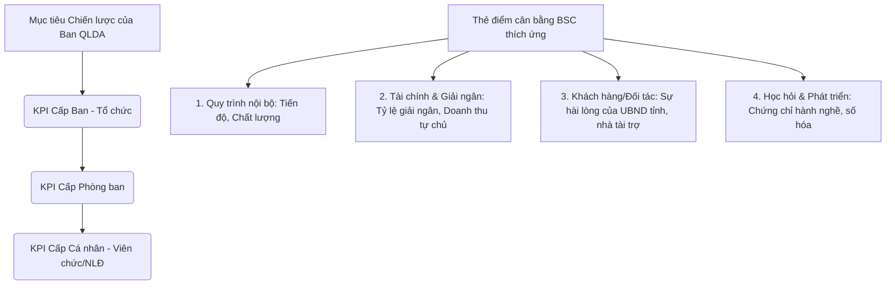
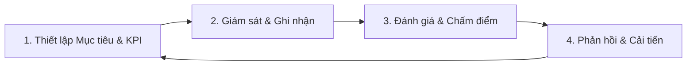

# PHƯƠNG ÁN XÂY DỰNG HỆ THỐNG ĐÁNH GIÁ KPI CHUẨN HÓA VÀ PHÂN RÃ CHI TIẾT CÔNG VIỆC
### BAN QUẢN LÝ DỰ ÁN ĐẦU TƯ XÂY DỰNG CÔNG TRÌNH DÂN DỤNG VÀ HẠ TẦNG KHU VỰC TỈNH HÀ TĨNH

---

Để xây dựng một hệ thống đánh giá hiệu suất (KPI) chuẩn hóa và khoa học cho một đơn vị đặc thù như Ban QLDA đầu tư xây dựng sử dụng vốn ngân sách nhà nước, việc chỉ phân chia công việc theo phòng ban là chưa đủ. Chúng ta cần thiết lập một **Kiến trúc quản lý hiệu suất** đồng bộ, kết hợp giữa **Thẻ điểm cân bằng (BSC)**, **Thư viện công việc theo vị trí chức danh**, và **Phân rã quy trình nghiệp vụ cốt lõi (Workflow Breakdown)**.

Tài liệu này trình bày giải pháp tối ưu để xây dựng hệ thống KPI chuẩn hóa và phân rã chi tiết các quy trình nghiệp vụ thành từng bước công việc nhỏ nhất (Tác vụ - Task).

---

## PHẦN I: KIẾN TRÚC HỆ THỐNG ĐÁNH GIÁ KPI CHUẨN HÓA (KPI FRAMEWORK)

Hệ thống KPI chuẩn nhất cho Ban QLDA được xây dựng dựa trên mô hình **3 Cấp độ đánh giá** phối hợp với các chiều chỉ số của **Thẻ điểm cân bằng (BSC - Balanced Scorecard)** thích ứng cho khối dịch vụ công ích.

### 1. BSC Thích ứng cho Ban QLDA Đầu tư xây dựng công ích
1. **Viễn cảnh Quy trình nội bộ (Trọng số 35%):**
   * Tỷ lệ dự án hoàn thành đúng tiến độ cam kết.
   * Tỷ lệ các gói thầu đấu thầu thành công, không bị hủy thầu hoặc khiếu kiện kéo dài.
   * Tỷ lệ hồ sơ thiết kế, dự toán tự thẩm định đạt chất lượng (không bị cơ quan chuyên môn bác bỏ).
2. **Viễn cảnh Tài chính & Giải ngân (Trọng số 35%):**
   * Tỷ lệ giải ngân vốn đầu tư công thực tế so với kế hoạch vốn được giao (Chỉ tiêu pháp lệnh từ UBND tỉnh).
   * Tổng doanh thu thu được từ các hợp đồng dịch vụ tư vấn ngoài (đối với phòng Phát triển dịch vụ).
   * Tỷ lệ tiết kiệm qua đấu thầu.
3. **Viễn cảnh Khách hàng & Đối tác (Trọng số 15%):**
   * Chỉ số hài lòng của các đơn vị thụ hưởng công trình (trường học, bệnh viện, địa phương).
   * Tỷ lệ xử lý các kiến nghị, vướng mắc của nhà thầu và địa phương đúng hạn.
4. **Viễn cảnh Học hỏi & Phát triển (Trọng số 15%):**
   * Tỷ lệ nhân sự kỹ thuật sở hữu chứng chỉ hành nghề phù hợp (Hạng I, Hạng II về Giám sát, Quản lý dự án, Định giá xây dựng).
   * Tỷ lệ hồ sơ công việc được số hóa và xử lý hoàn toàn trên hệ thống phần mềm quản lý trực tuyến.

---

## PHẦN II: PHÂN RÃ CHI TIẾT CÁC QUY TRÌNH NGHIỆP VỤ CỐT LÕI (WORKFLOW BREAKDOWN)
Để đánh giá chính xác KPI cá nhân, ta phân rã các quy trình nghiệp vụ lớn của Ban thành các **Tác vụ nhỏ (Tasks)**. Khi một dự án bị chậm hoặc lỗi, người quản lý có thể truy vết chính xác lỗi nằm ở bước nào, do nhân viên nào phụ trách.

### Quy trình 1: Chuẩn bị đầu tư (Từ Chủ trương đầu tư đến Phê duyệt dự án)
*Áp dụng chủ trì cho các phòng Quản lý dự án (1, 2, 3) phối hợp phòng Kỹ thuật - Thẩm định và Kế hoạch - Đấu thầu.*

| Bước | Tác vụ chi tiết (Sub-tasks) | Phòng/Vị trí chủ trì | Kết quả đầu ra cụ thể | Thời hạn tối đa (SLA) | Tiêu chí KPI đánh giá |
|---|---|---|---|---|---|
| **1.1** | Khảo sát thực địa sơ bộ, thu thập thông tin quy hoạch, hiện trạng khu đất | Chuyên viên Phòng QLDA | - Báo cáo khảo sát hiện trạng. - Sơ đồ vị trí, ảnh chụp thực tế. | **03 ngày làm việc** kể từ khi nhận văn bản giao nhiệm vụ. | - Đầy đủ dữ liệu hiện trạng. - Đúng quy hoạch sử dụng đất. |
| **1.2** | Lập Đề cương nhiệm vụ và Dự toán chi phí chuẩn bị đầu tư (lập chủ trương đầu tư) | Chuyên viên Phòng QLDA | - Tờ trình nội bộ. - Bản Đề cương nhiệm vụ & dự toán chi phí. | **03 ngày làm việc** sau khi hoàn thành khảo sát. | - Dự toán tính đúng, tính đủ chế độ chính sách hiện hành. |
| **1.3** | Thẩm định nội bộ Đề cương nhiệm vụ và Dự toán chi phí chuẩn bị đầu tư | Chuyên viên phòng KT-TĐ | - Báo cáo kết quả thẩm định nội bộ. - Dự thảo Quyết định phê duyệt. | **03 ngày làm việc** kể từ khi nhận đủ hồ sơ từ phòng QLDA. | - Phát hiện và chỉnh sửa hết sai sót về định mức, đơn giá. |
| **1.4** | Phê duyệt Nhiệm vụ và Dự toán chi phí chuẩn bị đầu tư | Lãnh đạo Ban QLDA | - Quyết định phê duyệt nhiệm vụ & dự toán chi phí. | **02 ngày làm việc** sau khi có báo cáo thẩm định của phòng KT-TĐ. | - Ký phê duyệt đúng thẩm quyền. |
| **1.5** | Lập Báo cáo đề xuất chủ trương đầu tư (hoặc BCNCTKT) | Chuyên viên Phòng QLDA (phối hợp Tư vấn nếu có) | - Tờ trình trình UBND tỉnh/Sở KH&ĐT. - Thuyết minh Báo cáo đề xuất chủ trương đầu tư. | **10 ngày làm việc** kể từ khi duyệt nhiệm vụ chuẩn bị đầu tư. | - Báo cáo thuyết minh đầy đủ luận chứng kinh tế - kỹ thuật. |
| **1.6** | Tổ chức lập Báo cáo nghiên cứu khả thi (BCNCKT) hoặc Báo cáo KTKT | Chuyên viên Phòng QLDA (đôn đốc Tư vấn thiết kế) | - Hồ sơ thiết kế cơ sở và dự toán dự án. - Thuyết minh BCNCKT. | Theo tiến độ hợp đồng tư vấn lập dự án (thông thường **30 - 45 ngày**). | - Tư vấn nộp hồ sơ đúng hạn hợp đồng. - Hồ sơ đạt chất lượng rà soát ban đầu. |
| **1.7** | Rà soát hồ sơ thiết kế cơ sở và dự toán trước khi trình Sở chuyên ngành | Chuyên viên phòng KT-TĐ | - Báo cáo kết quả rà soát chất lượng hồ sơ thiết kế, dự toán. | **05 ngày làm việc** kể từ khi phòng QLDA chuyển hồ sơ tư vấn. | - Giảm thiểu tối đa lỗi kỹ thuật trước khi trình ra ngoài. |
| **1.8** | Trình cơ quan chuyên môn của tỉnh (Sở Xây dựng, Giao thông, Y tế...) thẩm định | Chuyên viên Phòng QLDA | - Giấy biên nhận hồ sơ của Sở chuyên ngành. - Tờ trình trình thẩm định. | **02 ngày làm việc** kể từ khi hoàn thiện hồ sơ sau rà soát. | - Hồ sơ được tiếp nhận ngay lập tức, không bị trả về bổ sung. |
| **1.9** | Hoàn thiện hồ sơ theo ý kiến của cơ quan thẩm định chuyên môn | Chuyên viên Phòng QLDA (đôn đốc Tư vấn) | - Hồ sơ thiết kế, dự toán đã sửa đổi theo yêu cầu thẩm định. | **05 ngày làm việc** kể từ khi nhận được thông báo/ý kiến của cơ quan thẩm định. | - Sửa đúng, sửa đủ 100% nội dung yêu cầu của Sở chuyên ngành. |
| **1.10** | Trình phê duyệt dự án đầu tư xây dựng | Chuyên viên Phòng QLDA | - Quyết định phê duyệt dự án đầu tư của UBND tỉnh (hoặc cấp có thẩm quyền). | **03 ngày làm việc** kể từ ngày nhận được kết quả thẩm định chính thức. | - Có quyết định phê duyệt dự án đúng hạn kế hoạch vốn. |

---

### Quy trình 2: Lựa chọn nhà thầu (Từ Kế hoạch đấu thầu đến Ký hợp đồng)
*Áp dụng chủ trì cho phòng Kế hoạch - Đấu thầu phối hợp các phòng Quản lý dự án và Kỹ thuật - Thẩm định.*

| Bước | Tác vụ chi tiết (Sub-tasks) | Phòng/Vị trí chủ trì | Kết quả đầu ra cụ thể | Thời hạn tối đa (SLA) | Tiêu chí KPI đánh giá |
|---|---|---|---|---|---|
| **2.1** | Lập Kế hoạch lựa chọn nhà thầu (KHLCNT) | Chuyên viên Phòng QLDA | - Tờ trình và Phụ lục KHLCNT (phân chia gói thầu, hình thức đấu thầu, giá gói thầu). | **05 ngày làm việc** kể từ khi quyết định phê duyệt dự án được ban hành. | - Phân chia gói thầu khoa học, đúng quy định pháp luật đấu thầu. |
| **2.2** | Thẩm định Kế hoạch lựa chọn nhà thầu | Chuyên viên phòng KH-ĐT | - Báo cáo thẩm định KHLCNT. - Quyết định phê duyệt KHLCNT (nếu thuộc thẩm quyền của Ban). | **05 ngày làm việc** kể từ khi nhận được hồ sơ trình của phòng QLDA. | - Báo cáo thẩm định chính xác, phát hiện sai sót về hình thức lựa chọn nhà thầu. |
| **2.3** | Lập Hồ sơ mời thầu (HSMT) hoặc Hồ sơ yêu cầu (HSYC) | Chuyên viên phòng KH-ĐT | - Dự thảo HSMT/HSYC theo mẫu Thông tư Bộ KH&ĐT. | **07 ngày làm việc** kể từ ngày KHLCNT được duyệt. | - Không cài cắm các điều kiện hạn chế cạnh tranh không đúng quy định. |
| **2.4** | Thẩm định HSMT / HSYC | Chuyên viên phòng KT-TĐ | - Báo cáo thẩm định HSMT/HSYC. | **04 ngày làm việc** kể từ khi nhận hồ sơ từ phòng KH-ĐT. | - Kiểm tra kỹ tiêu chí năng lực, tài chính, kỹ thuật phù hợp quy mô gói thầu. |
| **2.5** | Đăng tải thông tin đấu thầu lên hệ thống mạng đấu thầu quốc gia (E-GP) | Chuyên viên phòng KH-ĐT | - Thông báo mời thầu, HSMT được đăng tải thành công trên E-GP. | **02 ngày làm việc** sau khi duyệt HSMT. | - Đăng tải đúng thời hạn luật định, không chậm trễ. |
| **2.6** | Đóng thầu, mở thầu qua mạng | Chuyên viên phòng KH-ĐT | - Biên bản mở thầu trích xuất từ hệ thống E-GP. | Đúng ngày giờ đóng thầu quy định trong HSMT. | - Thực hiện mở thầu công khai, minh bạch, bảo mật thông tin. |
| **2.7** | Đánh giá Hồ sơ dự thầu (HSDT) - Bước kỹ thuật | Tổ chuyên gia (đại diện phòng KH-ĐT và QLDA) | - Tờ trình và báo cáo đánh giá danh sách nhà thầu đạt yêu cầu kỹ thuật. | **10 ngày làm việc** kể từ ngày mở thầu. | - Đánh giá khách quan, trung thực, đúng tiêu chuẩn đánh giá của HSMT. |
| **2.8** | Đánh giá HSDT - Bước tài chính/giá | Tổ chuyên gia | - Báo cáo đánh giá tổng hợp HSDT bước tài chính và xếp hạng nhà thầu. | **07 ngày làm việc** kể từ ngày phê duyệt danh sách đạt kỹ thuật. | - Tính toán giá đánh giá, giá so sánh chính xác 100%. |
| **2.9** | Thương thảo hợp đồng | Phòng KH-ĐT chủ trì, phối hợp phòng QLDA | - Biên bản thương thảo hợp đồng. | **03 ngày làm việc** kể từ khi có kết quả xếp hạng nhà thầu. | - Đạt được sự đồng thuận về tiến độ, nhân sự, biện pháp thi công. |
| **2.10** | Thẩm định kết quả lựa chọn nhà thầu | Chuyên viên phòng KT-TĐ | - Báo cáo thẩm định kết quả lựa chọn nhà thầu. | **04 ngày làm việc** kể từ khi nhận báo cáo đánh giá từ Tổ chuyên gia. | - Rà soát kỹ tính pháp lý của quy trình đánh giá, năng lực nhà thầu trúng thầu. |
| **2.11** | Phê duyệt kết quả lựa chọn nhà thầu & Đăng tải kết quả | Chuyên viên phòng KH-ĐT | - Quyết định phê duyệt KQLCNT. - Thông báo trúng thầu được đăng tải lên E-GP. | **02 ngày làm việc** kể từ khi có báo cáo thẩm định KQLCNT. | - Đăng tải đúng thời hạn quy định (trong vòng 05 ngày làm việc). |
| **2.12** | Soạn thảo và ký kết hợp đồng kinh tế | Phòng KH-ĐT phối hợp phòng QLDA | - Hợp đồng xây lắp/tư vấn/mua sắm thiết bị được ký kết giữa Giám đốc Ban và Nhà thầu. | **05 ngày làm việc** kể từ ngày phê duyệt kết quả đấu thầu. | - Điều khoản hợp đồng chặt chẽ, phòng ngừa rủi ro tranh chấp pháp lý. |

---

### Quy trình 3: Quản lý thi công, Chất lượng & Tiến độ xây dựng
*Áp dụng chủ trì cho các phòng Quản lý dự án trực tiếp phối hợp phòng Kỹ thuật - Thẩm định.*

| Bước | Tác vụ chi tiết (Sub-tasks) | Phòng/Vị trí chủ trì | Kết quả đầu ra cụ thể | Thời hạn tối đa (SLA) | Tiêu chí KPI đánh giá |
|---|---|---|---|---|---|
| **3.1** | Bàn giao mặt bằng, mốc giới thi công ngoài thực địa | Chuyên viên Phòng QLDA | - Biên bản bàn giao mốc giới, mặt bằng sạch tại hiện trường. | Trong vòng **05 ngày làm việc** sau khi ký hợp đồng và có mặt bằng sạch. | - Bàn giao đúng ranh giới thiết kế, không tranh chấp. |
| **3.2** | Rà soát, phê duyệt Biện pháp tổ chức thi công và Tiến độ thi công tổng thể | Chuyên viên Phòng QLDA (đôn đốc Tư vấn giám sát) | - Văn bản chấp thuận tiến độ và biện pháp thi công của nhà thầu. | Trước khi nhà thầu khởi công xây dựng công trình. | - Tiến độ khả thi, bám sát tiến độ hợp đồng; biện pháp thi công an toàn. |
| **3.3** | Kiểm tra năng lực thực tế của Nhà thầu và Tư vấn giám sát khi vào hiện trường | Chuyên viên Phòng QLDA | - Biên bản kiểm tra năng lực nhân sự chủ chốt, thiết bị thi công thực tế tại công trường. | Ngày khởi công hoặc **03 ngày** sau khi nhà thầu huy động thiết bị. | - Đúng nhân sự, thiết bị đã cam kết trong HSDT và hợp đồng. |
| **3.4** | Nghiệm thu vật liệu, thiết bị đầu vào đưa vào công trình | Chuyên viên Phòng QLDA (kiểm tra giám sát tư vấn) | - Biên bản nghiệm thu vật liệu, thiết bị. - Kết quả thí nghiệm đạt yêu cầu. | Trước khi đưa vật liệu, thiết bị vào thi công đại trà. | - Kiểm soát 100% xuất xứ, CO/CQ, chứng chỉ chất lượng vật liệu. |
| **3.5** | Nghiệm thu công việc xây dựng tại hiện trường (chuyển bước thi công) | Chuyên viên Phòng QLDA | - Biên bản nghiệm thu công việc xây dựng. - Bản vẽ hoàn công công việc tương ứng. | Trong vòng **24 giờ** kể từ khi nhận được yêu cầu nghiệm thu của nhà thầu. | - Đúng chất lượng bản vẽ, cao độ, kích thước hình học hình vẽ thiết kế. |
| **3.6** | Xử lý sự cố chất lượng hoặc chậm tiến độ trên công trường | Chuyên viên Phòng QLDA | - Biên bản hiện trường ghi nhận sự cố/chậm tiến độ. - Văn bản yêu cầu khắc phục/nhắc nhở tiến độ. | Trong vòng **01 ngày làm việc** khi xảy ra sự cố hoặc chậm tiến độ quá 7 ngày. | - Hành động nhanh chóng, giảm thiểu thiệt hại cho dự án. |
| **3.7** | Nghiệm thu hoàn thành hạng mục công trình / Công trình đưa vào sử dụng | Chuyên viên Phòng QLDA | - Biên bản nghiệm thu hoàn thành công trình/hạng mục đưa vào sử dụng. - Danh mục hồ sơ hoàn công. | Trong vòng **10 ngày làm việc** sau khi nhà thầu hoàn thành toàn bộ khối lượng. | - Công trình hoàn thành đạt tính thẩm mỹ, đúng công năng thiết kế. |

---

### Quy trình 4: Quản lý chi phí, Giải ngân & Thanh toán khối lượng hoàn thành
*Áp dụng chủ trì cho các phòng Quản lý dự án phối hợp phòng Hành chính - Tổng hợp (Bộ phận Kế toán).*

| Bước | Tác vụ chi tiết (Sub-tasks) | Phòng/Vị trí chủ trì | Kết quả đầu ra cụ thể | Thời hạn tối đa (SLA) | Tiêu chí KPI đánh giá |
|---|---|---|---|---|---|
| **4.1** | Kiểm tra hồ sơ đề nghị tạm ứng hợp đồng của nhà thầu | Chuyên viên Phòng QLDA | - Tờ trình đề nghị tạm ứng. - Bảo lãnh tạm ứng hợp lệ. | **03 ngày làm việc** kể từ ngày nhận đủ hồ sơ đề nghị tạm ứng hợp lệ. | - Kiểm tra kỹ giá trị bảo lãnh tạm ứng khớp với điều khoản hợp đồng. |
| **4.2** | Đo đạc, kiểm tra khối lượng hoàn thành thực tế tại hiện trường | Chuyên viên Phòng QLDA phối hợp Tư vấn giám sát | - Biên bản xác nhận khối lượng hoàn thành tại hiện trường. | Định kỳ **hàng tháng** hoặc theo giai đoạn thanh toán của hợp đồng. | - Chỉ xác nhận những khối lượng thi công thực tế đạt chất lượng thiết kế. |
| **4.3** | Kiểm tra và ký duyệt Bảng xác nhận giá trị khối lượng công việc hoàn thành (Phụ lục 03.a/08.b) | Chuyên viên Phòng QLDA và Trưởng phòng QLDA | - Phụ lục 03.a/08.b đầy đủ chữ ký các bên. - Tờ trình đề nghị thanh toán gửi Lãnh đạo Ban. | **05 ngày làm việc** kể từ khi nhận được hồ sơ thanh toán đầy đủ từ nhà thầu. | - Tính toán giá trị thanh toán chính xác, khấu trừ tạm ứng đúng tỷ lệ hợp đồng. |
| **4.4** | Kiểm soát chứng từ kế toán, thực hiện hồ sơ rút vốn tại Kho bạc Nhà nước | Kế toán thanh toán (Phòng HC-TH) | - Phiếu kiểm soát chi của Kho bạc. - Giấy đề nghị thanh toán vốn đầu tư. - Ủy nhiệm chi chuyển tiền cho nhà thầu. | **03 ngày làm việc** kể từ khi nhận đủ hồ sơ trình thanh toán từ phòng QLDA. | - Chứng từ kế toán đúng chế độ. - Hồ sơ rút vốn tại Kho bạc trôi chảy, không bị bác bỏ. |
| **4.5** | Theo dõi, cập nhật tiến độ giải ngân kế hoạch vốn dự án | Chuyên viên Phòng QLDA | - File Excel theo dõi giải ngân của dự án được cập nhật định kỳ. | Cập nhật **hàng tuần** (trước thứ Năm). | - Số liệu báo cáo chính xác tuyệt đối, khớp với số liệu của kế toán. |

---

### Quy trình 5: Kết thúc dự án, Quyết toán dự án hoàn thành
*Áp dụng chủ trì cho các phòng Quản lý dự án phối hợp phòng Hành chính - Tổng hợp (Bộ phận Kế toán).*

| Bước | Tác vụ chi tiết (Sub-tasks) | Phòng/Vị trí chủ trì | Kết quả đầu ra cụ thể | Thời hạn tối đa (SLA) | Tiêu chí KPI đánh giá |
|---|---|---|---|---|---|
| **5.1** | Tập hợp, sắp xếp và số hóa hồ sơ hoàn công dự án | Chuyên viên Phòng QLDA | - Danh mục hồ sơ hoàn công chi tiết. - File PDF scan toàn bộ hồ sơ lưu trữ trên server Ban. | **15 ngày làm việc** kể từ khi ký biên bản nghiệm thu hoàn thành đưa vào sử dụng. | - Sắp xếp khoa học, dễ tra cứu; số hóa sắc nét đầy đủ. |
| **5.2** | Bàn giao tài sản công trình cho đơn vị quản lý sử dụng | Chuyên viên Phòng QLDA | - Biên bản bàn giao tài sản (Biểu mẫu theo quy định quản lý tài sản công). | **10 ngày làm việc** sau khi có thông báo chấp thuận của Sở chuyên ngành. | - Bàn giao đầy đủ công năng, thiết bị, hồ sơ hướng dẫn vận hành. |
| **5.3** | Lập Báo cáo quyết toán dự án hoàn thành | Chuyên viên Phòng QLDA phối hợp Kế toán Ban | - Hồ sơ Báo cáo quyết toán dự án hoàn thành theo mẫu Thông tư Bộ Tài chính. | - Dự án nhóm B: **90 ngày**. - Dự án nhóm C: **60 ngày** kể từ ngày bàn giao đưa vào sử dụng. | - Tổng hợp chi phí đầu tư chính xác; phân định rõ chi phí xây lắp, thiết bị, quản lý dự án, tư vấn, chi phí khác. |
| **5.4** | Tổ chức kiểm toán độc lập báo cáo quyết toán (nếu có) | Chuyên viên Phòng QLDA phối hợp phòng KH-ĐT | - Hợp đồng kiểm toán. - Báo cáo kết quả kiểm toán độc lập. | Theo kế hoạch đấu thầu gói thầu kiểm toán được duyệt. | - Lựa chọn đơn vị kiểm toán uy tín; giải trình số liệu kịp thời. |
| **5.5** | Trình cơ quan thẩm tra quyết toán (Sở Tài chính) phê duyệt quyết toán | Chuyên viên Phòng QLDA | - Tờ trình trình phê duyệt quyết toán dự án hoàn thành gửi Sở Tài chính. | **05 ngày làm việc** sau khi có báo cáo kiểm toán độc lập. | - Nộp hồ sơ quyết toán đúng hạn luật định. |
| **5.6** | Giải trình số liệu và hoàn thiện hồ sơ theo yêu cầu thẩm tra | Chuyên viên Phòng QLDA phối hợp Kế toán | - Biên bản giải trình quyết toán. - Quyết định phê duyệt quyết toán dự án hoàn thành của UBND tỉnh. | Trong vòng **15 ngày làm việc** kể từ khi nhận được văn bản yêu cầu giải trình của Sở Tài chính. | - Bảo vệ tối đa giá trị quyết toán của Ban; giải trình thuyết phục, đúng luật. |
| **5.7** | Tất toán tài khoản dự án, thanh lý hợp đồng | Kế toán Ban phối hợp Phòng QLDA | - Biên bản thanh lý tất cả các hợp đồng thuộc dự án. - Quyết định tất toán tài khoản dự án tại Kho bạc. | **30 ngày làm việc** kể từ khi có Quyết định phê duyệt quyết toán của UBND tỉnh. | - Đảm bảo không còn nợ đọng công nợ đối với các nhà thầu và các khoản phải thu. |

---

## PHẦN III: HƯỚNG DẪN XÂY DỰNG HỆ THỐNG ĐÁNH GIÁ KPI CHUẨN NHẤT
Để hệ thống đánh giá KPI này vận hành thành công và công bằng nhất, cơ quan cần áp dụng mô hình **Quản lý hiệu suất 4 giai đoạn liên tục** (Continuous Performance Management) thay vì chỉ đánh giá một chiều từ trên xuống vào cuối năm.

### 1. Nguyên tắc thiết lập KPI cá nhân hàng tháng (Thẻ KPI cá nhân)
Mỗi nhân viên hàng tháng sẽ ký một **Thẻ KPI cá nhân** gồm tối đa 5 - 7 chỉ số chính được rút ra từ Thư viện phân rã công việc ở Phần II. Ví dụ, một Chuyên viên quản lý dự án (phòng QLDA) sẽ có thẻ KPI tháng như sau:

| Tên KPI cá nhân | Cách tính / Đo lường | Trọng số | Chỉ tiêu kế hoạch tháng | Kết quả thực tế | Điểm đạt được |
|---|---|---|---|---|---|
| **1. Tiến độ nghiệm thu** | Tỷ lệ biên bản nghiệm thu hiện trường ký đúng SLA (trong vòng 24h). | 25% | 100% đúng hạn | | |
| **2. Tỷ lệ giải ngân** | Số vốn giải ngân thực tế của các dự án phụ trách so với kế hoạch tháng. | 25% | Đạt >= 95% kế hoạch | | |
| **3. Tiến độ hồ sơ thanh toán** | Tỷ lệ hồ sơ thanh toán ký trình kế toán đúng SLA (trong vòng 5 ngày). | 20% | 100% đúng hạn | | |
| **4. Chất lượng hồ sơ thiết kế** | Số lần hồ sơ trình bị Sở chuyên ngành trả về yêu cầu sửa đổi lớn. | 20% | 0 lần | | |
| **5. Ý thức phối hợp** | Điểm đánh giá phối hợp từ phòng KH-ĐT và KT-TĐ. | 10% | Đạt loại Tốt | | |
| **TỔNG CỘNG** | | **100%** | | | |

### 2. Các yếu tố cốt lõi giúp hệ thống KPI "chuẩn nhất":
1. **Lượng hóa tối đa (Quantifiable KPIs):** Không dùng các tiêu chí mơ hồ như "Lập báo cáo tốt", "Thẩm định nhiệt tình". Phải đổi thành "100% báo cáo đúng hạn trước ngày 25", "Số lỗi định mức đơn giá phát hiện trong báo cáo thẩm định >= 5 lỗi/hồ sơ".
2. **Hệ thống hóa bằng phần mềm (Software Integration):** 
   * Tích hợp danh sách phân rã công việc vào phần mềm quản lý công việc của Ban (ví dụ: Jira, Trello, Base hoặc hệ thống ERP nội bộ của Ban).
   * Khi chuyên viên cập nhật trạng thái Task (từ *Đang thực hiện* sang *Hoàn thành*), phần mềm sẽ tự động ghi nhận thời gian hoàn thành (Timestamp) để so sánh với SLA quy định. Hệ thống sẽ tự động tính điểm KPI tiến độ mà không cần chấm thủ công, tránh cảm tính.
3. **Phản hồi 360 độ (360-Degree Feedback):** Nhân viên phòng QLDA trình hồ sơ thanh toán cho Kế toán, nếu kế toán ngâm hồ sơ hoặc chuyên viên QLDA nộp hồ sơ thiếu sót dẫn đến chậm trễ, hệ thống phải cho phép đánh giá chéo giữa các phòng ban để tìm ra đúng nguyên nhân nghẽn cổ chai.
4. **Liên kết kết quả KPI với thu nhập tăng thêm:** Điểm KPI hàng tháng phải là căn cứ trực tiếp để chia quỹ thu nhập tăng thêm (theo cơ chế tự chủ tài chính Nghị định 60/2021/NĐ-CP và Nghị định 111/2025/NĐ-CP của đơn vị sự nghiệp công lập). 
   * KPI đạt loại A (Xuất sắc): Hưởng hệ số thu nhập tăng thêm tối đa (Vd: 1.5).
   * KPI đạt loại B (Tốt): Hưởng hệ số tiêu chuẩn (Vd: 1.0).
   * KPI đạt loại C (Khá): Hưởng hệ số thấp (Vd: 0.7).
   * KPI đạt loại D (Trung bình/Yếu): Không được hưởng thu nhập tăng thêm và đưa vào diện xem xét luân chuyển công tác.
5. **Quy chế xử lý bất khả kháng:** Trong quản lý dự án xây dựng, rất nhiều nguyên nhân khách quan dẫn đến chậm tiến độ (như thời tiết mưa bão, chậm giải phóng mặt bằng từ phía chính quyền địa phương, nhà thầu phá sản...). Quy chế KPI phải có điều khoản **loại trừ nguyên nhân khách quan** sau khi có báo cáo giải trình được Giám đốc Ban xác nhận để không trừ điểm oan cho nhân viên phụ trách.
