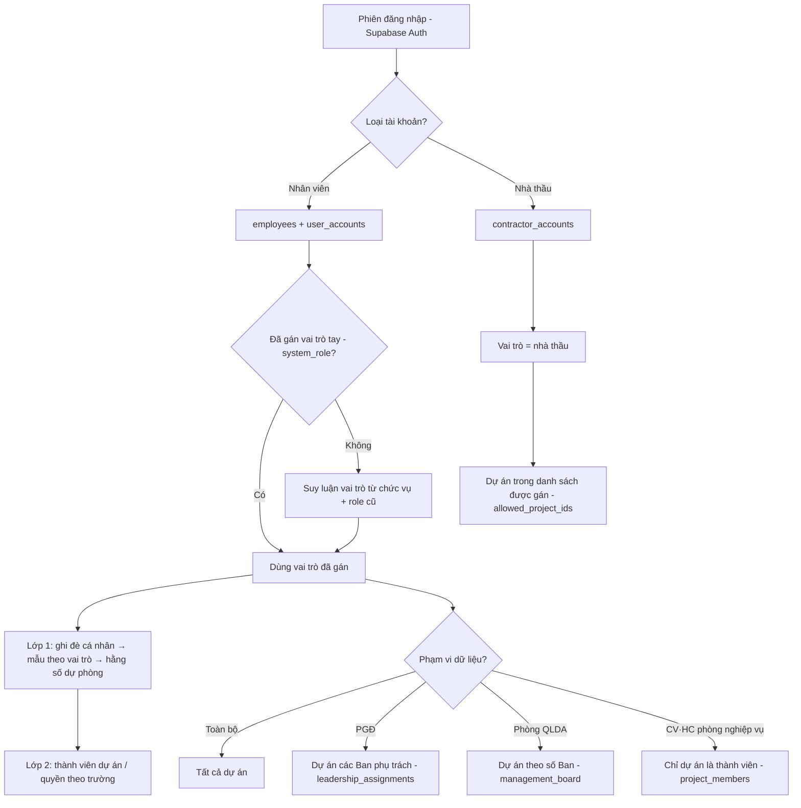

# 🔐 PHÂN QUYỀN HỆ THỐNG QLDA — TÀI LIỆU CHUẨN DUY NHẤT

**Ban QLDA Đầu tư xây dựng công trình Dân dụng và Hạ tầng khu vực tỉnh Hà Tĩnh**

> [!IMPORTANT]
> **Phiên bản:** 3.1 · **Cập nhật:** 2026-06-06 · **Trạng thái:** Chính thức (nguồn-sự-thật duy nhất)
> Tài liệu này **thay thế và hợp nhất** 3 tài liệu cũ đã xóa: `authorization_specification.md`, `huong_dan_phan_quyen_nguoi_dung.md`, `ke-hoach-auth-security.md`.
> Mọi nơi (mã nguồn, dữ liệu mẫu cơ sở dữ liệu, hướng dẫn) tham chiếu về đây. Khi sửa quyền: sửa tài liệu này **trước**, rồi đồng bộ mã nguồn + dữ liệu mẫu.
>
> 📌 **Căn cứ nghiệp vụ:** Quy chế làm việc Ban QLDA (ban hành 11/2025) · QĐ phân công nhiệm vụ Ban Giám đốc (07/11/2025) · Quy chế nhập liệu QLDA.
> 🔒 **Nguyên tắc cốt lõi:** *Mặc định từ chối* (deny-by-default) — mọi quyền bị từ chối cho đến khi được cấp rõ ràng; khi quyền chưa tải xong → từ chối.
>
> 📖 **Tài liệu này mô tả trạng thái MỤC TIÊU (chuẩn)** mà hệ thống hướng tới. Một số điểm ở mã nguồn / cơ sở dữ liệu hiện chưa khớp 100% — xem danh sách việc cần đồng bộ tại [Phần J](#phần-j--kế-hoạch-chuẩn-hóa-còn-lại-roadmap).

---

## Mục lục

- [Phần 0 — Bảng thuật ngữ & Giải thích dễ hiểu](#phần-0--bảng-thuật-ngữ--giải-thích-dễ-hiểu)
- [Phần A — Kiến trúc & Cơ chế kiểm tra quyền](#phần-a--kiến-trúc--cơ-chế-kiểm-tra-quyền)
- [Phần B — Vai trò hệ thống](#phần-b--vai-trò-hệ-thống)
- [Phần C — Bảng quyền theo phân hệ](#phần-c--bảng-quyền-theo-phân-hệ-giai-đoạn-1)
- [Phần D — Phạm vi dữ liệu](#phần-d--phạm-vi-dữ-liệu--ai-thấy-dự-án-nào)
- [Phần E — Bảo mật phụ trợ & Hạ tầng bảo mật theo dòng](#phần-e--bảo-mật-phụ-trợ--hạ-tầng-bảo-mật-theo-dòng)
- [Phần F — Giả làm người dùng](#phần-f--giả-làm-người-dùng-impersonation)
- [Phần G — Hướng dẫn cho người dùng cuối](#phần-g--hướng-dẫn-cho-người-dùng-cuối)
- [Phần H — Dành cho Lập trình viên](#phần-h--dành-cho-lập-trình-viên)
- [Phần I — Phân hệ để giai đoạn sau](#phần-i--phân-hệ-để-giai-đoạn-sau)
- [Phần J — Kế hoạch chuẩn hóa còn lại](#phần-j--kế-hoạch-chuẩn-hóa-còn-lại-roadmap)

---

# PHẦN 0 — BẢNG THUẬT NGỮ & GIẢI THÍCH DỄ HIỂU

## 0.1 Bảng thuật ngữ Anh – Việt

Tài liệu dùng tiếng Việt là chính. Mỗi thuật ngữ kỹ thuật kèm tiếng Anh trong ngoặc ở lần xuất hiện đầu để tiện tra cứu.

| Tiếng Anh | Cách gọi trong tài liệu | Giải thích ngắn |
| :--- | :--- | :--- |
| RBAC (Role-Based Access Control) | **Phân quyền theo vai trò** | Cấp quyền theo *vai trò* (Giám đốc, Chuyên viên…), không gán lẻ từng người. |
| ABAC (Attribute-Based) / Customizable | **Tùy chỉnh quyền theo cá nhân** | Quản trị viên bật/tắt thêm quyền cho một người cụ thể, ghi đè vai trò. |
| Deny-by-default | **Mặc định từ chối** | Chưa được cấp rõ ràng thì coi như *không có quyền*. |
| Defense-in-depth | **Phòng thủ nhiều tầng** | Kiểm tra quyền ở cả giao diện *và* cơ sở dữ liệu. |
| Scope / Data scope | **Phạm vi dữ liệu** | "Thấy dữ liệu của ai" — toàn ban, một phòng, hay chỉ dự án mình tham gia. |
| RLS (Row Level Security) | **Bảo mật theo dòng** | Cơ sở dữ liệu tự lọc *từng dòng* theo người đang đăng nhập. |
| Impersonation | **Giả làm người dùng** | Công cụ cho quản trị viên *xem trước* quyền của người khác. |
| Record-level | **Theo từng bản ghi** | Quyền xét trên *chính dự án/công việc đó*, không xét chung. |
| Dual Auth | **Hai luồng đăng nhập** | Tách riêng tài khoản Nhân sự Ban và tài khoản Nhà thầu. |
| Override | **Ghi đè quyền cá nhân** | Quyền gán riêng cho một người, ưu tiên cao hơn quyền theo vai trò. |
| MFA (Multi-Factor) / TOTP | **Xác thực đa yếu tố** | Đăng nhập cần thêm mã OTP ngoài mật khẩu. |
| JWT / Session | **Phiên đăng nhập** | "Vé" chứng minh bạn đã đăng nhập, hệ thống dựa vào đó để biết bạn là ai. |
| Cache | **Bộ nhớ đệm** | Lưu tạm quyền đã tải để khỏi hỏi lại cơ sở dữ liệu liên tục. |
| Fallback | **Giá trị dự phòng** | Dùng khi nguồn chính (cơ sở dữ liệu) tạm thời không có. |
| Board (number) | **Số Ban** | Số định danh phòng Quản lý dự án (Ban 1/2/3), dùng để giới hạn phạm vi. |

> 📌 **Tên bảng và cột cơ sở dữ liệu giữ nguyên tiếng Anh** (ví dụ `project_members`, `management_board`, `created_by`) vì đây là định danh kỹ thuật không dịch. Mỗi lần dùng đều kèm giải thích tiếng Việt.

## 0.2 Giải thích bằng ngôn ngữ thường ngày

Hình dung quyền của một người gồm **2 câu hỏi tách biệt**:

1. **"Được làm gì?"** → Tùy *vai trò*. Ví dụ: Chuyên viên được *Thêm/Sửa* dự án; Giám đốc chỉ *Xem*.
2. **"Thấy dữ liệu của ai?"** → Tùy *phạm vi*. Ví dụ: Chuyên viên Phòng QLDA 1 chỉ thấy dự án của Ban 1; Giám đốc thấy tất cả.

> 🧑‍💼 **Ví dụ:** *Chị An — Chuyên viên Phòng QLDA 1* đăng nhập:
> - **Thấy** danh sách dự án **của Ban 1** (không thấy dự án Ban 2, Ban 3).
> - **Tạo** được dự án mới, **Sửa** được dự án mà chị **được giao phụ trách** (là thành viên hoặc người tạo) — nhưng **không sửa** được dự án của đồng nghiệp khác trong Ban.
> - **Không thấy** menu *Cài đặt hệ thống* (chỉ Quản trị viên mới có).
>
> 🧑‍💼 *Anh Bình — Chuyên viên Phòng Kế hoạch – Đấu thầu (phòng nghiệp vụ)* đăng nhập:
> - **Chỉ thấy** những dự án mà anh **được thêm làm thành viên** — không thấy toàn bộ.
> - Lãnh đạo phòng anh (Trưởng/Phó phòng) thì **thấy tất cả dự án** để theo dõi chung.

Hai câu hỏi trên được hệ thống trả lời qua **cơ chế 2 lớp** (Phần A) và **phạm vi dữ liệu** (Phần D).

---

# PHẦN A — KIẾN TRÚC & CƠ CHẾ KIỂM TRA QUYỀN

## A.1 Nguyên tắc

| Nguyên tắc | Mô tả |
| :--- | :--- |
| 🔒 **Mặc định từ chối** (deny-by-default) | Mọi quyền bị từ chối cho đến khi được cấp. Quyền chưa tải xong → hàm `can()` trả về `false`. |
| 🎭 **Phân quyền theo vai trò** (RBAC) | Quyền cấp theo **vai trò hệ thống** (system role), không gán lẻ tẻ. |
| ⚙️ **Tùy chỉnh theo cá nhân** (ABAC) | Quản trị viên có thể bật/tắt từng quyền cho từng người (ghi đè vai trò). |
| 🌍 **Theo phạm vi dữ liệu** (scope-aware) | Phạm vi động: Toàn ban / Theo phụ trách (PGĐ) / Theo phòng QLDA / Theo thành viên (CV·HC) / Theo nhà thầu. |
| 👥 **Hai luồng đăng nhập** (dual auth) | Tách 2 tệp người dùng: Nhân sự Ban (`employees`) & Nhà thầu (`contractors`). |
| 🧱 **Phòng thủ nhiều tầng** (defense-in-depth) | Kiểm tra ở **2 tầng**: Giao diện (`can()`) + Cơ sở dữ liệu (bảo mật theo dòng — RLS). |

## A.2 Cơ chế 2 lớp kiểm tra quyền

Đây là điểm cốt lõi của hệ thống. Một thao tác được phép **chỉ khi qua đủ cả 2 lớp**:

| Lớp | Trả lời câu hỏi | Cơ chế | Nguồn dữ liệu |
| :--- | :--- | :--- | :--- |
| **Lớp 1 — Quyền theo vai trò** | Vai trò này *về nguyên tắc* được làm gì? | `DEFAULT_ROLE_PERMISSIONS` (hằng số dự phòng) ⇄ `role_permission_defaults` (bảng cơ sở dữ liệu) ⇄ `user_permissions` (ghi đè cá nhân) | Cơ sở dữ liệu là chuẩn, hằng số là dự phòng |
| **Lớp 2 — Quyền theo từng dự án/bản ghi** | Trên *chính dự án này* họ có quyền sửa không? | `canEditProject()` / `canOnProject()` (xét người tạo `created_by` và thành viên `project_members`) + quyền theo từng trường | `project_members`, `project_field_permissions` (cơ sở dữ liệu) |

> 💡 **Cách hiểu:** Lớp 1 nói *"Chuyên viên được Sửa dự án"*; Lớp 2 siết lại *"chỉ được Sửa dự án mà mình tạo hoặc được giao làm thành viên"*.
>
> ℹ️ **Lưu ý lịch sử:** Trước đây từng có thêm một lớp giới hạn theo **phòng ban** (department rules). Lớp này **đã được loại bỏ** (2026-06-06) vì đã có phân quyền theo vai trò và theo thành viên dự án. Quyền hiện chỉ phụ thuộc **vai trò + thành viên dự án**.

## A.3 Thứ tự ưu tiên trong hàm kiểm tra quyền `can()`

```
1. Là Quản trị viên (super_admin)?      → CHO PHÉP TẤT CẢ (bỏ qua mọi kiểm tra)
2. Quyền chưa tải xong (!loaded)?       → TỪ CHỐI (an toàn)
3. Có ghi đè cá nhân (user_permissions)? → trả CHO PHÉP/TỪ CHỐI theo đó (TUYỆT ĐỐI)
4. Có mẫu quyền theo vai trò (role_permission_defaults)? → trả CHO PHÉP/TỪ CHỐI
5. Dùng giá trị dự phòng DEFAULT_ROLE_PERMISSIONS (hằng số) → trả kết quả + ghi cảnh báo
```

> **Lớp 2** (`canEditProject`, `canOnProject`) áp **thêm** ở các điểm thao tác trên một dự án cụ thể, *sau khi* đã qua Lớp 1.

## A.4 Luồng phân quyền tổng thể



---

# PHẦN B — VAI TRÒ HỆ THỐNG

**9 vai trò** (định nghĩa tại `types/permission.types.ts`). Quản trị viên có thể gán thủ công qua cột `employees.system_role`, ghi đè kết quả suy luận tự động.

| # | Vai trò (nhãn hiển thị) | Mã hệ thống | Phạm vi dữ liệu | Ai thuộc nhóm |
| :--- | :--- | :--- | :--- | :--- |
| 1 | 🔑 Quản trị viên HT | `super_admin` | Toàn bộ (bỏ qua kiểm tra) | Người quản trị phần mềm |
| 2 | 👔 Giám đốc *(Lãnh đạo Ban)* | `director` | Toàn bộ | Giám đốc Ban |
| 3 | 👔 Phó Giám đốc *(Lãnh đạo Ban)* | `deputy_director` | **Theo phòng phụ trách** | 03 Phó Giám đốc |
| 4 | 📊 Kế toán trưởng | `chief_accountant` | Toàn bộ (tài chính) | Kế toán trưởng |
| 5 | 📋 Trưởng phòng *(Lãnh đạo phòng)* | `dept_head` | Toàn bộ / Theo phòng | Trưởng phòng, Chánh VP, GĐ Trung tâm |
| 6 | 📋 Phó phòng *(Lãnh đạo phòng)* | `deputy_head` | Toàn bộ / Theo phòng | Phó Trưởng phòng, Phó VP |
| 7 | 🔧 Chuyên viên | `specialist` | Theo phòng / Theo thành viên | Chuyên viên, Kỹ sư, TVGS, Thành viên |
| 8 | 📝 Hành chính | `staff` | Theo phòng / Theo thành viên | Văn thư, hành chính, kế toán viên |
| 9 | 👷 Nhà thầu | `contractor` | Theo dự án được gán | Đại diện nhà thầu *(giai đoạn sau)* |

> 💡 `director` và `deputy_director` cùng nhãn **"Lãnh đạo Ban"** nhưng khác **phạm vi dữ liệu** (Phần D) và quyền quản trị.

## B.1 Quy tắc suy luận vai trò (hàm `resolveSystemRole`)

Ưu tiên cột `employees.system_role` (gán tay); nếu trống → suy từ chức vụ (`position`) + vai trò cũ (`role`):
`Admin/quản trị → super_admin` · `Giám đốc → director` · `Phó Giám đốc → deputy_director` · `Kế toán trưởng → chief_accountant` · `Trưởng phòng/Chánh VP/GĐ Trung tâm → dept_head` · `Phó phòng → deputy_head` · `Chuyên viên/Kỹ sư/Thành viên → specialist` · `Nhân viên → staff` · `Nhà thầu → contractor`.

> ⚠️ **Khuyến nghị:** Nên **gán tường minh** `system_role` cho mọi nhân sự thay vì để hệ thống suy luận, tránh trường hợp chức vụ lạ (vd "Lao động hợp đồng") bị suy nhầm. Xem [Phần J](#phần-j--kế-hoạch-chuẩn-hóa-còn-lại-roadmap).

## B.2 Chuyên viên: "phụ trách" vs "hỗ trợ" (xét theo từng dự án)

Theo Quy chế (Điều 2.3 & 5.4), vai trò Chuyên viên tách 2 mức **theo từng dự án** (không cố định) — đây chính là biểu hiện của **Lớp 2** (quyền theo bản ghi):

| Mức | Là ai | Quyền trên dự án đó |
| :--- | :--- | :--- |
| **CV·PT** (phụ trách) | CV/KS Phòng QLDA chủ trì, được giao phụ trách chính (1 người/dự án) | Tác nghiệp đầy đủ: lập/sửa dự án, giao & quản lý công việc |
| **CV·HT** (hỗ trợ) | CV phòng khác / CV cùng phòng không phụ trách | Chủ yếu Xem + phối hợp; sửa phần việc được giao |

Lưu tại cột `project_members.role` (đã có sẵn 5 giá trị: Giám đốc dự án · Trưởng phòng phụ trách · **Chuyên viên phụ trách** ⇒ CV·PT · Kế toán dự án · **Thành viên** ⇒ CV·HT).

---

# PHẦN C — BẢNG QUYỀN THEO PHÂN HỆ (Giai đoạn 1)

> [!IMPORTANT]
> Giai đoạn 1 chỉ phân quyền **12 phân hệ đang vận hành**. Phân hệ hoãn xem [Phần I]. Bảng dưới **khớp với mã nguồn hiện tại** (`DEFAULT_ROLE_PERMISSIONS` + Lớp 2 theo dự án).
>
> Hành động: 👁️ Xem (`view`) · ➕ Thêm (`create`) · ✏️ Sửa (`update`) · 🗑️ Xóa (`delete`) · 📤 Xuất (`export`).
> Viết tắt: **GĐ** Giám đốc · **PGĐ** Phó Giám đốc · **KTT** Kế toán trưởng · **TrP** Trưởng phòng · **PhP** Phó phòng · **CV** Chuyên viên · **HC** Hành chính. *(QTV = Quản trị viên, toàn quyền, không liệt kê.)*
> 📝 = quyền bị **Lớp 2** siết lại theo người tạo / thành viên dự án.

### C.1 🏠 Tổng quan (`/`)
| Hành động | GĐ | PGĐ | KTT | TrP | PhP | CV | HC |
| :-- | :-: | :-: | :-: | :-: | :-: | :-: | :-: |
| 👁️ Xem | ✅ | ✅ | ✅ | ✅ | ✅ | ✅ | ✅ |
| 📤 Xuất | ✅ | ✅ | ✅ | ❌ | ❌ | ❌ | ❌ |

> Trang Tổng quan tuân thủ "của ai thấy của người đấy": CV/HC chỉ thấy việc được giao; TrP thấy của phòng; Lãnh đạo thấy phòng phụ trách / toàn bộ.

### C.2 📅 Lịch cơ quan (`/calendar`)
| Hành động | GĐ | PGĐ | KTT | TrP | PhP | CV | HC |
| :-- | :-: | :-: | :-: | :-: | :-: | :-: | :-: |
| 👁️ Xem | ✅ | ✅ | ✅ | ✅ | ✅ | ✅ | ✅ |
| ➕ Thêm | ✅ | ✅ | ❌ | ✅ | ✅ | ❌ | ❌ |
| ✏️ Sửa | ✅ | ✅ | ❌ | ✅ | ✅ | ❌ | ❌ |
| 🗑️ Xóa | ✅ | ✅ | ❌ | ❌ | ❌ | ❌ | ❌ |

### C.3 📁 Quản lý dự án (`/projects`)
| Hành động | GĐ | PGĐ | KTT | TrP | PhP | CV·PT | CV·HT | HC |
| :-- | :-: | :-: | :-: | :-: | :-: | :-: | :-: | :-: |
| 👁️ Xem | ✅ | ✅ | ✅ | ✅ | ✅ | ✅ | ✅ | ✅ |
| ➕ Thêm | ❌ | ❌ | ❌ | ❌ | ❌ | ✅ | ❌ | ❌ |
| ✏️ Sửa | ❌ | ❌ | ❌ | ❌ | ❌ | 📝✅ | 📝✅ | 📝✅ |
| 🗑️ Xóa | ❌ | ❌ | ❌ | ❌ | ❌ | ❌ | ❌ | ❌ |

> **Quyết định #1:** Lãnh đạo Ban/Phòng **chỉ Xem** dự án (chỉ đạo/duyệt), giao tác nghiệp cho phòng QLDA.
> 📝 **Sửa dự án:** chỉ người tạo (`created_by`) HOẶC thành viên dự án (`project_members`) — gồm cả CV·HT/HC được phân công (Lớp 2). Quyền chi tiết theo **từng trường** qua `project_field_permissions`.

### C.4 ✅ Quản lý công việc (`/work-plan`)
| Hành động | GĐ | PGĐ | KTT | TrP | PhP | CV | HC |
| :-- | :-: | :-: | :-: | :-: | :-: | :-: | :-: |
| 👁️ Xem | ✅ | ✅ | ✅ | ✅ | ✅ | ✅ | ✅ |
| ➕ Thêm | ❌ | ❌ | ❌ | ✅ | ✅ | ✅ | ✅ |
| ✏️ Sửa | ❌ | ❌ | ❌ | ✅ | ✅ | 📝✅ | 📝✅ |
| 🗑️ Xóa | ❌ | ❌ | ❌ | ✅ | ❌ | ❌ | ❌ |

> 📌 Phạm vi xem: nhân sự thấy việc của phòng mình (`department_code`); ngoại lệ xem toàn bộ chỉ QTV/GĐ/TrP phòng HC-TH; PGĐ thấy việc các phòng phụ trách.
> 📝 Sửa/cập nhật/bình luận: chỉ người tạo, người được giao (`assignee_id`), hoặc người phối hợp (`collaborator_ids`). TrP xóa được việc của phòng mình.

### C.5 👤 Nhân sự (`/employees`)
| Hành động | GĐ | PGĐ | KTT | TrP | PhP | CV | HC |
| :-- | :-: | :-: | :-: | :-: | :-: | :-: | :-: |
| 👁️ Xem | ✅ | ✅ | ✅ | ✅ | ✅ | ✅ | ✅ |
| ➕ Thêm | ❌ | ❌ | ❌ | ✅ | ❌ | ❌ | ❌ |
| ✏️ Sửa | ❌ | ❌ | ❌ | ✅ | ❌ | ❌ | ❌ |
| 🗑️ Xóa | ❌ | ❌ | ❌ | ✅ | ❌ | ❌ | ❌ |

> **Quyết định #3:** QTV và **Trưởng phòng** được Thêm/Sửa/Xóa nhân sự; còn lại chỉ Xem.

### C.6 ⚖️ VB Pháp luật & Quy chế (`/legal-documents`, `/regulations`)
| Hành động | GĐ | PGĐ | KTT | TrP | PhP | CV | HC |
| :-- | :-: | :-: | :-: | :-: | :-: | :-: | :-: |
| 👁️ Xem | ✅ | ✅ | ✅ | ✅ | ✅ | ✅ | ✅ |
| ➕ Thêm | ❌ | ❌ | ❌ | ✅ | ✅ | ✅ | ✅ |
| ✏️ Sửa | ❌ | ❌ | ❌ | ✅ | ✅ | ✅ | ✅ |

> **Quyết định #5:** Thêm/Sửa điều khoản Quy chế: QTV và các vai trò TrP/PhP/CV/HC. Lãnh đạo Ban chỉ Xem.

### C.7 📊 Báo cáo (`/reports`)
| Hành động | GĐ | PGĐ | KTT | TrP | PhP | CV | HC |
| :-- | :-: | :-: | :-: | :-: | :-: | :-: | :-: |
| 👁️ Xem | ✅ | ✅ | ✅ | ✅ | ✅ | ✅ | ✅ |
| 📤 Xuất | ✅ | ✅ | ✅ | ✅ | ✅ | ❌ | ❌ |

### C.8 🔄 Quy trình (`/quy-trinh`)
| Hành động | GĐ | PGĐ | KTT | TrP | PhP | CV | HC |
| :-- | :-: | :-: | :-: | :-: | :-: | :-: | :-: |
| 👁️ Xem | ✅ | ✅ | ✅ | ✅ | ✅ | ✅ | ✅ |
| ➕ Thêm / ✏️ Sửa | ❌ | ❌ | ❌ | ✅ | ❌ | ❌ | ❌ |

### C.9 ⚙️ Cài đặt hệ thống (`/settings`)
**Đặc quyền duy nhất của Quản trị viên (`super_admin`).** GĐ/PGĐ/KTT và mọi phòng ban khác **không** truy cập (xem tài khoản, phân quyền, nhật ký đều ❌ cho tất cả vai trò ngoài QTV).

## C.10 Tổng hợp 1 bảng
> **X**=Xem · **T**=Thêm · **S**=Sửa · **D**=Xóa · **E**=Xuất · **—**=không. (QTV toàn quyền.) · 📝 = Lớp 2 siết theo dự án.

| Phân hệ | GĐ | PGĐ | KTT | TrP | PhP | CV·PT | CV·HT | HC |
| :--- | :-- | :-- | :-- | :-- | :-- | :-- | :-- | :-- |
| Tổng quan | X E | X E | X E | X | X | X | X | X |
| Lịch cơ quan | X T S D | X T S D | X | X T S | X T S | X | X | X |
| Dự án | X | X | X | X | X | X T S📝 | X S📝 | X S📝 |
| Công việc | X | X | X | X T S D | X T S | X T S📝 | X T S📝 | X T S📝 |
| Nhân sự | X | X | X | X T S D | X | X | X |
| VB/Quy chế | X | X | X | X T S | X T S | X T S | X T S |
| Báo cáo | X E | X E | X E | X E | X E | X | X |
| Quy trình | X | X | X | X T S | X | X | X |
| Cài đặt | — | — | — | — | — | — | — |

---

# PHẦN D — PHẠM VI DỮ LIỆU — AI THẤY DỰ ÁN NÀO

Quyền hành động (Phần C) trả lời *"được làm gì"*; **phạm vi dữ liệu** trả lời *"thấy dữ liệu của ai"*. Hai người cùng vai trò nhưng khác phòng sẽ thấy tập dự án khác nhau.

## D.1 Năm loại phạm vi dữ liệu
| Phạm vi | Áp dụng cho | Thấy được | Cơ chế |
| :--- | :--- | :--- | :--- |
| 🌍 **Toàn bộ** | QTV, GĐ, KTT, **Trưởng/Phó phòng nghiệp vụ** (HC-TH, KH-ĐT, KT-TĐ, PTDV) | Tất cả dự án | `GLOBAL_VIEW_ROLES` / `GLOBAL_VIEW_DEPARTMENTS` |
| 👔 **Theo phụ trách** | **Phó Giám đốc** | Dự án các phòng PGĐ phụ trách | `leadership_assignments` → danh sách Ban phụ trách |
| 🏢 **Theo phòng** | Phòng QLDA 1/2/3 | Chỉ dự án phòng mình quản lý | `management_board` (số Ban) |
| 👥 **Theo thành viên** | CV & HC phòng nghiệp vụ | Chỉ dự án được thêm làm thành viên | `project_members` |
| 👷 **Theo nhà thầu** | Nhà thầu *(giai đoạn sau)* | Dự án được chỉ định | `allowed_project_ids` |

> Phạm vi dùng **số Ban** (`management_board`), không phụ thuộc tên phòng → tránh lệch khi tên phòng có biến thể.

## D.2 Phân công Phòng QLDA (Quy chế Điều 5.4.đ)
| Phòng | Địa bàn / lĩnh vực |
| :--- | :--- |
| **QLDA 1** | Đức Thọ, Vũ Quang; văn hóa, y tế, giáo dục, QLNN |
| **QLDA 2** | ODA, BIG2; Can Lộc, Cẩm Xuyên |
| **QLDA 3** | Thạch Hà, Hương Khê |

> Hiện chỉ còn **3 Phòng QLDA** (Quyết định #7 — đã dọn QLDA 4/5).

## D.3 ⭐ Phân công Phó Giám đốc — theo QĐ phân công nhiệm vụ BGĐ (07/11/2025)

Lưu tại bảng `leadership_assignments` (nguồn sự thật, thay cho "đoán theo thứ tự"):

| Lãnh đạo | Phòng trực tiếp phụ trách | ⇒ Phạm vi dữ liệu dự án |
| :--- | :--- | :--- |
| **GĐ Nguyễn Quang Linh** | Phòng KH-ĐT | 🌍 Toàn bộ (phụ trách chung) |
| **PGĐ Trần Ngọc Bảo** | **QLDA 1** + Phòng PTDV | Dự án QLDA 1 (+ tư vấn PTDV) |
| **PGĐ Nguyễn Văn Nhân** | **QLDA 2** + Phòng HC-TH | Dự án QLDA 2 |
| **PGĐ Ngô Đức Quý** | **QLDA 3** + Phòng KT-TĐ | Dự án QLDA 3 |

> **Quyết định #6:** đã seed `leadership_assignments` theo bảng này (3 PGĐ ↔ Ban 1/2/3).
> 🆕 **Phòng nghiệp vụ thứ 2:** mỗi PGĐ phụ trách thêm 1 phòng nghiệp vụ — lưu tại cột `leadership_assignments.functional_dept_codes` (Bảo→PTDV, Nhân→HCTH, Quý→KTTD). Hàm `get_current_deputy_managed_department_codes()` gộp *(Ban QLDA ∪ phòng nghiệp vụ)* → PGĐ thấy công việc của **cả 2 phòng**. (Dự án vẫn theo Ban QLDA vì phòng nghiệp vụ không sở hữu dự án.)
> ⚠️ Giá trị dự phòng không phá vỡ: PGĐ **chưa được phân công** → tạm giữ phạm vi Toàn bộ cho tới khi quản trị viên cấu hình (Cài đặt → Phân công lãnh đạo).

---

# PHẦN E — BẢO MẬT PHỤ TRỢ & HẠ TẦNG BẢO MẬT THEO DÒNG

## E.1 Phòng thủ nhiều tầng (Giao diện + Cơ sở dữ liệu)
- **Tầng Giao diện:** `can()`, `<PermissionGate>`, `<ProtectedRoute>`, ẩn/hiện menu thanh bên.
- **Tầng Cơ sở dữ liệu (bảo mật theo dòng — RLS):** hàm `has_permission(resource, action)` (QTV → ghi đè cá nhân → mẫu theo vai trò → từ chối) + lọc dòng `can_access_project` theo số Ban. `has_permission` tương đương `can()` của ứng dụng (cùng cách suy luận, cùng bảng) → thao tác hợp lệ qua Giao diện không bị ảnh hưởng; chỉ chặn ghi vượt quyền khi gọi thẳng vào cơ sở dữ liệu.
- **Hàm hỗ trợ bảo mật theo dòng:** `_resolve_system_role`, `current_system_role`, `has_permission`, `is_admin`, `is_global_role`, `current_user_board_number`, `can_access_project`, `is_project_managed_by_current_deputy`, `get_current_deputy_managed_boards`.

## E.2 Hạ tầng bảo mật
| Thành phần | Mô tả |
| :--- | :--- |
| **Bộ nhớ đệm quyền** | Lưu trong phiên trình duyệt (sessionStorage), hết hạn sau 5 phút theo từng người (`utils/permissionCache.ts`); xóa khi đăng xuất / đổi quyền / giả làm người dùng. |
| **Nhật ký thay đổi (audit log)** | Bẫy cơ sở dữ liệu `audit_permission_change()` ghi `audit_logs`, lấy người thực hiện từ phiên thật (`changed_by = auth.uid()`, không tin client) cho `user_permissions`, `role_permission_defaults`, `leadership_assignments`. |
| **Xác thực đa yếu tố (MFA/TOTP)** | Yêu cầu mã OTP khi đăng nhập. |
| **Tự đăng xuất** | Không hoạt động 8 giờ → tự đăng xuất. |
| **Giới hạn số lần đăng nhập** | Hàm `check_auth_rate_limit` / `record_auth_attempt`. |

## E.3 Áp quyền tức thì sau khi sửa
- `PermissionManager.handleSave` → `permissionCache.invalidate(targetUserId)`; sửa quyền chính mình → `refresh()`.
- `RoleDefaultsManager` → `clearRoleDefaultsCache()` + `permissionCache.invalidateAll()`.
- `LeadershipAssignmentManager` → xóa bộ nhớ đệm của PGĐ liên quan.

---

# PHẦN F — GIẢ LÀM NGƯỜI DÙNG (Impersonation)

Công cụ **xem trước quyền** giúp Quản trị viên kiểm thử phân quyền (Cài đặt → Công cụ).

## F.1 Đang hoạt động đúng ✅
- Nạp **quyền hiệu lực thật**: ghi đè cá nhân (`user_permissions`) → mẫu theo vai trò (`role_permission_defaults`), không dùng hằng số nếu cơ sở dữ liệu có.
- **Chặn giả làm Quản trị viên** (chống leo thang quyền).
- Hết hạn 30 phút + cảnh báo trước 2 phút; ghi nhật ký `impersonation_start/stop/auto_expired`.
- Nhãn rõ: *"Bảo mật theo dòng của cơ sở dữ liệu vẫn chạy dưới tài khoản Quản trị viên (chế độ xem trước)"*.

## F.2 Giới hạn cần biết ⚠️
> [!WARNING]
> Đây là **xem trước phía giao diện**, KHÔNG phải mô phỏng dữ liệu thật:
> 1. **Dữ liệu không bị thu hẹp thật** — bảo mật theo dòng chạy dưới quyền Quản trị viên, nên truy vấn trực tiếp vẫn có thể thấy toàn bộ; chỉ `useScopedProjects` lọc ở giao diện. Khi giả làm CV Phòng QLDA 2, không bảo đảm chỉ thấy dự án Ban 2.
> 2. **Bản xem trước chỉ hiện bảng quyền hành động**, không hiện phạm vi dữ liệu (Ban phụ trách của PGĐ / số Ban QLDA).
> 3. Hết hạn & người thực hiện trong nhật ký phụ thuộc giao diện (rủi ro thấp vì chỉ là xem trước, không đổi phiên đăng nhập thật).

Hướng nâng cấp lên "giả làm thật" xem [Phần J].

---

# PHẦN G — HƯỚNG DẪN CHO NGƯỜI DÙNG CUỐI

## G.1 Hai tầng bảo vệ
Mọi quyền được kiểm tra ở **2 tầng**: Giao diện (không có quyền → nút bị ẩn/khóa) và Cơ sở dữ liệu (dù gọi thẳng cũng bị chặn).

## G.2 Nguyên tắc bảo mật chung
| # | Nguyên tắc | Mô tả |
| :-- | :--- | :--- |
| 1 | Chỉ làm những gì được phép | Ngoài phạm vi → hệ thống tự chặn |
| 2 | Mỗi người một tài khoản | Không chia sẻ; mọi thao tác ghi nhận theo tên bạn |
| 3 | Tự động đăng xuất | Không thao tác 8 tiếng → tự đăng xuất |
| 4 | Bảo mật đăng nhập | Có xác thực đa yếu tố; sai nhiều lần → tạm khóa |
| 5 | Lưu vết mọi thao tác | Thay đổi quyền/dữ liệu được ghi nhật ký tự động |

## G.3 Câu hỏi thường gặp
- **"Không thấy nút Thêm/Sửa?"** → Vai trò của bạn không có quyền đó trên phân hệ này. Cần thêm → liên hệ Quản trị viên.
- **"Không thấy dự án mà đồng nghiệp thấy?"** → Khác phòng ban hoặc bạn chưa được thêm làm thành viên dự án. Cần xem ngoài phạm vi → liên hệ Quản trị viên.
- **"PGĐ chỉ thấy một số dự án?"** → Mỗi PGĐ phụ trách nhóm phòng cụ thể; Quản trị viên cấu hình tại **Cài đặt → Phân công lãnh đạo**. Chưa phân công → mặc định xem toàn bộ.
- **"Muốn cấp thêm quyền?"** → Liên hệ Quản trị viên (bật thêm quyền không cần đổi vai trò).

---

# PHẦN H — DÀNH CHO LẬP TRÌNH VIÊN

## H.1 Kiểm tra quyền trong React
```tsx
const { can, canOnProject, canEditProject, isGlobalScope, systemRole } = usePermissionCheck();

if (can('contracts', 'create')) { /* ... */ }

<PermissionGate resource="cde" anyAction={['create', 'update']}>
  <Button>Thao tác CDE</Button>
</PermissionGate>

<ProtectedRoute resource="admin_accounts" action="view">
  <UserAccountManager />
</ProtectedRoute>

// Lớp 2 — kiểm tra quyền sửa một dự án cụ thể:
if (canEditProject({ createdBy: p.created_by, memberIds: p.member_ids })) { /* ... */ }
```

## H.2 Tập tin mã nguồn liên quan
| Tầng | Tập tin |
| :--- | :--- |
| Kiểu dữ liệu / vai trò / bảng quyền | `types/permission.types.ts` |
| Cơ chế 2 lớp | `context/PermissionContext.tsx` |
| Hook tiêu dùng | `hooks/usePermissionCheck.ts` |
| Bộ nhớ đệm quyền | `utils/permissionCache.ts` |
| Phạm vi dự án | `hooks/useScopedProjects.ts`, `utils/boardScope.ts` |
| Thành phần bảo vệ | `components/PermissionGate.tsx`, `components/ProtectedRoute.tsx` |
| Đăng nhập / giả làm người dùng | `context/AuthContext.tsx`, `context/ImpersonationContext.tsx` |
| Phân công lãnh đạo | `services/LeadershipService.ts` |
| Giao diện quản trị (10 thẻ) | `features/settings/*` (PermissionManager, RoleDefaultsManager, ProjectFieldPermissionManager, LeadershipAssignmentManager, UserImpersonator) |

## H.3 Bảng cơ sở dữ liệu liên quan
| Bảng | Mô tả |
| :--- | :--- |
| `employees` | Nhân sự; cột `system_role` (gán tay). |
| `user_accounts` / `contractor_accounts` | Tài khoản NV / Nhà thầu (`allowed_project_ids[]`). |
| `user_permissions` | Ghi đè cá nhân (Lớp 1, ưu tiên cao nhất). |
| `role_permission_defaults` | **Mẫu quyền theo vai trò** (Lớp 1, nguồn chuẩn). |
| `project_members` / `project_field_permissions` | **Theo bản ghi / theo trường** (Lớp 2). |
| `leadership_assignments` | Phân công PGĐ ↔ số Ban. |
| `cde_permissions` | Quyền CDE nhà thầu (5 mức ISO 19650 — giai đoạn sau). |
| `audit_logs` | Nhật ký chỉ-thêm (append-only). |

---

# PHẦN I — PHÂN HỆ ĐỂ GIAI ĐOẠN SAU

Chưa phân quyền lần này (vẫn còn trong `ALL_RESOURCES` nhưng ẩn khỏi giao diện bảng quyền qua `PHASE1_RESOURCES`):

| Phân hệ | Lý do hoãn |
| :--- | :--- |
| 🏢 Tài sản công | Thực hiện giai đoạn sau. |
| 👷 Nhà thầu (vai trò + quản lý) | Chưa cấp tài khoản nhà thầu. |
| 📋 Đấu thầu & Hợp đồng | Giai đoạn sau. |
| 💳 Thanh toán · 💰 KH Vốn & Giải ngân | Chuỗi tài chính — giai đoạn sau. |
| 🗂️ CDE & Hồ sơ tài liệu · 🧊 BIM | Giai đoạn sau. |
| 🚧 Giải phóng mặt bằng (GPMB) | Giai đoạn sau. |

> Khi mở: bổ sung bảng quyền tương ứng + (Nhà thầu) khôi phục 5 mức CDE theo ISO 19650 (viewer/contributor/reviewer/approver/admin).

---

# PHẦN J — KẾ HOẠCH CHUẨN HÓA CÒN LẠI (Roadmap)

> Hệ thống đã ở mức chuẩn cao về **thiết kế**. Các hạng mục dưới đây để đạt "chuẩn mực nhất" về **thực thi**. Ưu tiên giảm dần.

## J.1 Lỗ hổng/độ lệch cần xử lý (phát hiện qua rà soát 2026-06-06)

| # | Hạng mục | Mô tả & Mục tiêu | Mức độ | Trạng thái |
| :-- | :--- | :--- | :--- | :--- |
| **J-A** | 🔴 **Chính sách "cho phép tất cả" (`allow_all_*`) ở cơ sở dữ liệu** | Nhiều bảng còn chính sách bảo mật theo dòng kiểu `qual = true` cho mọi người (kể cả `anon`) → **vô hiệu hóa các chính sách siết quyền** (Postgres gộp bằng phép HOẶC). | **Nghiêm trọng** | **Đã làm (2026-06-06)** cho các bảng Phase-1: `project_members` (bịt lỗ hổng tự thêm vào dự án), `employees`, `user_accounts`, `regulations`. **Còn ~52 bảng** (toàn bộ là phân hệ giai-đoạn-sau đang ngủ + bảng con công việc `sub_tasks`/`task_*`/`folders`) → **Đợt 3** (gộp với J-6). |
| **J-B** | 🔴 **View chạy quyền chủ sở hữu (`security_definer_view`)** | 2 view bỏ qua bảo mật theo dòng của người gọi → chuyển sang `security_invoker = on`. | **Nghiêm trọng** | ✅ **Đã làm (2026-06-06)**: `cde_project_stats_view`, `monthly_report_view`. |
| **J-C** | 🟠 **Độ lệch "Lớp giới hạn theo phòng ban" giữa ứng dụng và cơ sở dữ liệu** | Ứng dụng đã bỏ lớp này, nhưng cơ sở dữ liệu từng còn hàm `dept_rule_allows` (gọi trong `has_permission`) và bảng `department_permission_rules`. | **Cao** | ✅ **Đã làm (2026-06-06)**: tạo lại `has_permission` không gọi cổng phòng ban; xóa hàm `dept_rule_allows` + bảng `department_permission_rules`. *(Còn tồn: `projects_insert_perm` vẫn siết tạo dự án về Phòng KH-ĐT — mâu thuẫn nghiệp vụ với ma trận C.3 (CV·PT QLDA), cần lãnh đạo quyết → ghi J-H.)* |
| **J-D** | 🟠 **Vai trò chưa gán tường minh** | Cột `employees.system_role` đang trống cho toàn bộ nhân sự → phụ thuộc suy luận; chức vụ lạ bị suy nhầm. | **Cao** | ✅ **Đã làm (2026-06-06)**: seed `system_role` cho 129 NV = đúng giá trị suy luận (không đổi quyền). *Quyết định nghiệp vụ:* 36 "Lao động hợp đồng" **giữ nguyên** (26 Chuyên viên + 10 Hành chính) theo chỉ đạo. Chuẩn hóa cột `role` cũ → còn lại. |
| **J-E** | 🟠 **Hàm thiếu cố định `search_path`** | Nhiều hàm chạy quyền chủ sở hữu (SECURITY DEFINER) chưa cố định `search_path` → rủi ro leo thang. Thêm `SET search_path = public, pg_temp`. | **Cao** | Một phần: đã thêm cho `has_permission`. Còn ~50 hàm → Đợt 3. |
| **J-F** | 🟡 **Cảnh báo bảo mật khác** | Bật bảo vệ mật khẩu lộ (leaked password protection); chuyển extension khỏi schema `public`; rà 3 thùng lưu trữ (bucket) cho phép liệt kê công khai. | **Trung bình** | Đợt 3 |
| **J-G** | 🟡 **`has_permission` mặc định CHO PHÉP khi không tìm thấy nhân sự** | `IF emp_id IS NULL THEN RETURN TRUE` — tài khoản đã đăng nhập nhưng không ánh xạ tới `employees` sẽ có *toàn quyền*. Rủi ro thấp (mọi tài khoản app đều có hồ sơ NV) nhưng nên đổi mặc định thành từ chối. | **Trung bình** | Cần quyết |
| **J-H** | 🟠 **Ai được tạo dự án?** | Chốt: **cán bộ phụ trách (CV·PT thuộc Phòng QLDA) tạo dự án** — khớp ma trận C.3. | **Cao** | ✅ **Đã làm (2026-06-06)**: sửa `projects_insert_perm` → `specialist` có số Ban QLDA (`current_user_board_number() IS NOT NULL`) hoặc admin. Bỏ điều kiện chỉ KH-ĐT. |

## J.2 Hạng mục nâng chuẩn (đã có lộ trình)

| # | Hạng mục | Mục tiêu | Trạng thái |
| :-- | :--- | :--- | :--- |
| **J-1** | ✅ **Hợp nhất 1 tài liệu chuẩn duy nhất** | Tài liệu này thay thế 3 doc cũ; mọi nơi tham chiếu về đây | **Đã làm** |
| **J-2** | **Kiểm thử chống lệch (drift) mã↔CSDL↔tài liệu** | Test đối chiếu `DEFAULT_ROLE_PERMISSIONS` ⇄ dữ liệu mẫu `role_permission_defaults` ⇄ bảng Phần C; tích hợp liên tục (CI) báo lỗi khi lệch. Tận dụng `scripts/gen-rbac-matrix.mjs`. | Cần làm |
| **J-3** | **Dọn lệch chú thích trong mã** | Sửa phần đầu `permission.types.ts` (đang ghi "TP.HCM" & phiên bản cũ → Hà Tĩnh & trỏ về tài liệu này); rà QLDA 4/5 còn sót; đồng bộ tên phòng chuẩn. | Cần làm |
| **J-4** | **Giả làm "thật" theo bảo mật theo dòng** *(nâng cao)* | Lựa chọn: (A) giữ xem trước phía giao diện nhưng hiển thị thêm **phạm vi dữ liệu**; (B) dùng hàm chạy quyền chủ sở hữu áp thông tin phiên của người bị giả làm cho truy vấn đọc. | Cần quyết |
| **J-5** | **Nhật ký & hết hạn giả làm phía máy chủ** | Người thực hiện lấy từ phiên thật; kiểm tra hết hạn ở cơ sở dữ liệu thay vì chỉ trình duyệt. | Tùy chọn |
| **J-6** | **Thu hẹp chính sách ghi còn rộng** | `sub_tasks`, `folders`, `task_*`, `cde_*` còn cho người đăng nhập bất kỳ ghi → siết theo thành viên/vai trò. (Liên quan J-A.) | Tùy chọn |
| **J-7** | ✅ **Seed phân công lãnh đạo thực tế** | Đã seed `leadership_assignments` cho 3 PGĐ theo [D.3]. | **Đã làm** |

---

> *Khi sửa ✅/❌ trong Phần C hoặc phân công Phần D: cập nhật tài liệu này trước, sau đó đồng bộ `DEFAULT_ROLE_PERMISSIONS`, dữ liệu mẫu `role_permission_defaults`, `leadership_assignments` và bảo mật theo dòng (RLS) tương ứng.*
