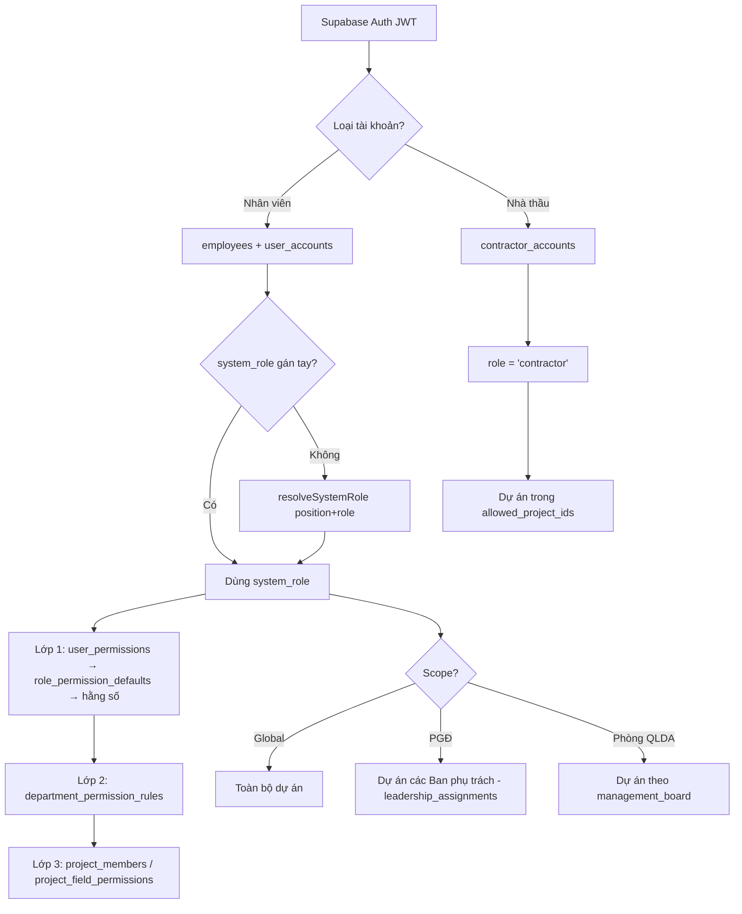

# 🔐 PHÂN QUYỀN HỆ THỐNG QLDA — TÀI LIỆU CHUẨN DUY NHẤT

**Ban QLDA Đầu tư xây dựng công trình Dân dụng và Hạ tầng khu vực tỉnh Hà Tĩnh**

> [!IMPORTANT]
> **Phiên bản:** 2.0 · **Cập nhật:** 2026-06-06 · **Trạng thái:** Chính thức (nguồn-sự-thật duy nhất)
> Tài liệu này **thay thế và hợp nhất** 3 tài liệu cũ đã xóa: `authorization_specification.md`, `huong_dan_phan_quyen_nguoi_dung.md`, `ke-hoach-auth-security.md`.
> Mọi nơi (code, seed DB, hướng dẫn) tham chiếu về đây. Khi sửa quyền: sửa tài liệu này **trước**, rồi đồng bộ code + seed.
>
> 📌 **Căn cứ nghiệp vụ:** Quy chế làm việc Ban QLDA (ban hành 11/2025) · QĐ phân công nhiệm vụ Ban Giám đốc (07/11/2025) · Quy chế nhập liệu QLDA.
> 🔒 **Nguyên tắc cốt lõi:** *Deny-by-default* — mọi quyền bị từ chối cho đến khi được cấp rõ ràng; khi quyền chưa load xong → từ chối.

---

## Mục lục

- [Phần A — Kiến trúc & Engine kiểm tra quyền](#phần-a--kiến-trúc--engine-kiểm-tra-quyền)
- [Phần B — Vai trò hệ thống](#phần-b--vai-trò-hệ-thống)
- [Phần C — Ma trận quyền theo module](#phần-c--ma-trận-quyền-theo-module-giai-đoạn-1)
- [Phần D — Phạm vi dữ liệu](#phần-d--phạm-vi-dữ-liệu--ai-thấy-dự-án-nào)
- [Phần E — Bảo mật phụ trợ & Hạ tầng RLS](#phần-e--bảo-mật-phụ-trợ--hạ-tầng-rls)
- [Phần F — Giả làm người dùng](#phần-f--giả-làm-người-dùng-impersonation)
- [Phần G — Hướng dẫn cho người dùng cuối](#phần-g--hướng-dẫn-cho-người-dùng-cuối)
- [Phần H — Dành cho Developer](#phần-h--dành-cho-developer)
- [Phần I — Module để giai đoạn sau](#phần-i--module-để-giai-đoạn-sau)
- [Phần J — Kế hoạch chuẩn hóa còn lại](#phần-j--kế-hoạch-chuẩn-hóa-còn-lại-roadmap)

---

# PHẦN A — KIẾN TRÚC & ENGINE KIỂM TRA QUYỀN

## A.1 Nguyên tắc

| Nguyên tắc | Mô tả |
| :--- | :--- |
| 🔒 **Deny-by-default** | Mọi quyền bị từ chối cho đến khi được cấp. Quyền chưa load → `can()` trả `false`. |
| 🎭 **Role-based (RBAC)** | Quyền cấp theo **System Role**, không gán lẻ tẻ. |
| ⚙️ **Customizable (ABAC)** | Admin có thể bật/tắt từng quyền cho từng cá nhân (ghi đè role). |
| 🌍 **Scope-aware** | Phạm vi dữ liệu động: Toàn ban / Theo phụ trách (PGĐ) / Theo phòng QLDA / Theo nhà thầu. |
| 👥 **Dual Auth** | Tách 2 tệp người dùng: Nhân sự Ban (`employees`) & Nhà thầu (`contractors`). |
| 🧱 **Defense-in-depth** | Kiểm tra ở **2 tầng**: UI (`can()`) + Database (RLS `has_permission` + row-scope). |

## A.2 Mô hình 3 lớp kiểm tra quyền

Đây là điểm cốt lõi của hệ thống. Một thao tác được phép **chỉ khi qua đủ cả 3 lớp**:

| Lớp | Trả lời câu hỏi | Cơ chế | Nguồn dữ liệu |
| :--- | :--- | :--- | :--- |
| **Lớp 1 — Ma trận vai trò** | Vai trò này *về nguyên tắc* được làm gì? | `DEFAULT_ROLE_PERMISSIONS` (hằng số) ⇄ `role_permission_defaults` (DB) ⇄ `user_permissions` (ghi đè cá nhân) | DB là chuẩn, hằng số là fallback |
| **Lớp 2 — Giới hạn theo phòng** | Phòng của người này có được làm action đó? | `DEFAULT_DEPARTMENT_RULES` / `deptGateAllows()` | `department_permission_rules` (DB) |
| **Lớp 3 — Theo bản ghi/dự án** | Trên *chính dự án này* họ có quyền sửa? | `canEditProject()` (created_by / project_members) + quyền theo từng trường | `project_members`, `project_field_permissions` (DB) |

> 💡 Lớp 1 nói "Chuyên viên được Sửa dự án"; Lớp 2 siết "chỉ Chuyên viên phòng KH-ĐT mới được *Thêm* dự án"; Lớp 3 siết "chỉ được *Sửa* dự án mà mình tạo hoặc là thành viên".

## A.3 Thứ tự ưu tiên trong `PermissionContext.can()`

```
1. super_admin?                         → ALLOW ALL (bypass)
2. Quyền chưa load (!loaded)?           → DENY (an toàn)
3. Có ghi đè cá nhân (user_permissions)? → trả ALLOW/DENY theo đó (TUYỆT ĐỐI, bỏ qua Lớp 2)
4. Có template role (role_permission_defaults DB)? → kết hợp Lớp 2 (deptGateAllows)
5. Fallback DEFAULT_ROLE_PERMISSIONS (hằng số) → kết hợp Lớp 2 + cảnh báo console
```

Lớp 3 (`canEditProject`, `canOnProject`) áp **thêm** ở các điểm thao tác trên dự án cụ thể.

## A.4 Luồng phân quyền tổng thể



---

# PHẦN B — VAI TRÒ HỆ THỐNG

**9 vai trò** (mã tại `types/permission.types.ts`). QTV có thể gán thủ công (`employees.system_role`) ghi đè suy luận tự động.

| # | Vai trò (nhãn hiển thị) | Mã hệ thống | Phạm vi | Ai thuộc nhóm |
| :--- | :--- | :--- | :--- | :--- |
| 1 | 🔑 Quản trị viên HT | `super_admin` | Global (bypass) | Người quản trị phần mềm |
| 2 | 👔 Giám đốc *(Lãnh đạo Ban)* | `director` | Global | Giám đốc Ban |
| 3 | 👔 Phó Giám đốc *(Lãnh đạo Ban)* | `deputy_director` | **Theo phòng phụ trách** | 03 Phó Giám đốc |
| 4 | 📊 Kế toán trưởng | `chief_accountant` | Global (tài chính) | Kế toán trưởng |
| 5 | 📋 Trưởng phòng *(Lãnh đạo phòng)* | `dept_head` | Global/Phòng | Trưởng phòng, Chánh VP, GĐ Trung tâm |
| 6 | 📋 Phó phòng *(Lãnh đạo phòng)* | `deputy_head` | Global/Phòng | Phó Trưởng phòng, Phó VP |
| 7 | 🔧 Chuyên viên | `specialist` | Phòng/Thành viên | Chuyên viên, Kỹ sư, TVGS, Thành viên |
| 8 | 📝 Hành chính | `staff` | Phòng/Thành viên | Nhân viên văn thư, hành chính, kế toán viên |
| 9 | 👷 Nhà thầu | `contractor` | Theo dự án được gán | Đại diện nhà thầu *(giai đoạn sau)* |

> 💡 `director` và `deputy_director` cùng nhãn **"Lãnh đạo Ban"** nhưng khác **phạm vi dữ liệu** (Phần D) và quyền quản trị.

## B.1 Quy tắc phân giải vai trò (`resolveSystemRole`)

Ưu tiên `employees.system_role` (gán tay); nếu trống → suy từ `position` + `role`:
`Admin/quản trị → super_admin` · `Giám đốc → director` · `Phó Giám đốc → deputy_director` · `Kế toán trưởng → chief_accountant` · `Trưởng phòng/Chánh VP/GĐ Trung tâm → dept_head` · `Phó phòng → deputy_head` · `Chuyên viên/Kỹ sư/Thành viên → specialist` · `Nhân viên → staff` · `Nhà thầu → contractor`.

## B.2 Chuyên viên: "phụ trách" vs "hỗ trợ" (Lớp 3, theo từng dự án)

Theo Quy chế (Điều 2.3 & 5.4), vai trò Chuyên viên tách 2 mức **theo từng dự án** (không cố định):

| Mức | Là ai | Quyền trên dự án đó |
| :--- | :--- | :--- |
| **CV·PT** (phụ trách) | CV/KS Phòng QLDA chủ trì, được giao phụ trách chính (1 người/dự án) | Tác nghiệp đầy đủ: lập/sửa dự án, giao & quản lý công việc |
| **CV·HT** (hỗ trợ) | CV phòng khác / CV cùng phòng không phụ trách | Chủ yếu Xem + phối hợp; sửa phần việc được giao |

Lưu tại `project_members.role` (đã có sẵn 5 giá trị: Giám đốc dự án · Trưởng phòng phụ trách · **Chuyên viên phụ trách** ⇒ CV·PT · Kế toán dự án · **Thành viên** ⇒ CV·HT).

---

# PHẦN C — MA TRẬN QUYỀN THEO MODULE (Giai đoạn 1)

> [!IMPORTANT]
> Giai đoạn 1 chỉ phân quyền **12 module đang vận hành**. Module hoãn xem [Phần I]. Bảng dưới **khớp 100% code hiện tại** (`DEFAULT_ROLE_PERMISSIONS` + Lớp 2/3).
>
> Hành động: 👁️ Xem (`view`) · ➕ Thêm (`create`) · ✏️ Sửa (`update`) · 🗑️ Xóa (`delete`) · 📤 Xuất (`export`).
> Viết tắt: **GĐ** · **PGĐ** · **KTT** Kế toán trưởng · **TrP** Trưởng phòng · **PhP** Phó phòng · **CV** Chuyên viên · **HC** Hành chính. *(QTV = toàn quyền, không liệt kê.)*
> 📢 = bị **Lớp 2** siết về phòng cụ thể · 📝 = bị **Lớp 3** siết theo thành viên/người tạo dự án.

### C.1 🏠 Tổng quan (`/`)
| Hành động | GĐ | PGĐ | KTT | TrP | PhP | CV | HC |
| :-- | :-: | :-: | :-: | :-: | :-: | :-: | :-: |
| 👁️ Xem | ✅ | ✅ | ✅ | ✅ | ✅ | ✅ | ✅ |
| 📤 Xuất | ✅ | ✅ | ✅ | ❌ | ❌ | ❌ | ❌ |

> Dashboard cá nhân tuân thủ "của ai thấy của người đấy": CV/HC chỉ thấy việc được giao; TrP thấy của phòng; Lãnh đạo thấy phòng phụ trách/toàn bộ.

### C.2 📅 Lịch cơ quan (`/calendar`)
| Hành động | GĐ | PGĐ | KTT | TrP | PhP | CV | HC |
| :-- | :-: | :-: | :-: | :-: | :-: | :-: | :-: |
| 👁️ Xem | ✅ | ✅ | ✅ | ✅ | ✅ | ✅ | ✅ |
| ➕ Thêm | ✅ | ✅ | ❌ | 📢✅ | 📢✅ | ❌ | ❌ |
| ✏️ Sửa | ✅ | ✅ | ❌ | 📢✅ | 📢✅ | ❌ | ❌ |
| 🗑️ Xóa | ✅ | ✅ | ❌ | ❌ | ❌ | ❌ | ❌ |

> 📢 Thêm/Sửa lịch của TrP/PhP bị Lớp 2 siết về **Phòng HC-TH** (chủ trì lịch họp, Quy chế Điều 25).

### C.3 📁 Quản lý dự án (`/projects`)
| Hành động | GĐ | PGĐ | KTT | TrP | PhP | CV·PT | CV·HT | HC |
| :-- | :-: | :-: | :-: | :-: | :-: | :-: | :-: | :-: |
| 👁️ Xem | ✅ | ✅ | ✅ | ✅ | ✅ | ✅ | ✅ | ✅ |
| ➕ Thêm | ❌ | ❌ | ❌ | ❌ | ❌ | 📢✅ | ❌ | ❌ |
| ✏️ Sửa | ❌ | ❌ | ❌ | ❌ | ❌ | 📝✅ | 📝✅ | 📝✅ |
| 🗑️ Xóa | ❌ | ❌ | ❌ | ❌ | ❌ | ❌ | ❌ | ❌ |

> **Decision #1:** Lãnh đạo Ban/Phòng **chỉ Xem** dự án (chỉ đạo/duyệt), giao tác nghiệp cho phòng QLDA.
> 📢 **Thêm dự án:** chỉ **Chuyên viên Phòng KH-ĐT** (Lớp 2).
> 📝 **Sửa dự án:** người tạo (`created_by`) HOẶC thành viên dự án (`project_members`) — gồm cả CV·HT/HC được phân công (Lớp 3). Quyền theo **từng trường** qua `project_field_permissions`.

### C.4 ✅ Quản lý công việc (`/work-plan`)
| Hành động | GĐ | PGĐ | KTT | TrP | PhP | CV | HC |
| :-- | :-: | :-: | :-: | :-: | :-: | :-: | :-: |
| 👁️ Xem | ✅ | ✅ | ✅ | ✅ | ✅ | ✅ | ✅ |
| ➕ Thêm | ❌ | ❌ | ❌ | ✅ | ✅ | ✅ | ✅ |
| ✏️ Sửa | ❌ | ❌ | ❌ | ✅ | ✅ | 📝✅ | 📝✅ |
| 🗑️ Xóa | ❌ | ❌ | ❌ | 📢✅ | ❌ | ❌ | ❌ |

> 📌 Phạm vi xem: nhân sự thấy việc của phòng mình (`department_code`); ngoại lệ xem toàn bộ chỉ QTV/GĐ/TrP HC-TH; PGĐ thấy việc các phòng phụ trách.
> 📝 Sửa/cập nhật/bình luận: chỉ người tạo, người được giao (`assignee_id`), hoặc người phối hợp (`collaborator_ids`). TrP xóa được việc của phòng mình.

### C.5 👤 Nhân sự (`/employees`)
| Hành động | GĐ | PGĐ | KTT | TrP | PhP | CV | HC |
| :-- | :-: | :-: | :-: | :-: | :-: | :-: | :-: |
| 👁️ Xem | ✅ | ✅ | ✅ | ✅ | ✅ | ✅ | ✅ |
| ➕ Thêm | ❌ | ❌ | ❌ | 📢✅ | ❌ | ❌ | ❌ |
| ✏️ Sửa | ❌ | ❌ | ❌ | 📢✅ | ❌ | ❌ | ❌ |
| 🗑️ Xóa | ❌ | ❌ | ❌ | 📢✅ | ❌ | ❌ | ❌ |

> **Decision #3:** QTV và **Trưởng phòng HC-TH** (📢 Lớp 2) được Thêm/Sửa/Xóa nhân sự; còn lại chỉ Xem.

### C.6 ⚖️ VB Pháp luật & Quy chế (`/legal-documents`, `/regulations`)
| Hành động | GĐ | PGĐ | KTT | TrP | PhP | CV | HC |
| :-- | :-: | :-: | :-: | :-: | :-: | :-: | :-: |
| 👁️ Xem | ✅ | ✅ | ✅ | ✅ | ✅ | ✅ | ✅ |
| ➕ Thêm | ❌ | ❌ | ❌ | 📢✅ | 📢✅ | 📢✅ | 📢✅ |
| ✏️ Sửa | ❌ | ❌ | ❌ | 📢✅ | 📢✅ | 📢✅ | 📢✅ |

> **Decision #5:** Thêm/Sửa điều khoản Quy chế: QTV và cán bộ **Phòng HC-TH** (📢 Lớp 2). Còn lại chỉ Xem.

### C.7 📊 Báo cáo (`/reports`)
| Hành động | GĐ | PGĐ | KTT | TrP | PhP | CV | HC |
| :-- | :-: | :-: | :-: | :-: | :-: | :-: | :-: |
| 👁️ Xem | ✅ | ✅ | ✅ | ✅ | ✅ | ✅ | ✅ |
| 📤 Xuất | ✅ | ✅ | ✅ | ✅ | ✅ | ❌ | ❌ |

### C.8 🔄 Quy trình (`/quy-trinh`)
| Hành động | GĐ | PGĐ | KTT | TrP | PhP | CV | HC |
| :-- | :-: | :-: | :-: | :-: | :-: | :-: | :-: |
| 👁️ Xem | ✅ | ✅ | ✅ | ✅ | ✅ | ✅ | ✅ |
| ➕ Thêm / ✏️ Sửa | ❌ | ❌ | ❌ | ✅ | ❌ | ❌ | ❌ |

### C.9 ⚙️ Cài đặt hệ thống (`/settings`)
**Đặc quyền duy nhất của QTV (`super_admin`).** GĐ/PGĐ/KTT và mọi phòng ban khác **không** truy cập (xem tài khoản, phân quyền, nhật ký đều ❌ cho tất cả role ngoài QTV).

## C.10 Tổng hợp 1 bảng
> **X**=Xem · **T**=Thêm · **S**=Sửa · **D**=Xóa · **E**=Xuất · **—**=không. (QTV toàn quyền.)

| Module | GĐ | PGĐ | KTT | TrP | PhP | CV·PT | CV·HT | HC |
| :--- | :-- | :-- | :-- | :-- | :-- | :-- | :-- | :-- |
| Tổng quan | X E | X E | X E | X | X | X | X | X |
| Lịch cơ quan | X T S D | X T S D | X | X T S📢 | X T S📢 | X | X | X |
| Dự án | X | X | X | X | X | X T📢 S📝 | X S📝 | X S📝 |
| Công việc | X | X | X | X T S D | X T S | X T S📝 | X T S📝 |
| Nhân sự | X | X | X | X T S D📢 | X | X | X |
| VB/Quy chế | X | X | X | X T S📢 | X T S📢 | X T S📢 | X T S📢 |
| Báo cáo | X E | X E | X E | X E | X E | X | X |
| Quy trình | X | X | X | X T S | X | X | X |
| Cài đặt | — | — | — | — | — | — | — |

---

# PHẦN D — PHẠM VI DỮ LIỆU — AI THẤY DỰ ÁN NÀO

Quyền hành động (Phần C) trả lời *"được làm gì"*; **phạm vi dữ liệu** trả lời *"thấy dữ liệu của ai"*. Hai người cùng vai trò khác phòng sẽ thấy tập dự án khác nhau.

## D.1 Bốn loại phạm vi
| Phạm vi | Áp dụng cho | Thấy được | Cơ chế |
| :--- | :--- | :--- | :--- |
| 🌍 **Toàn bộ** | QTV, GĐ, KTT, **Trưởng/Phó phòng chức năng** (HC-TH, KH-ĐT, KT-TĐ, PTDV) | Tất cả dự án | `GLOBAL_VIEW_ROLES` / `GLOBAL_VIEW_DEPARTMENTS` |
| 👔 **Theo phụ trách** | **Phó Giám đốc** | Dự án các phòng PGĐ phụ trách | `leadership_assignments` → `managedBoards` |
| 🏢 **Theo phòng** | Phòng QLDA 1/2/3 | Chỉ dự án phòng quản lý | `management_board` (số Ban) |
| 👥 **Theo thành viên** | CV & NV phòng chức năng | Chỉ dự án được gán làm thành viên | `project_members` |
| 👷 **Theo nhà thầu** | Nhà thầu *(giai đoạn sau)* | Dự án được chỉ định | `allowed_project_ids` |

> RLS scope dùng **số Ban** (`management_board`), không phụ thuộc tên phòng → tránh lệch khi tên phòng có biến thể.

## D.2 Phân công Phòng QLDA (Quy chế Điều 5.4.đ)
| Phòng | Địa bàn / lĩnh vực |
| :--- | :--- |
| **QLDA 1** | Đức Thọ, Vũ Quang; văn hóa, y tế, giáo dục, QLNN |
| **QLDA 2** | ODA, BIG2; Can Lộc, Cẩm Xuyên |
| **QLDA 3** | Thạch Hà, Hương Khê |

> Hiện chỉ còn **3 Phòng QLDA** (Decision #7 — đã dọn QLDA 4/5).

## D.3 ⭐ Phân công Phó Giám đốc — theo QĐ phân công nhiệm vụ BGĐ (07/11/2025)

Đưa vào bảng `leadership_assignments` (nguồn sự thật, thay cho "đoán theo thứ tự mảng"):

| Lãnh đạo | Phòng trực tiếp phụ trách | ⇒ Phạm vi dữ liệu dự án |
| :--- | :--- | :--- |
| **GĐ Nguyễn Quang Linh** | Phòng KH-ĐT | 🌍 Toàn bộ (phụ trách chung) |
| **PGĐ Trần Ngọc Bảo** | **QLDA 1** + Phòng PTDV | Dự án QLDA 1 (+ tư vấn PTDV) |
| **PGĐ Nguyễn Văn Nhân** | **QLDA 2** + Phòng HC-TH | Dự án QLDA 2 |
| **PGĐ Ngô Đức Quý** | **QLDA 3** + Phòng KT-TĐ | Dự án QLDA 3 |

> **Decision #6:** seed `leadership_assignments` theo bảng này.
> ⚠️ Fallback không phá vỡ: PGĐ **chưa được phân công** → tạm giữ Global view cho tới khi admin cấu hình (Cài đặt → Phân công lãnh đạo).

---

# PHẦN E — BẢO MẬT PHỤ TRỢ & HẠ TẦNG RLS

## E.1 Defense-in-depth (UI + DB)
- **Tầng UI:** `can()`, `<PermissionGate>`, `<ProtectedRoute>`, gating menu Sidebar.
- **Tầng DB (RLS):** `has_permission(resource, action)` (super_admin → `user_permissions` → `role_permission_defaults` → deny) + row-scope `can_access_project` theo số Ban. `has_permission` == `can()` của app (cùng resolver + cùng bảng) → thao tác hợp lệ qua UI không bị ảnh hưởng; chỉ chặn ghi vượt quyền qua API trực tiếp.
- **RLS helpers:** `_resolve_system_role`, `current_system_role`, `has_permission`, `is_admin`, `is_global_role`, `current_user_board_number`, `can_access_project`, `is_project_managed_by_current_deputy`, `get_current_deputy_managed_boards`.

## E.2 Hạ tầng bảo mật
| Thành phần | Mô tả |
| :--- | :--- |
| **Cache quyền** | `sessionStorage`, TTL 5 phút theo `userId` (`utils/permissionCache.ts`); invalidate khi logout/đổi quyền/giả lập. |
| **Audit log** | Trigger DB `audit_permission_change()` ghi `audit_logs` với `changed_by = auth.uid()` (server-side, không tin client) cho `user_permissions`, `role_permission_defaults`, `leadership_assignments`. |
| **MFA (TOTP)** | Thử thách AAL2 khi đăng nhập. |
| **Inactivity timeout** | 8 giờ không hoạt động → tự đăng xuất. |
| **Rate limit đăng nhập** | RPC `check_auth_rate_limit` / `record_auth_attempt`. |

## E.3 Áp quyền tức thì sau khi sửa
- `PermissionManager.handleSave` → `permissionCache.invalidate(targetUserId)`; sửa quyền chính mình → `refresh()`.
- `RoleDefaultsManager` → `clearRoleDefaultsCache()` + `permissionCache.invalidateAll()`.
- `DepartmentRuleManager` → `clearDeptRulesCache()`.
- `LeadershipAssignmentManager` → invalidate cache PGĐ.

---

# PHẦN F — GIẢ LÀM NGƯỜI DÙNG (Impersonation)

Công cụ **xem trước quyền** giúp Admin kiểm thử phân quyền (Cài đặt → Công cụ).

## F.1 Đang hoạt động đúng ✅
- Nạp **quyền hiệu lực thật**: `user_permissions` (ghi đè) → `role_permission_defaults` (theo role), không dùng hằng số nếu DB có.
- Áp **Lớp 2** (giới hạn theo phòng) vào bảng preview; ghi nhãn caveat **Lớp 3**.
- **Chặn giả lập `super_admin`** (chống leo thang).
- Timeout 30 phút + cảnh báo 2 phút; audit `impersonation_start/stop/auto_expired`.
- Nhãn rõ: *"RLS cơ sở dữ liệu vẫn chạy dưới tài khoản Admin (chế độ xem trước)"*.

## F.2 Giới hạn cần biết ⚠️
> [!WARNING]
> Đây là **xem trước phía client**, KHÔNG phải mô phỏng dữ liệu thật:
> 1. **Dữ liệu không bị thu hẹp thật** — RLS chạy dưới quyền Admin, nên truy vấn trực tiếp vẫn có thể thấy toàn bộ; chỉ `useScopedProjects` lọc client. Khi giả lập CV Phòng QLDA 2, không bảo đảm chỉ thấy dự án Ban 2.
> 2. **Preview chỉ hiện ma trận hành động**, không hiện phạm vi dữ liệu (Ban phụ trách của PGĐ / board QLDA).
> 3. Timeout & `changed_by` audit phụ thuộc client (rủi ro thấp vì chỉ là preview, không đổi phiên Auth thật).

Hướng nâng cấp lên "giả lập thật" xem [Phần J].

---

# PHẦN G — HƯỚNG DẪN CHO NGƯỜI DÙNG CUỐI

## G.1 Hai lớp bảo vệ
Mọi quyền kiểm tra ở **2 tầng**: Giao diện (không có quyền → nút bị ẩn/khóa) và Cơ sở dữ liệu (dù gọi thẳng API cũng bị chặn).

## G.2 Nguyên tắc bảo mật chung
| # | Nguyên tắc | Mô tả |
| :-- | :--- | :--- |
| 1 | Chỉ làm những gì được phép | Ngoài phạm vi → hệ thống tự chặn |
| 2 | Mỗi người một tài khoản | Không chia sẻ; mọi thao tác ghi nhận theo tên bạn |
| 3 | Tự động đăng xuất | Không thao tác 8 tiếng → tự đăng xuất |
| 4 | Bảo mật đăng nhập | Có MFA; sai nhiều lần → tạm khóa |
| 5 | Lưu vết mọi thao tác | Thay đổi quyền/dữ liệu ghi nhật ký tự động |

## G.3 Câu hỏi thường gặp
- **"Không thấy nút Thêm/Sửa?"** → Vai trò bạn không có quyền đó trên phân hệ này. Cần thêm → liên hệ QTV.
- **"Không thấy dự án mà đồng nghiệp thấy?"** → Khác phòng ban; hệ thống giới hạn theo phòng. Cần xem ngoài phạm vi → liên hệ QTV.
- **"PGĐ chỉ thấy một số dự án?"** → Mỗi PGĐ phụ trách nhóm phòng cụ thể; QTV cấu hình tại **Cài đặt → Phân công lãnh đạo**. Chưa phân công → mặc định xem toàn bộ.
- **"Muốn cấp thêm quyền?"** → Liên hệ QTV (bật thêm quyền không cần đổi vai trò).

---

# PHẦN H — DÀNH CHO DEVELOPER

## H.1 Kiểm tra quyền trong React
```tsx
const { can, canOnProject, canEditProject, isGlobalScope, systemRole } = usePermissionCheck();

if (can('contracts', 'create')) { /* ... */ }

<PermissionGate resource="cde" anyAction={['create', 'update']}>
  <Button>Thao tác CDE</Button>
</PermissionGate>

<ProtectedRoute resource="admin_accounts" action="view">
  <UserAccountManager />
</ProtectedRoute>

// Lớp 3 — sửa một dự án cụ thể:
if (canEditProject({ createdBy: p.created_by, memberIds: p.member_ids })) { /* ... */ }
```

## H.2 File mã nguồn liên quan
| Tầng | File |
| :--- | :--- |
| Types/role/matrix/Lớp 2 rules | `types/permission.types.ts` |
| Engine 3 lớp | `context/PermissionContext.tsx` |
| Hook tiêu dùng | `hooks/usePermissionCheck.ts` |
| Cache quyền | `utils/permissionCache.ts` |
| Scope dự án | `hooks/useScopedProjects.ts`, `utils/boardScope.ts` |
| Component bảo vệ | `components/PermissionGate.tsx`, `components/ProtectedRoute.tsx` |
| Xác thực / giả lập | `context/AuthContext.tsx`, `context/ImpersonationContext.tsx` |
| Phân công lãnh đạo | `services/LeadershipService.ts` |
| UI quản trị (11 tab) | `features/settings/*` (PermissionManager, RoleDefaultsManager, DepartmentRuleManager, ProjectFieldPermissionManager, LeadershipAssignmentManager, UserImpersonator) |

## H.3 Bảng DB liên quan
| Bảng | Mô tả |
| :--- | :--- |
| `employees` | Nhân sự; cột `system_role` (gán tay). |
| `user_accounts` / `contractor_accounts` | Tài khoản NV / Nhà thầu (`allowed_project_ids[]`). |
| `user_permissions` | Ghi đè cá nhân (Lớp 1, ưu tiên cao nhất). |
| `role_permission_defaults` | **Template quyền theo role** (Lớp 1, nguồn chuẩn). |
| `department_permission_rules` | **Giới hạn theo phòng** (Lớp 2). |
| `project_members` / `project_field_permissions` | **Theo bản ghi/trường** (Lớp 3). |
| `leadership_assignments` | Phân công PGĐ ↔ Ban. |
| `cde_permissions` | Quyền CDE nhà thầu (5 mức ISO 19650 — giai đoạn sau). |
| `audit_logs` | Nhật ký append-only. |

---

# PHẦN I — MODULE ĐỂ GIAI ĐOẠN SAU

Chưa phân quyền lần này (vẫn còn trong `ALL_RESOURCES` nhưng ẩn khỏi UI ma trận qua `PHASE1_RESOURCES`):

| Module | Lý do hoãn |
| :--- | :--- |
| 🏢 Tài sản công | Thực hiện giai đoạn sau. |
| 👷 Nhà thầu (vai trò + quản lý) | Chưa cấp tài khoản nhà thầu. |
| 📋 Đấu thầu & Hợp đồng | Giai đoạn sau. |
| 💳 Thanh toán · 💰 KH Vốn & Giải ngân | Chuỗi tài chính — giai đoạn sau. |
| 🗂️ CDE & Hồ sơ tài liệu · 🧊 BIM | Giai đoạn sau. |
| 🚧 Giải phóng mặt bằng (GPMB) | Giai đoạn sau. |

> Khi mở: bổ sung bảng quyền tương ứng + (Nhà thầu) khôi phục 5 mức CDE theo ISO 19650 (viewer/contributor/reviewer/approver/admin).

---

# PHẦN J — KẾ HOẠCH CHUẨN HÓA CÒN LẠI (Roadmap)

> Hệ thống đã ở mức chuẩn cao. Các hạng mục dưới đây để đạt "chuẩn mực nhất". Ưu tiên giảm dần.

| # | Hạng mục | Mục tiêu | Trạng thái |
| :-- | :--- | :--- | :--- |
| **J-1** | ✅ **Hợp nhất 1 tài liệu chuẩn duy nhất** | Tài liệu này thay thế 3 doc cũ; mọi nơi tham chiếu về đây | **Đã làm (2026-06-06)** |
| **J-2** | **Test chống "drift" code↔DB↔doc** | Test Vitest đối chiếu `DEFAULT_ROLE_PERMISSIONS` ⇄ seed `role_permission_defaults` ⇄ ma trận Phần C; CI fail khi lệch. Tận dụng `scripts/gen-rbac-matrix.mjs`. | Cần làm |
| **J-3** | **Dọn lệch metadata trong code** | Sửa header `permission.types.ts` (đang ghi "TP.HCM" & "v1.0" → Hà Tĩnh & trỏ về tài liệu này); rà QLDA 4/5 còn sót; đồng bộ tên phòng canonical. | Cần làm |
| **J-4** | **Giả lập "thật" theo RLS** *(nâng cao)* | Lựa chọn: (A) giữ client-preview nhưng hiển thị thêm **phạm vi dữ liệu** trong panel; (B) RPC `SECURITY DEFINER` áp `request.jwt.claims` của người bị giả lập cho phiên đọc. | Cần quyết |
| **J-5** | **Audit & timeout impersonation phía server** | `changed_by` lấy từ phiên auth thật; validate timeout qua DB thay vì chỉ localStorage. | Tùy chọn |
| **J-6** | **Thu hẹp policy write rộng còn lại** | `sub_tasks`, `folders`, `task_*`, `cde_*` còn cho authenticated bất kỳ ghi → siết theo membership/role. | Tùy chọn |
| **J-7** | **Seed phân công lãnh đạo thực tế** | Seed `leadership_assignments` cho 3 PGĐ theo [D.3] (QĐ 07/11/2025) để bỏ fallback Global. | Cần làm |

---

> *Khi sửa ✅/❌ trong Phần C hoặc phân công Phần D: cập nhật tài liệu này trước, sau đó đồng bộ `DEFAULT_ROLE_PERMISSIONS`, seed `role_permission_defaults`, `department_permission_rules`, `leadership_assignments` và RLS tương ứng.*
